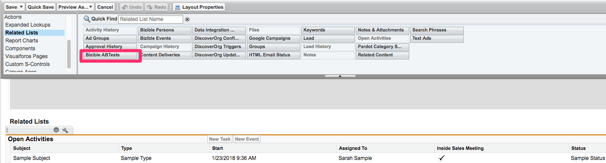

# Configurazione e reporting dei test A/B {#a-b-testing-set-up-and-reporting}

Il [!DNL Marketo Measure] L’integrazione di test A/B consente di tenere traccia dell’impatto sui ricavi delle [Ottimizzato](https://www.optimizely.com/){target="_blank"} e gli esperimenti sul sito VWO. Questo articolo fornisce istruzioni su come aggiungere [!DNL Marketo Measure] Sezioni di prova A/B al lead, [!UICONTROL Contact], Case e [!UICONTROL Opportunity] layout di pagina. Sono inoltre trattate le procedure di reporting generali e le raccomandazioni per l’esecuzione di [!DNL Marketo Measure] Tipi di rapporti A/B.

## Configurazione {#set-up}

Aggiungi il [!DNL Marketo Measure] Sezioni del test A/B su lead, contatto, caso e opportunità. [!DNL Marketo Measure] L’integrazione di test A/B consente di tenere traccia dell’impatto sui ricavi delle [Ottimizzato](https://www.optimizely.com/){target="_blank"} and [VWO](https://vwo.com/){target="_blank"} esperimenti sul sito.

1. Verifica dell’utilizzo del pacchetto [!DNL Marketo Measure] v3.9 o successiva. Per eseguire questa operazione, vai a [!UICONTROL Salesforce] >[!UICONTROL Set Up] > [!UICONTROL Installed packages].
1. Modifica il layout della pagina lead e aggiungi **[!DNL Marketo Measure]Test A/B** Elenco correlato alla pagina.

   

1. Fai clic su [!UICONTROL Wrench] pulsante. Rimuovi il campo &quot;Id&quot; stock dall’elenco dei campi Selezionati. Aggiungi **[!UICONTROL Experiment]**, **[!UICONTROL Variation]**, e **[!UICONTROL DateReported]** campi. Cambia &quot;[!UICONTROL Sort by]&quot; a **[!UICONTROL Date Reported]**, e seleziona **[!UICONTROL Descending]** nel menu a discesa.

   

1. Sotto [!UICONTROL Buttons], deseleziona **[!UICONTROL New]**.

   

1. Contatta il tuo [!DNL Marketo Measure] rep o [Supporto Marketo](https://nation.marketo.com/t5/support/ct-p/Support){target="_blank"} per abilitare la funzione.

## Reporting {#reporting}

I clienti hanno accesso a un paio di [!DNL Marketo Measure] Tipi di rapporti A/B che consentono di creare rapporti su test A/B in relazione a lead, contatti e opportunità:

* [!DNL Marketo Measure] Test A/BT
* [!DNL Marketo Measure] Test A/BT con contatto
* [!DNL Marketo Measure] Test A/BT con lead
* [!DNL Marketo Measure] Test A/BT con opportunità

I tipi di rapporto A/B vengono utilizzati per indicare su quale lead, contatto o opportunità è stato esposto a un test A/B. Questi rapporti mostrano anche l’importo dei ricavi legati a un’opportunità che è stata esposta a un test A/B.

È importante notare che Optimizely/VWO è una piattaforma di variazione dei contenuti e non un canale di marketing. Pertanto, questi [!DNL Marketo Measure] I tipi di report A/B vengono utilizzati in modo diverso rispetto ai report Punti di contatto buyer. I tipi di rapporti sui punti di contatto dell’acquirente vengono utilizzati per capire quale canale di marketing (pubblicità a pagamento, web direct, social) ha portato un lead o un contatto a una pagina specifica. Tuttavia, [!DNL Marketo Measure] I tipi di rapporto A/B non possono essere utilizzati per generare rapporti sul modo in cui una variante ha influenzato un lead o un’opportunità. Poiché una variante di test A/B non è un canale, i dettagli sulla variante non vengono visualizzati nel punto di contatto dell’acquirente.

Di seguito sono riportati alcuni campi consigliati da utilizzare durante la generazione di rapporti su un test A/B per migliorare chiarezza e approfondimenti:

* Lead convertito
* Esperimento
* ID esperimento
* Variante
* ID variante
* Data rapporto

## [!DNL Salesforce] Report di esempio {#salesforce-example-reports}

**[!DNL Marketo Measure]Test A/B con lead**

**[!DNL Marketo Measure]Test A/B con opportunità**

