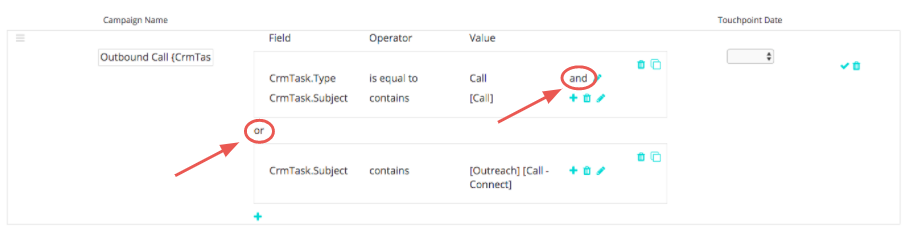

# Attribuzione attività Salesforce {#salesforce-activities-attribution}

Il [!DNL Marketo Measure] L’integrazione delle attività Salesforce consente di inserire record specifici di attività ed eventi nel modello di attribuzione. Inizia a tenere traccia di elementi come e-mail di vendita o telefonate di vendita che non ricevevano il dovuto credito. Per configurare la regola delle attività, devi passare a [experience.adobe.com/marketo-measure](https://experience.adobe.com/marketo-measure){target="_blank"}. Da lì, vai al **[!UICONTROL Settings]** e fai clic sul pulsante **[!UICONTROL Activities]** scheda.

Stai per rendere molto felice il tuo team vendite! Segui questo breve tutorial.

Per cominciare, stiamo introducendo un nuovo concetto chiamato [!DNL Marketo Measure] Campagna. Per ogni regola definita, devi inserire i record in un bucket [!DNL Marketo Measure] Campagna a cui puoi assegnare un nome. Aggiungi più campagne in base alle esigenze. Immagina di misurare l’efficacia di una campagna di vendita in uscita accanto a una campagna a pagamento.

Stai per utilizzare questo [!DNL Marketo Measure] Nome della campagna per indicarci a quale canale deve essere mappato. Se stai ancora pensando alle vendite in uscita, forse tutte le campagne di vendita in uscita dovrebbero sedere in un canale BDR.

Acquisisci familiarità con questa gerarchia:

* Canale
   * Sottocanale
      * Campagna
      * Campagna
   * Sottocanale
      * Campagna

>[!TIP]
>
>Se ad esempio desideri impostare una campagna univoca per ogni rappresentante di vendita, utilizza i nostri parametri di sostituzione dinamici per compilare [!DNL Marketo Measure] Nome della campagna. Nello stesso esempio, puoi immettere: `"Outbound Sales - {AssignedTo}"` e lo trasformeremo in qualcosa di simile `"Outbound Sales - Jill"` o `"Outbound Sales - Jack."` Non hai idea di quanto tempo ti abbiamo appena risparmiato!

Una volta [!DNL Marketo Measure] Se si imposta il nome della campagna, è il momento di impostare le regole di attività.

Le regole fungono da filtro per indicarci quali record sono idonei per l’attribuzione. Immagina di creare un rapporto nel CRM utilizzando una logica simile per generare tale rapporto. Puoi utilizzare una combinazione di istruzioni e/o e vari operatori come corrisponde a, contiene, inizia con, termina con, è uguale a, ecc. Definire le istruzioni &quot;e&quot; all’interno di una regola o di un livello &quot;o&quot; in box al di fuori della casella.

>[!NOTE]
>
>I campi formula non possono essere utilizzati nelle regole e non verranno visualizzati nell&#39;elenco a discesa. Poiché le formule vengono calcolate in background senza modificare un record, [!DNL Marketo Measure] non è in grado di rilevare se un record soddisfa o meno una regola.
>
>Assicurati di utilizzare i valori corretti per i campi ID come CrmEvent.CreatedById. [!DNL Salesforce IDs] hanno una lunghezza di 18 caratteri (ad esempio, 0054H000007WmrfQAC).

Infine, scegliamo uno dei campi di data o data/ora da utilizzare come data del punto di contatto dell&#39;acquirente. È possibile selezionare i campi standard e personalizzati.

>[!TIP]
>
>Con l’installazione del pacchetto, [!DNL Marketo Measure] include un campo Data punto di contatto buyer personalizzato nel record Attività. Se desideri utilizzare una data dinamica, come la data in cui lo stato cambia, puoi utilizzare un flusso di lavoro di gestione delle relazioni con i clienti per impostare la &quot;Data punto di contatto acquirente&quot;, quindi seleziona la Data punto di contatto acquirente qui in questo passaggio.

Non dimenticare di impostare regole diverse per Attività o Eventi. È necessario conoscere l&#39;oggetto utilizzato dal team vendite per registrare le attività.

È probabile che si desideri inserire questi nuovi punti di contatto nel relativo [Canale di marketing](https://experience.adobe.com/#/marketo-measure/MyAccount/Business?busView=false&amp;id=10#/!/MyAccount/Business/Account.Settings.SettingsHome?tab=Channels.Online%20Channels){target="_blank"}. Per farlo, definisci il canale con la nuova mappatura Campaign che hai appena creato. Forse creerai una nuova riga per il canale BDR in cui la campagna inizia con In uscita.

>[!TIP]
>
>Quando aggiungi una definizione di canale, utilizza i valori dei caratteri jolly, un modo più semplice per indicare gli operatori come:
>
>inizia con ( In uscita&#42; )
>
>contiene ( &#42;In uscita&#42; )
>
>termina con ( &#42;In uscita )
>
>Nessun carattere jolly in pratica significa &quot;è uguale a&quot;, quindi assicurati di utilizzarli in base alle esigenze.

| **Operatore** | **Caso d’uso** |
|---|---|
| È uguale a | Valore singolo - Corrispondenza esatta |
| Contiene | Valore singolo - contiene valore |
| Corrisponde a qualsiasi | Più valori - Corrispondenza esatta |
| Corrisponde a qualsiasi (contiene) | Più valori - &#42;valore&#42;, &#42;valore, &#42;valore&#42; |

Infine, ma non per importanza, puoi immettere i costi per i nuovi canali. Nostro [Caricamento delle spese di marketing](https://experience.adobe.com/#/marketo-measure/MyAccount/Business?busView=false&amp;id=10#/!/MyAccount/Business/Account.Settings.SettingsHome?tab=Reporting.Marketing%20Spend){target="_blank"} consente di immettere la spesa a livello di canale, sottocanale o campagna. Con il tuo nuovo [!DNL Marketo Measure] Per le campagne, puoi aggiungere i costi correlati per mese, quindi visualizzare il ROI di ogni campagna.

>[!MORELIKETHIS]
>
>[Domande frequenti su Activity Attribution](/help/advanced-marketo-measure-features/activities-attribution/activities-attribution-faq.md)
