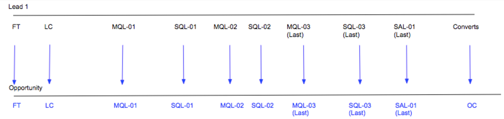
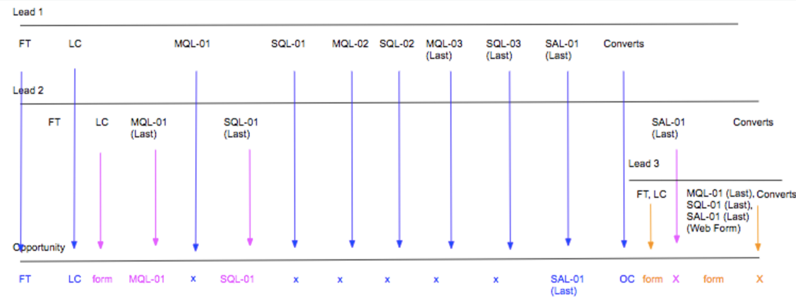

# Scenari Boomerang Stage {#boomerang-stage-scenarios}

>[!AVAILABILITY]
>
>La funzione Boomerang è abilitata solo per i clienti di livello 2 e 3. Per richiedere un livello di account superiore, contatta il team dell’account di Adobe (il tuo account manager).

Di seguito sono riportati alcuni esempi di scenari Boomerang Stage per comprendere come [!DNL Marketo Measure] crea punti di contatto in ogni situazione.

## Scenari di lead singoli {#single-lead-scenarios}

**Scenario 1: punti di contatto boomerang standard per un lead**

Questo è lo scenario Boomerang più semplice. La riga superiore (con etichetta Lead 1) rappresenta il percorso dei singoli lead e il modo in cui i relativi punti di contatto vengono visualizzati sul record Lead. La linea di fondo (denominata Opportunità) mostra come i punti di contatto dei lead si traducono nell’opportunità. La progressione dei punti di contatto è spiegata in modo cronologico, da sinistra a destra.

In questo scenario, un cliente ha scelto di tenere traccia delle fasi **MQL** e **SQL** con Boomerang. Ogni posizione del punto di contatto Boomerang è etichettata con lo stadio e il numero in cui si verifica (MQL-01, SQL-01, MQL-02). L&#39;ultimo punto di contatto boomerang per quella fase ha &quot;(Last)&quot; nella posizione del punto di contatto.

Il lead 1 viene quindi convertito in un contatto con un&#39;opportunità, che viene considerato contatto OC.

**Scenario 2: punti di contatto Boomerang E fasi personalizzate per un lead**

In questo scenario, un cliente ha scelto di tenere traccia solo della **fase SQL** con punti di contatto boomerang. È ancora in corso il tracciamento degli stadi MQL e SAL, ma con la funzionalità [!DNL Marketo Measure] Custom Stage.

La posizione del punto di contatto MQL non è etichettata con un numero. Questo perché non è stato selezionato per il tracciamento con punti di contatto Boomerang. Durante la creazione di punti di contatto per le fasi incluse nel modello personalizzato, ma non tracciate con Boomerang, [!DNL Marketo Measure] prende l&#39;ultima occorrenza da tale fase.

Per la fase SAL, [!DNL Marketo Measure] ignora le prime due occorrenze di questa fase. [!DNL Marketo Measure] crea solo un punto di contatto SAL per l&#39;occorrenza _last_. Nell&#39;esempio precedente, ciò avviene immediatamente prima del punto di contatto OC.

La fase SQL viene tracciata con punti di contatto Boomerang, e tre punti di contatto sono stati creati ed etichettati di conseguenza.

Il lead 1 viene quindi convertito in un contatto con un&#39;opportunità, che viene considerato contatto OC.

**Scenario 3: quando i lead non raggiungono o saltano una fase**

Questo scenario utilizza gli stessi criteri dello scenario 2. Un cliente ha scelto solo di tenere traccia della fase SQL con punti di contatto boomerang. MQL e SAL sono ancora tracciati, ma con la funzione di staging personalizzato [!DNL Marketo Measure].

In questo scenario, il lead non passa mai effettivamente alla fase SAL. Si converte in un contatto prima di raggiungere la fase SAL, essenzialmente &quot;saltando&quot; la fase SAL. In questa situazione, [!DNL Marketo Measure] presuppone che la SAL si verifichi con il punto di contatto OC e che sia la posizione SAL che OC appariranno sullo stesso punto di contatto.

Il lead 1 viene quindi convertito in un contatto con un&#39;opportunità, che viene considerato contatto OC.

## Scenari con più lead {#scenarios-with-multiple-leads}

Gli scenari seguenti sono quelli in cui le fasi Boomerang possono diventare più complicate, mentre stiamo osservando come più lead possono influenzare il percorso di opportunità.

La riga superiore (etichettata come Lead 1, in blu) rappresenta il percorso dei singoli Lead e il modo in cui i relativi punti di contatto vengono visualizzati sul record Lead. Lo stesso vale per il piombo 2 (in rosa) e il piombo 3 (in arancione). La linea di fondo (denominata Opportunità) mostra come entrambi i punti di contatto di questi lead si traducono nell’opportunità. La progressione dei punti di contatto è spiegata in modo cronologico, da sinistra a destra.

**Scenario 1:[!UICONTROL Three Leads with Opportunity]**

In questo scenario, un cliente ha scelto di tenere traccia di **MQL** e **fasi SAL** con punti di contatto boomerang. La fase SQL viene tracciata dalle fasi personalizzate standard.

I punti di contatto FT e LC sull’opportunità provengono da Lead 1 (blu), perché si sono verificati prima del FT e LC di Lead 2 (rosa). Il punto di contatto LC per Lead 2 verrà visualizzato come punto di contatto &quot;Modulo&quot; nell’opportunità.

MQL-01 (Ultimo) da Lead 2 diventerà il primo MQL sull’opportunità. L’MQL-01 dal lead 1 non verrà visualizzato come punto di contatto nell’opportunità perché l’MQL del lead 2 è avvenuto per primo. Tuttavia, i modelli MQL-02 e MQL-03 del lead 1 verranno visualizzati nell’opportunità.

La fase SQL viene tracciata con fasi personalizzate e non con fasi boomerang. Anche se ci sono tre occorrenze della fase SQL tra Lead 1 e Lead 2, solo l’ultima occorrenza SQL verrà inclusa come punto di contatto nell’opportunità.

Il punto di contatto SAL-01 (ultimo) da Lead 1 viene riportato come punto di contatto sull’opportunità. Il lead 1 viene quindi convertito in un contatto con un&#39;opportunità, che viene considerato contatto OC. Il punto di contatto SAL-01 (ultimo) del lead 2 non verrà creato come punto di contatto perché questa transizione di fase si è verificata _dopo_ il contatto OC.

I punti di contatto FT, LC e MQL, SQL, SAL (arancione) del lead 3 si sono verificati tutti dopo il punto di contatto OC sull’opportunità. Questi punti di contatto sono inclusi nell’opportunità, ma sono considerati &quot;tocchi intermedi&quot;.

Quando il lead 2 e 3 vengono convertiti in contatti, [!DNL Marketo Measure] non creerà un altro punto di contatto OC perché può essere presente una sola fase di creazione delle opportunità.

**Scenario 2 - Punti Di Contatto Boomerang Per La Visita Al Web**

In questo scenario, un cliente ha scelto di tenere traccia delle fasi **MQL**, **SQL** e **SAL** con punti di contatto boomerang. Questo scenario è quasi identico a quello precedente, con alcune eccezioni.

Tutti i punti di contatto da Lead 1 saranno inclusi nell&#39;opportunità, da FT a SAL-01 (Last). Il punto di contatto LC della Lead 2 verrà incluso come punto di contatto Modulo tra i punti di contatto LC e MQL-01 sull’opportunità.

L&#39;MQL-01 (ultimo) del lead 2 (visita web) non verrà creato come punto di contatto nell&#39;Opp. Questo perché questo punto di contatto era una visita web che si verifica dopo l’ultima occorrenza della fase SQL e non aiuta a portare avanti l’opportunità.

La fase del lead 1 cambia in SAL e viene quindi convertita in un contatto con un&#39;opportunità; in questo caso, le posizioni SAL-01 (Last) e OC sono combinate nello stesso punto di contatto.

Il contatto FT,LC del lead 3 viene creato come punto di contatto del modulo sull&#39;Opp. Dopo il contatto OC verranno create come punti di contatto solo le azioni di riempimento del modulo. Per questo motivo, le transizioni di fase SQL-01 (Ultimo) e SAL-01 (Ultimo) per Lead 2 non verranno create come punti di contatto perché si tratta di visite Web.

I tocchi MQL, SQL e SAL del lead 3 sono inclusi come punto di contatto perché si trattava di un’azione di compilazione di un modulo.

**Scenario 3 - Ponderazione attribuzione Boomerang**

In questo scenario, un cliente ha scelto di tenere traccia delle fasi **MQL**, **SQL** e **SAL** con punti di contatto boomerang.

I punti di contatto FT e LC sull’opportunità provengono da Lead 1 (blu), perché si sono verificati prima del FT e LC di Lead 2 (rosa). Il punto di contatto LC per Lead 2 viene visualizzato come punto di contatto &#39;Modulo&#39; nell’opportunità.

L&#39;MQL-01 (ultimo) da Lead 2 diventa il primo MQL sull&#39;opportunità. L’MQL-01 dal lead 1 non verrà visualizzato come punto di contatto nell’opportunità perché l’MQL del lead 2 è avvenuto per primo.

SQL-01 (ultimo) dal lead 2 diventa SQL-01 sull’opportunità. SQL-01 sul lead 1 non verrà visualizzato come punto di contatto sull’opportunità perché SQL-01 sul lead 2 è stato eseguito per primo.

Si noti che il Lead 1 si innesca tra MQL e SQL un paio di volte prima di raggiungere finalmente la fase SAL. SQL-01, MQL-02, SQL-02, MQL-03, SQL-03 _non_ verranno inclusi come punti di contatto nell&#39;opportunità perché queste transizioni di fase non aiutano a far avanzare l&#39;opportunità nel percorso.

Il punto di contatto SAL-01 (ultimo) della Lead 1 è il successivo punto di contatto da includere nell&#39;Opp. Il lead 1 viene quindi convertito in un contatto con un&#39;opportunità, creando il punto di contatto OC.

I punti di contatto FT e LC del lead 3 e i punti di contatto MQL, SQL e SAL vengono visualizzati come forma per toccare l’opportunità.

Il punto di contatto SQL-01 (ultimo) del lead 2 non verrà incluso come punto di contatto nell&#39;Opp perché si è verificato dopo il punto di contatto OC. Inoltre, la transizione della fase SQL del lead 2 si è verificata _dopo la transizione finale della fase SAL_ e non aiuta a portare avanti il percorso di opportunità.

## Scenari di opportunità {#opportunity-scenarios}

**Scenario 1 - Contatti con opportunità e tracciamento Boomerang**

In questo scenario, un cliente ha scelto di tenere traccia delle transizioni della fase **Demo e negoziazione** nel **Contatto**. Ogni fase del boomerang può ricevere fino a due punti di contatto. La differenza tra le transizioni di fase su un contatto e le transizioni di fase su un lead è che le transizioni di fase di contatto possono apparire come punti di contatto Boomerang sull&#39;opportunità _dopo_ il punto di contatto OC. Questo non è vero per le transizioni di fase che si verificano sul lead poiché appaiono come punto di contatto di un modulo.

In questo esempio, le transizioni della fase Demo e Negoziazione di Contact 1 sono incluse come punti di contatto Demo-01 e Negotiation-01 sull’opportunità. La transizione della fase di dimostrazione del contatto 2 si verifica _dopo_ il punto di contatto del contatto 1 e viene visualizzato come punto di contatto Demo-02 (ultimo) sull&#39;opportunità.

Notate che non c&#39;è una seconda transizione alla fase di negoziazione; l&#39;opportunità passa immediatamente da Demo-02 (Ultimo) a Chiudi vinto. In questo caso, [!DNL Marketo Measure] includerà la transizione di negoziazione con il punto di contatto Closed Won.
