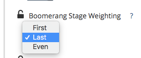

# Impostazione delle fasi di Boomerang {#setting-up-boomerang-stages}

Per abilitare [!UICONTROL Boomerang] Le fasi per il tuo account devono essere un amministratore account. Oppure, può essere attivato contattando [Supporto Marketo](https://nation.marketo.com/t5/support/ct-p/Support){target="_blank"}. Una volta che la funzione è stata abilitata, segui queste istruzioni per configurarle.

## Configurazione della fase Boomerang {#boomerang-stage-setup}

1. Vai a [!UICONTROL Stage Mapping]. Sotto la colonna intitolata &quot;[!UICONTROL Boomerang],&quot; seleziona le caselle accanto alle aree di visualizzazione che desideri monitorare.

   

1. Vai a [!UICONTROL Attribution Settings] e inserisci il numero di punti di contatto per ogni fase che desideri visualizzare. Consentiamo un massimo di 10. Il valore predefinito è 1.

   

1. Clic **[!UICONTROL Save]**.

   >[!NOTE]
   >
   >Consenti 24-48 ore di rielaborazione dei dati in base a queste modifiche.

## Configurazione della fase Boomerang con attribuzione del modello personalizzato {#boomerang-stage-setup-with-custom-model-attribution}

1. Vai a [!UICONTROL Stage Mapping]. Sotto la colonna &quot;[!UICONTROL Boomerang],&quot; seleziona le caselle accanto alle aree di visualizzazione che desideri monitorare.

   

1. Se desideri che anche questi stadi Boomerang siano inclusi nel tuo Modello personalizzato e ricevano un credito di attribuzione, assicurati di selezionare anche la casella sotto &quot;[!UICONTROL Custom Model]&quot; colonna.

   

1. Vai a [!UICONTROL Attribution Settings] scheda . Determina come ponderare l’attribuzione per gli stadi boomerang. Le opzioni sono quelle di ponderare l’attribuzione sulla prima occorrenza, sull’ultima occorrenza o di suddividerla in modo uniforme tra tutte le occorrenze.

   

1. Immetti il numero di occorrenze di ogni fase che desideri visualizzare. Possiamo permettere un massimo di 10. Il valore predefinito è 1.

   

1. Imposta la percentuale di attribuzione da allocare agli Stadi Boomerang inclusi nel modello personalizzato. Assicurati che l’attribuzione totale per tutte le fasi sia fino al 100%. Clic **[!UICONTROL Save and Process]**.

   

   >[!NOTE]
   >
   >Consenti 24-48 ore di rielaborazione dei dati in base a queste modifiche.
