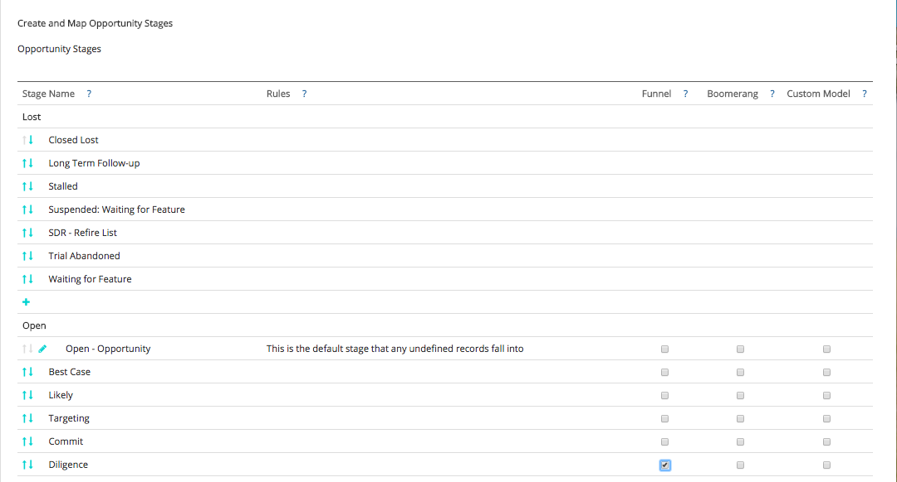

# Modello di attribuzione e configurazione personalizzati {#custom-attribution-model-and-setup}

Per una panoramica della sezione [!DNL Marketo Measure] modello di attribuzione personalizzato e come configurarlo.

## Modello di attribuzione personalizzato {#custom-attribution-model}

Il [!DNL Marketo Measure] Il modello di attribuzione personalizzato consente agli utenti di scegliere quali punti di contatto o fasi personalizzate includere nel modello. Gli utenti possono controllare la percentuale di credito di ricavo attribuita a questi punti di contatto e stadi, oppure possono utilizzare i valori di percentuale di attribuzione suggeriti da [!DNL Marketo Measure] Modello di apprendimento automatico.

## Come impostare il modello di attribuzione personalizzato {#how-to-set-up-your-custom-attribution-model}

1. Determina quali stadi desideri includere nel modello personalizzato.

   Per iniziare a creare il modello di attribuzione personalizzato, seleziona le fasi più importanti per il team Marketing. Oltre al [!DNL Marketo Measure] fasi cardine (FT, LC, OC, Chiuso) è possibile aggiungere fino a sei ulteriori stati di lead/contatti o di opportunità nel modello personalizzato. Ad esempio, è comune che lo stadio MQL sia incluso nel modello personalizzato. I team di marketing spesso desiderano sapere quali sforzi o canali stanno guidando le transizioni alla fase MQL.

   Accedi a [experience.adobe.com/marketo-measure](https://experience.adobe.com/marketo-measure){target="_blank"}. Vai a [!UICONTROL My Account] > [!UICONTROL Settings] > e nella sezione CRM, seleziona **[!UICONTROL Stage Mapping]**.

   Quindi, seleziona le fasi lead/contatti e opportunità da includere **[!UICONTROL Include in Model]** casella.

   >[!NOTE]
   >
   >Sono consentiti fino a sei stadi personalizzati (esclusi i valori predefiniti: FT, LC, OC, Closed).

   

   >[!NOTE]
   >
   >_Tutti_ Qui verranno visualizzate le fasi Lead/Contatti e Opportunità, anche se la fase è inattiva o non è più utilizzata in [!DNL Salesforce]. Se desideri rimuovere questi stadi, devi eliminarli definitivamente in [!DNL Salesforce].

   Dopo aver selezionato le fasi, fai clic sul pulsante **[!UICONTROL Save & Process]** nella parte inferiore della pagina. Le fasi verranno ora visualizzate nel **[!UICONTROL Attribution Settings]** e potrai assegnare le percentuali di attribuzione a ogni fase. Le fasi personalizzate vengono visualizzate anche nella suite di prestazioni marketing come fase lead o opportunità all’interno della cascata della domanda.

   Se nel modello sono presenti altri stadi che si desidera includere ma non sono presenti nel [!UICONTROL Lead/Contact Status] o [!UICONTROL Opportunity Stage] Elenco, puoi definire una tua fase personalizzata in base ai campi presenti nel CRM.

   Nell’esempio seguente, viene definita una fase &quot;MQL&quot; personalizzata utilizzando un campo data. La regola afferma semplicemente che se il campo Data MQL non è vuoto, deve essere considerato un MQL e deve essere incluso nel modello personalizzato. È inoltre importante ordinare le fasi personalizzate una volta create in modo che seguano l’avanzamento del ciclo di vendita.

   

   >[!CAUTION]
   >
   >Non dimenticare di abilitare il tracciamento della cronologia per i campi personalizzati.

Se nel modello personalizzato viene utilizzato un campo personalizzato, il tracciamento della cronologia dei campi DEVE essere abilitato nel CRM. Per istruzioni su come abilitare il tracciamento della cronologia dei campi, fare riferimento a [Impostazione modello personalizzato: abilita tracciamento cronologia campi](/help/advanced-marketo-measure-features/custom-attribution-models/custom-model-setup-enable-field-history-tracking.md).

1. Determina le percentuali di attribuzione per il modello personalizzato.

   Vai a **[!UICONTROL Attribution Settings]** in [!DNL Marketo Measure] App; le fasi personalizzate verranno visualizzate qui nella tabella di attribuzione. Nella tabella di attribuzione vengono visualizzati tutti i [!DNL Marketo Measure] modelli di attribuzione e la ponderazione dell’attribuzione di ciascun modello. Le percentuali di attribuzione dei primi cinque modelli sono fisse e non possono essere modificate.

   Nell&#39;estrema destra colonna etichettata &quot;**[!UICONTROL Custom]**,&quot; puoi impostare la ponderazione percentuale per ogni fase nel modello di attribuzione personalizzato. È sufficiente immettere i valori per ogni fase nella colonna Personalizzato. Then **[!UICONTROL Save and Reprocess]** una volta completato.

   A sinistra del _Personalizzato_ colonna è il valore **[!DNL Marketo Measure]Modello di apprendimento automatico**. Il modello di apprendimento automatico calcola la ponderazione dell’attribuzione in base all’importanza relativa per la vincita di un’offerta, in base a ciò che è successo in ogni fase personalizzata. Per ulteriori informazioni sul modello di apprendimento automatico, consulta [Domande frequenti sul modello di apprendimento automatico](/help/advanced-marketo-measure-features/custom-attribution-models/machine-learning-model-faq.md).

   

## Posizioni dei punti di contatto {#touchpoint-positions}

Una volta salvate ed elaborate le percentuali di attribuzione, i punti di contatto verranno aggiornati e riceveranno i loro nuovi stadi e posizioni. Al punto di contatto che si è verificato più di recente, prima di una transizione di fase, verrà attribuito il merito per quella fase (come mostrato di seguito). Anche la ponderazione personalizzata e le entrate vengono ridistribuite.

## La differenza tra gli stadi funnel e gli stadi del modello personalizzato {#the-difference-between-funnel-stages-and-custom-model-stages}

Ora puoi visualizzare le fasi personalizzate nel funnel di marketing, anche se non hai abilitato Custom Model. Questo avveniva attraverso l’utilizzo della funzionalità Funnel Stage. Gli stadi funnel ora consentono di aggiungere stadi al funnel, ma non di visualizzarne l’attribuzione.

Gli stadi funnel verranno comunque tracciati come punti di contatto e verranno comunque visualizzati come posizioni dei punti di contatto nel CRM. Senza modello personalizzato, questi punti di contatto possono ancora ricevere l’attribuzione del contatto intermedio in caso di compilazione di un modulo (10% per i contatti intermedi), ma zero credito di attribuzione in caso di semplice visita web.

Come puoi vedere qui sotto, abbiamo incluso la fase Diligence come parte dei nostri Stadi Funnel. Ciò significa che avremo punti di contatto in cui la posizione contiene Diligence, ma che riceveranno credito di attribuzione Middle Touch solo se il modello personalizzato non è abilitato (al massimo il 10%).

>[!NOTE]
>
>Il comportamento dei modelli personalizzati BAT consiste nel dividere in modo uniforme la percentuale di contatto intermedio del modello personalizzato in altri stadi, purché non vi siano contatti intermedi.
