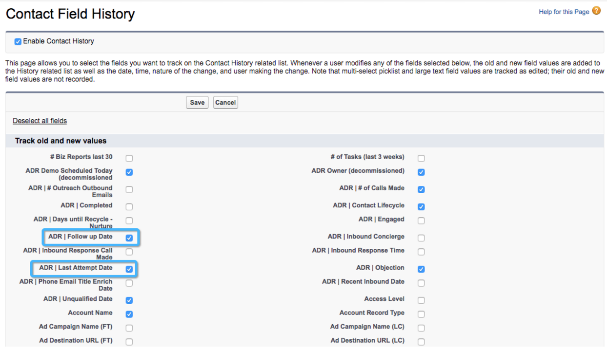

# Impostazione modello personalizzato: abilita tracciamento cronologia campi {#custom-model-setup-enable-field-history-tracking}

## Perché e quando abilitare il tracciamento della cronologia dei campi {#why-and-when-to-enable-field-history-tracking}

Se decidi di includere un campo personalizzato come fase nel modello di attribuzione personalizzato, il tracciamento della cronologia dei campi **deve essere abilitato** per questo campo. L&#39;abilitazione del tracciamento della cronologia dei campi consentirà a [!DNL Salesforce] di tenere traccia di qualsiasi modifica apportata al campo personalizzato creando un record nella tabella Tracciamento cronologia. [!DNL Marketo Measure] può scaricare tale tabella e utilizzare queste informazioni per misurare l&#39;ora e il giorno in cui si è verificata una &quot;transizione&quot;. Senza il tracciamento della cronologia dei campi, [!DNL Marketo Measure] non è in grado di tenere traccia delle modifiche relative a questo campo.

Se nel modello personalizzato vengono utilizzati solo [!UICONTROL Lead Status] o gli stadi opportunità, non è necessario attivare il tracciamento della cronologia dei campi perché verrà tracciato automaticamente come transizione di stadio.

Per abilitare il tracciamento della cronologia dei campi, segui le istruzioni riportate di seguito.

## Abilita tracciamento cronologia campi {#enable-field-history-tracking}

>[!NOTE]
>
>Per apportare queste modifiche ai campi dell&#39;oggetto Lead/Contatto/Opportunità, è necessario essere amministratore di sistema.

1. Passare all&#39;oggetto in cui si trova il campo personalizzato e fare clic sul pulsante **[!UICONTROL Set History Tracking]**.

   

1. Seleziona i campi in cui desideri tenere traccia delle modifiche.

   

[!DNL Marketo Measure] può reimportare un record solo se vede che è stato modificato di recente. I campi formula tecnicamente non modificano un record quando viene modificato, in quanto il calcolo viene eseguito in background. Si sono verificati problemi in cui una regola viene ignorata perché [!DNL Marketo Measure] non ha visto la modifica del record, pertanto si consiglia di **non utilizzare i campi formula nelle definizioni delle regole**. La soluzione consiste nel creare un campo di testo e utilizzare un flusso di lavoro per compilare tale campo con il valore o il calcolo corretto ogni volta che il record viene modificato o soddisfa i criteri. Questo richiede che tutti i record vengano modificati in modo che il flusso di lavoro possa funzionare retroattivamente sui record precedenti.
