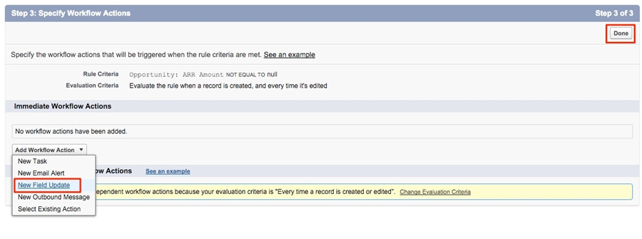

# Utilizzo di un campo personalizzato per l&#39;importo dei ricavi {#using-a-custom-revenue-amount-field}

Per impostazione predefinita, i punti di contatto di attribuzione buyer richiameranno l’importo dell’opportunità da uno dei due campi seguenti:

* Importo (predefinito SFDC)
* [!DNL Marketo Measure] Importo dell’opportunità (personalizzato)

Se utilizzi un campo Importo personalizzato nelle opportunità, dovremo configurare un flusso di lavoro per calcolare i ricavi del punto di contatto dell’acquirente. Questa operazione richiede una conoscenza più avanzata di [!DNL Salesforce], quindi potrebbe richiedere l&#39;assistenza dell&#39;amministratore SFDC.

A partire da, avremo bisogno delle seguenti informazioni:

* Nome API del campo Importo

Da qui inizieremo a creare il flusso di lavoro.

## Creare il flusso di lavoro in Salesforce Lightning {#create-the-workflow-in-salesforce-lightning}

I seguenti passaggi sono per gli utenti di Salesforce Lightning. Se utilizzi ancora Salesforce Classic, questi passaggi [sono elencati di seguito](#create-the-workflow-in-salesforce-classic).

1. In Configurazione, digitare &quot;Flussi&quot; nella casella Ricerca rapida e selezionare **[!UICONTROL Flows]** per avviare Flow Builder. Dal pannello di destra, fai clic su **[!UICONTROL New Flow]** pulsante.

   

1. Seleziona **[!UICONTROL Record-Triggered Flow]** e fai clic su **[!UICONTROL Create]** in basso a destra.

   

1. Nella finestra Configura avvio, selezionare l&#39;oggetto Opportunità. Dalla sezione [!UICONTROL Configure Trigger] sezione, seleziona **[!UICONTROL A record is created or updated]**.

   

1. Nella sezione Imposta condizioni di entrata, alla voce [!UICONTROL Condition Requirements], seleziona **[!UICONTROL Custom Condition Logic Is Met]**.
   * Dal campo di ricerca, selezionare il campo Importo personalizzato.
   * Imposta l’operatore come **Is Null** e il valore come **[!UICONTROL False]**.
   * Imposta i criteri di valutazione su **[!UICONTROL Every time a record is updated and meets the condition requirements]**.

   

1. Nella sezione &quot;Ottimizza il flusso per&quot;, seleziona **[!UICONTROL Fast Field Updates]**. Clic **[!UICONTROL Done]** in basso a destra.

   

1. Per aggiungere l’elemento, fai clic sull’icona più (+) e seleziona **[!UICONTROL Update Triggering Record]**.

   

1. Nella finestra Nuovo record aggiornamento, inserire quanto segue:

   * Immetti un’etichetta: il nome API viene generato automaticamente
   * In &quot;Come trovare i record da aggiornare e impostare i relativi valori&quot;, selezionare **[!UICONTROL Use the opportunity record that triggered the flow]**.
   * Nella sezione &quot;[!UICONTROL Set Filter Conditions]&quot;, seleziona **[!UICONTROL Always Update Record]** come requisito della condizione per aggiornare il record.
   * In &quot;[!UICONTROL Set Field Values for the Campaign Record],&quot; dal campo, seleziona l’importo dell’opportunità Marketo Measure e dal valore. Selezionare quindi il campo Importo personalizzato.
   * Clic **[!UICONTROL Done]**.

   

1. Clic **[!UICONTROL Save]**. Viene visualizzata una finestra a comparsa. Digita &quot;Etichetta flusso&quot; nella finestra Salva il flusso (il Nome API del flusso verrà generato automaticamente). Clic **[!UICONTROL Save]** di nuovo.

   

1. Fai clic su **[!UICONTROL Activate]** per attivare il flusso.

   

## Creare il flusso di lavoro in Salesforce Classic {#create-the-workflow-in-salesforce-classic}

I seguenti passaggi sono per gli utenti di Salesforce Classic. Se hai effettuato il passaggio a Salesforce Lightning, questi passaggi [si trova sopra](#create-the-workflow-in-salesforce-lightning).

1. Accedi a **[!UICONTROL Setup]** > **[!UICONTROL Create]** > **[!UICONTROL Workflow & Approvals]** > **[!UICONTROL Workflow Rules]**.

   

1. Seleziona **[!UICONTROL New Rule]**, impostare l&#39;oggetto come &quot;Opportunità&quot; e fare clic su **[!UICONTROL Next]**.

   

   

1. Configura il flusso di lavoro. Imposta il nome della regola come &quot;Aggiorna&quot; [!DNL Marketo Measure] Importo dell’opportunità.&quot; Imposta il criterio di valutazione su &quot;Creato e ogni volta che viene modificato&quot;. Per Criteri regola, seleziona il campo Importo personalizzato e l’operatore [!UICONTROL as "Not Equal To"] e lasciare vuoto il campo &quot;Valore&quot;.

   

1. Aggiungi un’azione del flusso di lavoro. Imposta questo elenco a discesa su &quot;[!UICONTROL New Field Update].&quot;
   

1. Qui compilerai le informazioni sul campo. Nel campo &quot;Nome&quot;, si consiglia di utilizzare questa denominazione: &quot;[!DNL Marketo Measure] Importo Opp.&quot; Il &quot;Nome univoco&quot; verrà compilato automaticamente in base al campo &quot;Nome&quot;. Nell’elenco a discesa &quot;Campo da aggiornare&quot;, seleziona &quot;[!DNL Marketo Measure] Importo dell’opportunità.&quot; Dopo aver selezionato il campo, seleziona la casella &quot;Re-Evaulate Workflow Rules after Field Change&quot; (Valuta nuovamente regole flusso di lavoro dopo la modifica del campo). In &quot;Specifica nuovo valore campo&quot;, selezionare &quot;Utilizza una formula per impostare il nuovo valore&quot;. Nella casella vuota, rilascia il nome API del campo Importo personalizzato. Clic **[!UICONTROL Save]**.

   

1. Verrai riportato a una pagina di rollup per il flusso di lavoro, assicurati di &quot;Attivare&quot; e sarai a posto. Per attivare, fai clic su **[!UICONTROL Edit]** accanto al nuovo flusso di lavoro e quindi fai clic su **[!UICONTROL Activate]**.

   Dopo aver completato questi passaggi, le opportunità dovranno essere aggiornate per attivare il flusso di lavoro in modo che abbia il nuovo valore da [!UICONTROL custom opportunity] campo.

   A tale scopo, esegui le opportunità tramite Data Loader in SFDC. Scopri come utilizzare Data Loader in [questo articolo](/help/advanced-marketo-measure-features/custom-revenue-amount/using-data-loader-to-update-marketo-measure-custom-amount-field.md).

In caso di domande, contatta il team degli Adobi (il tuo Account Manager) o [[!DNL Marketo] Supporto](https://nation.marketo.com/t5/support/ct-p/Support){target="_blank"}.
