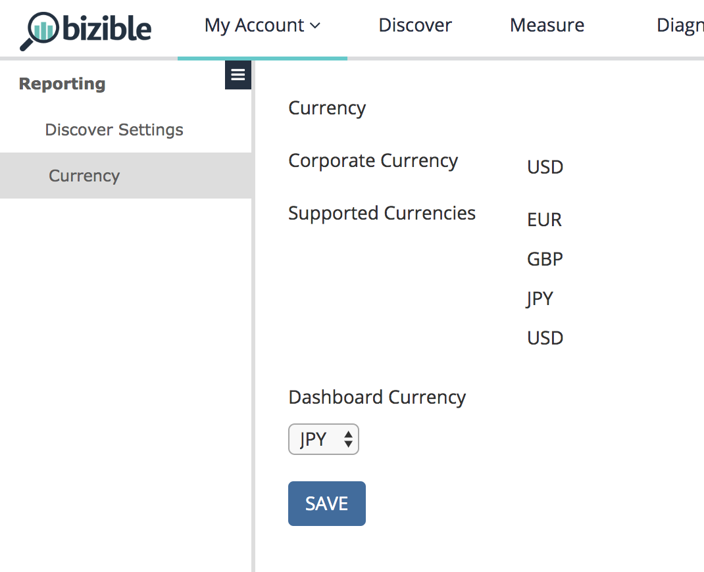

# Impostazioni {#settings}

Ci sono due bit di funzionalità separati legati a questa funzione, che si trovano nella scheda Impostazioni generali del CRM: Valute multiple e Valute avanzate.

**Valute multiple**: Abilitato se il cliente utilizza più di una singola valuta.

**Valute avanzate**: Un bit aggiuntivo che deve essere abilitato se il cliente utilizza la funzione &quot;Gestione avanzata delle valute&quot; di Salesforce, in cui l’utente può impostare un intervallo temporale per i tassi di conversione.

Sotto il tuo [!UICONTROL User Settings] in [!DNL Marketo Measure] Applicazione, mostreremo la Valuta Aziendale ed eventuali Valute Supportate prelevate dal CRM. Poiché questi valori vengono tutti estratti dal CRM, questi campi sono di sola lettura e non possono essere modificati. La valuta del dashboard è la valuta predefinita per ogni caricamento di un dashboard. Potete tornare indietro e cambiare la valuta come necessario.

