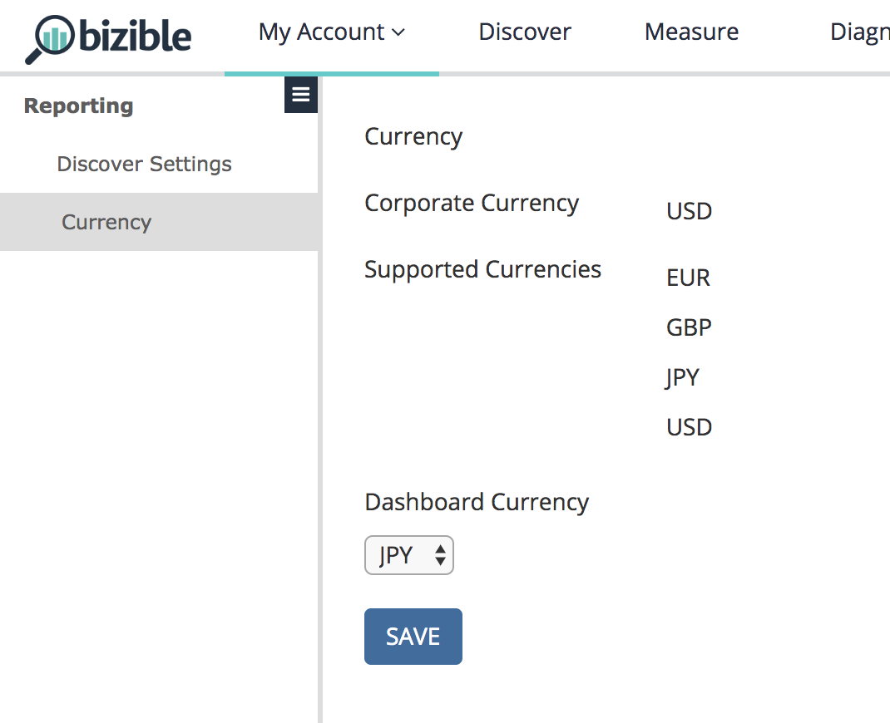

# Impostazioni {#settings}

Esistono due bit di funzionalità separati associati a questa funzionalità, che si trovano nella scheda [!UICONTROL General Settings] del sistema di gestione delle relazioni con i clienti: Valute multiple e Valute avanzate.

**Più valute**: abilitato se il cliente utilizza più di una valuta.

**Valute avanzate**: bit aggiuntivo da abilitare se il cliente utilizza la funzione &quot;Advanced Currency Management&quot; di Salesforce in cui l&#39;utente può impostare un intervallo basato sul tempo per i tassi di conversione.

Sotto [!UICONTROL User Settings] nell&#39;applicazione [!DNL Marketo Measure] verranno visualizzate la valuta aziendale ed eventuali valute supportate estratte dal CRM. Poiché questi valori vengono tutti estratti dal CRM, questi campi sono di sola lettura e non possono essere modificati. La valuta del dashboard è la valuta predefinita per ogni caricamento di un dashboard. È possibile tornare indietro e cambiare la valuta in base alle esigenze.

