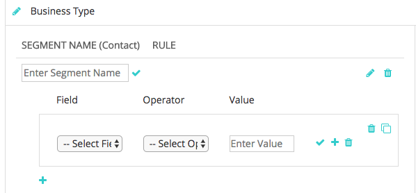
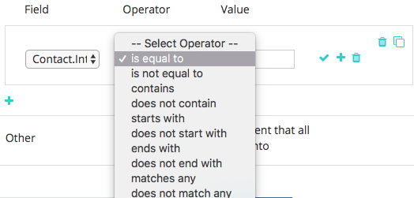

# Segmentazione personalizzata {#custom-segmentation}

I segmenti consentono di filtrare i dati nel [!DNL Marketo Measure] Dashboard sul ROI per approfondire l’analisi su un set di dati specifico. Ad esempio, un segmento può essere definito per territorio geografico o per un sistema di classificazione.

**Perché la segmentazione personalizzata?**

La funzione Segmentazione personalizzata consente di filtrare i punti di contatto in base a una categoria e fino a cinque segmenti. A seconda dell’oggetto a cui il Dash del ROI è puntato (Lead o Contatto), puoi creare segmenti in base ai campi presenti nell’oggetto Lead/Contatto. Inoltre, potrai creare segmenti in base a qualsiasi campo trovato nell’oggetto Opportunity.

**Quando è utile la funzione di segmentazione personalizzata?**

La segmentazione personalizzata può essere utilizzata per visualizzare i dati per un particolare tipo di record. Una volta mappata la logica del filtro, dovresti essere in grado di visualizzare nella [!DNL Marketo Measure] Vista a cascata domanda del dashboard: gli stessi dati che visualizzeresti nel tuo CRM.

**Come la configuro?**

Passaggio 1: determina quali informazioni desideri visualizzare.

Prima di utilizzare questa funzione, specifica le informazioni sui punti di contatto in base alle quali desideri filtrare. Ricorda di utilizzare i valori esatti nel CRM per i tipi di record. La configurazione filtrerà i punti di contatto dall’alto verso il basso del funnel di marketing.

Passaggio 2: accedere e individuare la funzione Segmenti.

* Vai a [experience.adobe.com/marketo-measure](https://experience.adobe.com/marketo-measure){target="_blank"} e accedi
* Sotto la [!UICONTROL My Account] scheda , seleziona [!UICONTROL Settings]
* Seleziona [!UICONTROL Segments] dalle opzioni sulla barra laterale a sinistra, sotto il [!UICONTROL Reporting] sezione

Passaggio 3: comprendere i componenti.

* Usa questa legenda per capire le varie icone presenti in questa pagina

Passaggio 4 - Aggiungere regole di filtro.

* Innanzitutto, inserisci il nome della categoria. Tipo di business è un esempio. Al termine, fai clic sul segno di spunta. È necessario immettere un nome per la categoria prima di poter aggiungere segmenti
* Fai clic sul segno più per aggiungere un segmento
* Inserisci un nome Segmento. Ad esempio, puoi avere un segmento per Nuove attività, Partner, Rinnovo o Rivendita

* Fai clic sull’icona più per visualizzare i campi di input della regola. Le opzioni nell’elenco di selezione Campo richiamano i campi direttamente dal CRM

>[!NOTE]
>
>I campi Formula non possono essere utilizzati all&#39;interno delle regole e non verranno visualizzati nell&#39;elenco a discesa. Poiché le formule si calcolano in background e non modificano un record, [!DNL Marketo Measure] impossibile rilevare se un record soddisfa una regola o meno.

* L’opzione Valore non è un elenco a discesa e il relativo valore deve essere immesso manualmente. Verifica i valori nella tua organizzazione Salesforce
* Ripeti questo processo per le regole del segmento Opportunità
* La categoria &quot;Altro&quot; è un segmento predefinito che acquisirà eventuali punti di contatto non definiti. Puoi modificare il nome predefinito del segmento
* Fai clic sull’icona del cestino per eliminare un’intera categoria o una singola regola all’interno di una categoria. In alternativa, fai clic sull’icona a forma di matita per modificare la categoria o la regola
* Noterai di avere un pulsante &quot;Save&quot; e un pulsante &quot;Save and Process&quot;. Utilizza il pulsante Salva per salvare il lavoro e le modifiche nel tempo. Utilizzare il pulsante Salva ed elabora SOLO una volta verificato che:

   * La mappatura è accurata
   * Hai aggiunto tutti i segmenti che desideri tracciare all’interno di una categoria
   * Viene attivato il pulsante Salva ed elabora . [!DNL Marketo Measure] per sincronizzare tutti i punti di contatto e applicare le nuove informazioni aggiunte. Questo processo richiede 7 giorni e le regole non possono essere modificate durante questo periodo

**_Note aggiuntive:_**

Se le regole non sono impostate sia per Lead/Contatti che per Opportunità, visualizzerai solo una parte dei tuoi dati. Per elaborare, se non si impostano le regole Opportunità, verranno visualizzati solo i dati Lead/Contatto senza le opportunità associate. Lo stesso vale se non si impostano le regole per Lead/Contatti: verranno visualizzate solo le opportunità senza i lead/contatti associati.

Al termine, fai clic su [!UICONTROL Save] prima, controlla tutto e poi fai clic su [!UICONTROL Save and Process]. Ricorda che non potrai modificare le impostazioni per sette giorni al momento del salvataggio e dell&#39;elaborazione, come [!DNL Marketo Measure] sta riformattando i dati in questo momento.

**Come si salvano i rapporti generati?**

Non puoi salvare i rapporti generati direttamente nell’interfaccia utente. Tuttavia, [!DNL Marketo Measure] salva i nomi dei segmenti nell’URL in modo da poter tenere un record di ciascun rapporto segnalando la pagina.
