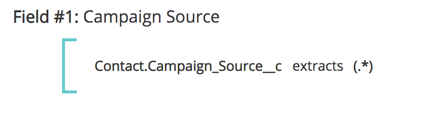

# Campi punto di contatto {#touchpoint-fields}

Storicamente, quando i clienti si collegavano con [!DNL Marketo Measure] e nel caso in cui non disponiamo di un’integrazione diretta di tag, il nostro team Customer Success insegna ai nostri clienti come assegnare tag appropriati alle pagine di destinazione, in modo che utilizzino il formato UTM corretto e possiamo risolvere i loro annunci. Alcuni di questi clienti non utilizzano UTM, ma utilizzano piuttosto i propri parametri di tag, il che significa che può richiedere molto tempo per modificare tutte le pagine di destinazione in tutte le loro reti di annunci con una nuova struttura di tag che [!DNL Marketo Measure] applica. Per adattarci alla loro struttura di tag, ora accettiamo parametri personalizzati che possono essere mappati con le nostre definizioni di regole. L’obiettivo è adattarsi all’utilizzo dei parametri di tracciamento personalizzati da parte dei clienti, in modo da non richiedere loro di modificare la struttura dell’URL.

>[!AVAILABILITY]
>
>Disponibile ora con Segmentazione completa nei livelli 2 e 3.

>[!NOTE]
>
>Si tratta di una funzione avanzata che deve essere configurata solo da Professional Services.

## Abilitazione della funzione {#enabling-the-feature}

Dalla sezione [!DNL Marketo Measure] Dal menu Impostazioni, passare alla pagina Campi punto di contatto. Da qui, puoi abilitare la funzione selezionando **Sì** in **Abilita campi calcolati**. Una volta attivato, potrai creare i campi punto di contatto.

## Procedura {#how-to}

Per creare un campo calcolato, tieni presente che un utente può eseguire tre azioni diverse: estrae, mappa a e concatena. Questi operatori sono anche noti come operatori per la definizione di un campo calcolato.

Estratti

L’operatore estrae il valore da un campo da un’altra posizione, ad esempio un campo Campagna, un campo Lead o in un caso d’uso più avanzato. [estrarre parametri personalizzati dalla pagina di destinazione](https://docs.google.com/document/d/1NRViyCsXvPKbCTfGW32Yi2vWBjMDRF7bzkzKj9s2DDA/edit?ts=5e20b482#heading=h.xxwtissvw4){target="_blank"}. It then places it onto a Touchpoint Field (See [Maps To Example](https://docs.google.com/document/d/1NRViyCsXvPKbCTfGW32Yi2vWBjMDRF7bzkzKj9s2DDA/edit?ts=5e20b482#heading=h.xxwtissvw4){target="_blank"} #2).

**Esempio di #1**

È presente un campo personalizzato sul contatto, campaign_source__c, che il cliente desidera rilasciare sul punto di contatto a scopo di reporting. Puoi definire una regola per creare un campo calcolato denominato &quot;Origine campagna&quot; e rilasciare il valore in tale campo.

Obiettivo: utilizza il valore di un campo personalizzato e inseriscilo nell’oggetto punto di contatto per facilitarne la generazione di rapporti.

* Creare un campo calcolato e etichettarlo come &quot;Origine campagna&quot;
* Definisci la regola iniziando con la ricerca del campo Contact.Campaign_Source__c
* Utilizza l’operatore &quot;estrae&quot; perché è necessario estrarre il valore dal parametro
* Per estrarre la stringa completa dal campo, verrà utilizzata l’espressione &quot;(.&#42;)&quot;

   * **(** segna l’inizio dell’estrazione
   * **)** segna la fine dell’estrazione
   * **.&#42;** ci dice che stiamo estraendo la stringa completa

**Esempio di #2**

Un caso d’uso comune che questa funzione abilita è quello di estrarre i valori dai parametri personalizzati di una stringa URL. Questa opzione è utile se si utilizzano parametri diversi da UTM ma si desidera analizzare i valori nei campi dei punti di contatto.

**Link:** `https://www.adobe.com/blog/marketing-revenue-reporting-overview?promo=5OFF` o `https://www.adobe.com/blog/marketing-revenue-reporting-overview?promo=25OFF`.\
**Obiettivo:** Crea un campo personalizzato denominato &quot;Codice sconto&quot; e rilascia il valore &quot;5OFF&quot; o &quot;25OFF&quot;, qualsiasi valore venga passato.

* Creare un campo calcolato e etichettarlo come &quot;Codice sconto&quot;
* Definisci la regola iniziando con la ricerca del campo Touchpoint.Session.LandingPage
* Utilizza l’operatore &quot;estrae&quot; perché è necessario estrarre il valore dal parametro
* Per estrarre il valore della promozione, definiremo il valore come &quot;promo=(\w+)&quot;

   * **(** segna l’inizio dell’estrazione
   * **)** segna la fine dell’estrazione
   * **\w** ci dice che stiamo estraendo una &quot;parola&quot; che include 0-9
   * **+** estrae il valore completo del parametro senza alcun limite di caratteri
   * Tieni presente che stai utilizzando una barra in avanti e non una barra indietro

**Esempio di #3**

Proviamo un esempio simile in cui estraiamo un codice di tracciamento come: `https://www.adobe.com/blog/marketing-revenue-reporting-overview?cid=123456`.

**Obiettivo:** Crea un campo calcolato e assegnagli l’etichetta &quot;Adobe Campaign Id&quot; con il valore del parametro cid.

* Creare un campo calcolato e assegnargli l’etichetta &quot;Adobe Campaign Id&quot;
* Definisci la regola iniziando con la ricerca del campo Touchpoint.Session.LandingPage
* Utilizza l’operatore &quot;estrae&quot; perché è necessario estrarre il valore dal parametro
* Per estrarre il valore &quot;123456&quot;, definiremo il valore come &quot;cid=(\d{6})&quot;

   * **(** segna l’inizio dell’estrazione
   * **)** segna la fine dell’estrazione
   * **\d** ci dice che stiamo estraendo una &quot;cifra&quot;
   * **{6}** è il numero di caratteri che si estrae

**Esempio di #4**

Man mano che le pagine di destinazione si complicano e si hanno più parametri di tracciamento, potrebbe essere necessario creare più campi di punti di contatto ed estrarre più volte i valori, ad esempio:
`https://www.adobe.com/blog/marketing-revenue-reporting-overview?trackID=123456&country=US&campaign_ID=7890`.

**Obiettivo:** Crea più campi calcolati per &quot;Paese di destinazione&quot; e &quot;ID campagna personalizzato&quot; con i rispettivi valori provenienti dai parametri.

* Creare un campo calcolato e etichettarlo come &quot;Paese di destinazione&quot;
* Definisci la regola iniziando con la ricerca del campo Touchpoint.Session.LandingPage
* Utilizza l’operatore &quot;estrae&quot; perché è necessario estrarre il valore dal parametro
* Per estrarre il valore &quot;US&quot;, definiremo il valore come &quot;country=(\w{2})&quot;

   * **(** segna l’inizio dell’estrazione
   * **)** segna la fine dell’estrazione
   * **\w** ci dice che stiamo estraendo una &quot;parola&quot;
   * **{2}** è il numero di caratteri che si estrae

* Creare un campo calcolato e etichettarlo come &quot;ID campagna personalizzato&quot;
* Definisci la regola iniziando con la ricerca del campo Touchpoint.Session.LandingPage
* Utilizza l’operatore &quot;estrae&quot; perché è necessario estrarre il valore dal parametro
* Per estrarre il valore &quot;123456&quot;, definiremo il valore come &quot;campaign_ID=(\d{6})&quot;

   * **(** segna l’inizio dell’estrazione
   * **)** segna la fine dell’estrazione
   * **\d** ci dice che stiamo estraendo una &quot;cifra&quot;
   * **{6}** è il numero di caratteri che si estrae

**Mapping a**

L’operatore mappa su crea una tabella di valori che devono essere convertiti o inseriti in un altro valore. Di solito, si presenta sotto forma di un valore chiave in cui un codice rappresenta un nome descrittivo che deve essere mappato a tale nome.

**Esempio di #1**

Sono presenti campagne create per una &quot;promozione di fine estate&quot; e una &quot;promozione del Black Friday&quot; su più canali. Desideri creare un campo calcolato denominato &quot;Iniziativa&quot; e mappare tutti i punti di contatto con una promozione di &quot;fine estate&quot; o &quot;Black Friday&quot; su un valore di Iniziativa come &quot;Promozioni&quot;, oltre ad altri possibili valori.

**Esempio di #2**

Ora che abbiamo imparato a estrarre e mappare i campi, combiniamo queste azioni per estrarre prima un valore da un parametro, quindi mapparlo su un nome descrittivo che abbia un po&#39; più di senso. Iniziamo quindi con questa pagina di destinazione: `https://www.adobe.com/blog/marketing-revenue-reporting-overview?BZ=04-01-09-03-10`.

**Obiettivo:** Crea più campi calcolati: il primo numero è associato a un’area geografica, il secondo a un prodotto, il terzo a un’iniziativa, il quarto a un utente tipo e il quinto a una piattaforma multimediale. Quindi, mappa il valore numerico su un &quot;nome descrittivo&quot;.

* Creare un campo calcolato e etichettarlo come &quot;Area&quot;
* Definisci la regola iniziando con la ricerca del campo Touchpoint.Session.LandingPage
* Utilizza l’operatore &quot;[!UICONTROL extracts]&quot; poiché è necessario estrarre il valore dal parametro
* Per estrarre il valore &quot;04&quot;, definiremo il valore come &quot;BZ=(\d{2})-\d{2}-\d{2}-\d{2}-\d{2}&quot;

   * **(** segna l’inizio dell’estrazione

      * Tieni presente che poiché estraiamo solo le 4, solo le prime cifre hanno la parentesi aperta

   * **)** segna la fine dell’estrazione

      * Tieni presente che poiché estraiamo solo le 4, solo le prime cifre hanno la parentesi chiusa

   * **\d** ci dice che stiamo estraendo una &quot;cifra&quot;
   * **{2}** è il numero di caratteri che si estrae

* Clic [!UICONTROL Save]. È necessario salvare il nuovo campo prima che sia disponibile per l&#39;utilizzo per la regola successiva.
* Quindi, è necessario mappare tutti i valori possibili per le prime cifre ai relativi nomi descrittivi
* Creare un campo calcolato e etichettarlo come &quot;Region_Name&quot;
* Definisci la regola iniziando con la ricerca del campo estratto. In questo caso, Touchpoint.Region
* Utilizza l’operatore &quot;[!UICONTROL maps to]&quot; poiché si desidera creare una mappatura per ogni numero al relativo valore
* Verrà visualizzata una tabella in cui elencare ogni mappatura. Alla fine sarà più o meno così:
* In base alla mappatura e all’URL indicati sopra, il &quot;Region_Value&quot; di un punto di contatto con questa pagina di destinazione sarà &quot;EMEA&quot;
* Ripeti l’estrazione e la mappatura per i rimanenti 4 set di cifre

   * Per estrarre il valore 01, è necessario definire il valore come &quot;BZ=\d{2}-**(\d{2})**-\d{2}-\d{2}-\d{2}&quot;
   * Per estrarre il valore 09, è necessario definire il valore come &quot;BZ=\d{2}-\d{2}-**(\d{2})**-\d{2}-\d{2}&quot;
   * Per estrarre lo 03, è necessario definire il valore come &quot;BZ=\d{2}-\d{2}-\d{2}-**(\d{2})**-\d{2}&quot;
   * Per estrarre il valore 10, è necessario definire il valore come &quot;BZ=\d{2}-\d{2}-\d{2}-\d{2}-**(\d{2})**&quot;

**Concatena**

L’operatore concatena combina valori provenienti da più campi in un unico campo. Questo è utile per creare un valore personalizzato che richiama i dati tra vari campi al fine di

**Esempio di #1**

L’oggetto Opportunity contiene campi separati per Segment__c e Grade__c che l’utente desidera combinare in un singolo campo sull’oggetto Touchpoint a scopo di reporting. Concatenando i campi, verranno visualizzati valori quali Enterprise_A o Mid-Market_B.

## Campi e segmenti dei punti di contatto {#touchpoint-fields-and-segments}

Ora che i valori dell’URL sono stati analizzati ed esistono sul punto di contatto, verranno visualizzati i nuovi campi in cui vengono utilizzati i campi del punto di contatto, ad esempio per creare segmenti o definire regole per l’eliminazione dei punti di contatto.

Con questa versione del prodotto è disponibile la possibilità di creare segmenti utilizzando i campi punto di contatto. Impossibile creare i segmenti con campi punto di contatto precedenti.

Per semplificare la creazione dei segmenti, ora puoi creare segmenti dinamici dai campi dei punti di contatto creati. Ad esempio, se hai creato un campo punto di contatto che ha analizzato un’area geografica, invece di creare un segmento per ogni possibile area, puoi impostare un segmento e creeremo segmenti per ogni istanza in cui viene visualizzato un nuovo valore. Questa funzione è estremamente utile se un attributo come il codice postale deve essere analizzato e utilizzato come segmento.

La configurazione sarà simile a quella mostrata di seguito. Il Nome segmento richiama dinamicamente il valore del Campo punto di contatto utilizzando le parentesi graffe per cercare il campo.

La regola fa riferimento allo stesso campo punto di contatto e cerca valori &quot;non uguali a null&quot;.

## Domande frequenti {#faq}

**Esiste un numero massimo di campi punto di contatto che è possibile creare?**

È previsto un limite di 100 campi.

**Non viene visualizzato il nuovo campo punto di contatto appena creato nell&#39;elenco a discesa. Dov&#39;è?**

Non dimenticare di salvare le regole dopo averle create. Se il nuovo campo non viene visualizzato, verifica se è stato salvato. È necessario salvare il nuovo campo prima che sia disponibile per l&#39;utilizzo per la regola successiva.

>[!NOTE]
>
>A causa del livello di complessità, un campo punto di contatto che utilizza l’operatore &quot;mappa su&quot; non è disponibile per essere utilizzato in un altro campo punto di contatto.

**Quale espressione viene utilizzata per estrarre più parametri da una singola pagina di destinazione?**

Come nell’#4 Estrai esempio, per estrarre ciascuno dei parametri dovrai creare più campi. Pertanto, se si dispone di cinque valori diversi, verranno creati cinque campi punto di contatto per estrarre ciascuno di essi.

**Perché non vedo i miei nuovi campi in [!DNL Marketo Measure] schema?**

È necessario un ulteriore lavoro per esporre i nuovi campi nel [!DNL Marketo Measure] Data Warehouse schema. Al momento, i campi sono esposti tramite impostazioni e configurazione, in modo da poter utilizzare i campi punto di contatto nella creazione di segmenti o nella creazione di regole per l’eliminazione dei punti di contatto.

**Come posso verificare che l’espressione di estrazione sia valida e richiamare il valore corretto?**

È disponibile uno strumento online ([https://regex101.com/](https://regex101.com/){target="_blank"}) che è possibile eseguire e verificare l’espressione. L’espressione apparirà in verde se è valida o in rosso se non è valida. Inoltre, la casella di spiegazione in alto a destra è utile e ti dice cosa stai estraendo.

