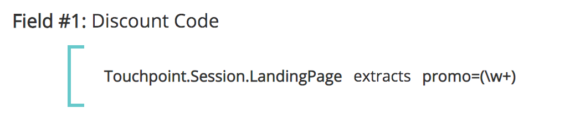
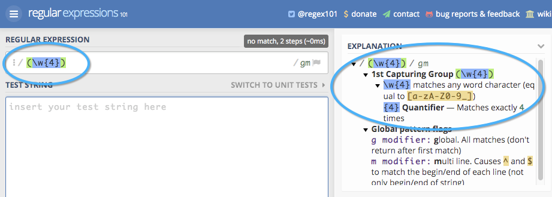

# Campi punto di contatto {#touchpoint-fields}

Storicamente, quando i clienti sono a bordo con [!DNL Marketo Measure] e nel caso in cui non disponiamo di un’integrazione di tag diretti, il nostro team di successo cliente spiega ai clienti come assegnare tag appropriati alle pagine di destinazione in modo che utilizzino il formato UTM corretto e possiamo risolvere i loro annunci. Alcuni di questi clienti non utilizzano gli UTM ma utilizzano parametri di assegnazione tag personalizzati, il che significa che può essere molto lungo modificare tutte le pagine di destinazione in tutte le loro reti di annunci con una nuova struttura di assegnazione tag che [!DNL Marketo Measure] impone. Per adattarci alla loro struttura di assegnazione tag, ora accettiamo parametri personalizzati che possono essere mappati con le nostre definizioni di regole. L’obiettivo è quello di adattarci all’uso dei parametri di tracciamento personalizzati da parte dei clienti, in modo da non dover richiedere loro di modificare la struttura URL.

>[!AVAILABILITY]
>
>Disponibile ora con Segmentazione completa nei livelli 2 e 3.

>[!NOTE]
>
>Si tratta di una funzione avanzata che deve essere impostata solo da Professional Services.

## Abilitazione della funzione {#enabling-the-feature}

Da [!DNL Marketo Measure] Menu Impostazioni, passare alla pagina Campi punto di contatto. Da qui, è possibile abilitare la funzione selezionando **Sì** sotto **Abilita campi calcolati**. Una volta abilitato , puoi creare campi per punti di contatto.

## Come fare per {#how-to}

Per creare un campo calcolato, ricorda che un utente può eseguire tre azioni diverse: estrae, mappa e concatena. Sono anche noti come operatori per la definizione di un campo calcolato.

Estratti

L’operatore estrae il valore da un campo da un’altra posizione, ad esempio: un campo Campaign, un campo Lead o in un caso d’uso più avanzato, [estrarre parametri personalizzati dalla pagina di destinazione](https://docs.google.com/document/d/1NRViyCsXvPKbCTfGW32Yi2vWBjMDRF7bzkzKj9s2DDA/edit?ts=5e20b482#heading=h.xxwtissvw4){target="_blank"}. It then places it onto a Touchpoint Field (See [Maps To Example](https://docs.google.com/document/d/1NRViyCsXvPKbCTfGW32Yi2vWBjMDRF7bzkzKj9s2DDA/edit?ts=5e20b482#heading=h.xxwtissvw4){target="_blank"} 2).

**Esempio n. 1**

Il campo personalizzato Contatto, campaign_source__c, contiene un campo personalizzato che il cliente desidera inserire nel punto di contatto a scopo di reporting. Puoi definire una regola per creare un campo calcolato denominato &quot;Origine campagna&quot; e rilasciare il valore in tale campo.

Obiettivo: Utilizzare il valore di un campo personalizzato e inserirlo nell’oggetto Punto di contatto per facilitarne il reporting.

* Crea un campo calcolato ed etichettalo &quot;Origine campagna&quot;
* Definire la regola iniziando la ricerca del campo Contact.Campaign_Source_c
* Utilizza gli &quot;estratti&quot; dell’operatore, in quanto è necessario estrarre il valore dal parametro
* Per estrarre la stringa completa dal campo, utilizzeremo l’espressione &quot;(.&#42;)&quot;

   * **(** segna l’inizio dell’estrazione
   * **)** segna la fine dell’estrazione
   * **.&#42;** indica che stiamo estraendo la stringa completa

**Esempio n. 2**

Un caso d’uso comune di questa funzione è quello di estrarre i valori dai parametri personalizzati di una stringa URL. Questa opzione è utile se utilizzi parametri diversi da UTM, ma desideri analizzare i valori nei campi dei punti di contatto.

**Collegamento:** `https://www.adobe.com/blog/marketing-revenue-reporting-overview?promo=5OFF` o `https://www.adobe.com/blog/marketing-revenue-reporting-overview?promo=25OFF`.\
**Obiettivo:** Crea un campo personalizzato denominato &quot;Codice sconto&quot; e rilascia il valore &quot;5OFF&quot; o &quot;25OFF&quot;, qualsiasi valore viene passato.

* Crea un campo calcolato ed etichettalo &quot;Codice sconto&quot;
* Definisci la regola iniziando la ricerca del campo Touchpoint.Session.LandingPage
* Utilizza gli &quot;estratti&quot; dell’operatore, in quanto è necessario estrarre il valore dal parametro
* Per estrarre il valore della promo, definiremo il valore come &quot;promo=(\w+)&quot;

   * **(** segna l’inizio dell’estrazione
   * **)** segna la fine dell’estrazione
   * **\w** indica che stiamo estraendo una &quot;parola&quot; che include 0-9
   * **+** estrarrà il valore completo del parametro senza alcun limite di caratteri
   * Tieni presente che stai utilizzando una barra rovesciata e non una barra rovesciata

**Esempio n. 3**

Proviamo un esempio simile in cui estraiamo un codice di tracciamento come: `https://www.adobe.com/blog/marketing-revenue-reporting-overview?cid=123456`.

**Obiettivo:** Crea un campo calcolato ed etichettalo &quot;Adobe Campaign Id&quot; con il valore del parametro cid .

* Crea un campo calcolato ed etichettalo &quot;Adobe Campaign ID&quot;
* Definisci la regola iniziando la ricerca del campo Touchpoint.Session.LandingPage
* Utilizza gli &quot;estratti&quot; dell’operatore, in quanto è necessario estrarre il valore dal parametro
* Per estrarre il valore &quot;123456&quot;, verrà definito il valore come &quot;cid=(\d{6})&quot;

   * **(** segna l’inizio dell’estrazione
   * **)** segna la fine dell’estrazione
   * **\d** ci dice che stiamo estraendo una &quot;cifra&quot;
   * **{6}** è il numero di caratteri da estrarre

**Esempio n. 4**

Man mano che le pagine di destinazione si complicano e si dispone di più parametri di tracciamento, potrebbe essere necessario creare più campi dei punti di contatto ed estrarre più volte i valori, ad esempio:
`https://www.adobe.com/blog/marketing-revenue-reporting-overview?trackID=123456&country=US&campaign_ID=7890`.

**Obiettivo:** Crea più campi calcolati per &quot;Paese di destinazione&quot; e &quot;ID campagna personalizzata&quot; con i rispettivi valori dai parametri.

* Crea un campo calcolato ed etichettalo &quot;Paese di destinazione&quot;
* Definisci la regola iniziando la ricerca del campo Touchpoint.Session.LandingPage
* Utilizza gli &quot;estratti&quot; dell’operatore, in quanto è necessario estrarre il valore dal parametro
* Per estrarre il valore &quot;US&quot;, verrà definito il valore come &quot;country=(\w{2})&quot;

   * **(** segna l’inizio dell’estrazione
   * **)** segna la fine dell’estrazione
   * **\w** ci dice che stiamo estraendo una &quot;parola&quot;
   * **{2}** è il numero di caratteri da estrarre

* Crea un campo calcolato ed etichettalo &quot;ID campagna personalizzata&quot;
* Definisci la regola iniziando la ricerca del campo Touchpoint.Session.LandingPage
* Utilizza gli &quot;estratti&quot; dell’operatore, in quanto è necessario estrarre il valore dal parametro
* Per estrarre il valore &quot;123456&quot;, verrà definito il valore come &quot;campaign_ID=(\d{6})&quot;

   * **(** segna l’inizio dell’estrazione
   * **)** segna la fine dell’estrazione
   * **\d** ci dice che stiamo estraendo una &quot;cifra&quot;
   * **{6}** è il numero di caratteri da estrarre

**Mappa su**

Le mappe all&#39;operatore creano una tabella di valori che devono essere tradotti o inseriti in un altro valore. Di solito, si tratta di un valore chiave in cui un codice rappresenta un nome descrittivo e deve essere mappato su tale nome descrittivo.

**Esempio n. 1**

Ci sono campagne create per una &quot;promozione di fine estate&quot; e una &quot;promozione di Black Friday&quot; che si estendono su più canali. Desideri creare un campo calcolato denominato &quot;Iniziativa&quot; e mappare eventuali punti di contatto con una &quot;Promozione fine estate&quot; o una &quot;Promozione Black Friday&quot; su un valore di iniziativa come &quot;Promozioni&quot;, oltre ad altri possibili valori.

**Esempio n. 2**

Ora che abbiamo imparato come estrarre e mappare i campi, combiniamo queste azioni per prima cosa estrarre un valore da un parametro, poi mapparlo su un nome descrittivo che ha un po&#39; più senso. Cominciamo con questa pagina di destinazione: `https://www.adobe.com/blog/marketing-revenue-reporting-overview?BZ=04-01-09-03-10`.

**Obiettivo:** Crea più campi calcolati, in cui il primo numero è associato a una regione, il secondo a un prodotto, il terzo a un’iniziativa, il quarto a una Persona e il quinto a una Media Platform. Quindi, mappa il valore numerico in un &quot;nome descrittivo&quot;.

* Crea un campo calcolato ed etichettalo &quot;Region&quot;
* Definisci la regola iniziando la ricerca del campo Touchpoint.Session.LandingPage
* Utilizza l’operatore &quot;[!UICONTROL extracts]&quot; poiché è necessario estrarre il valore dal parametro
* Per estrarre il valore &quot;04&quot;, verrà definito il valore come &quot;BZ=(\d{2})-\d{2}-\d{2}-\d{2}-\d{2}-\d{2}&quot;

   * **(** segna l’inizio dell’estrazione

      * Notate che poiché estraiamo solo i 4, solo le prime cifre hanno la parentesi aperta
   * **)** segna la fine dell’estrazione

      * Notate che poiché estraiamo solo i 4, solo le prime cifre hanno la parentesi chiusa
   * **\d** ci dice che stiamo estraendo una &quot;cifra&quot;
   * **{2}** è il numero di caratteri da estrarre

* Clic [!UICONTROL Save]. È necessario salvare il nuovo campo prima che sia disponibile per l&#39;utilizzo per la regola successiva.
* Ora, vogliamo mappare tutti i valori possibili per le prime cifre ai suoi nomi descrittivi
* Crea un campo calcolato ed etichettalo &quot;Region_Name&quot;
* Definisci la regola iniziando con la ricerca del campo estratto. In questo caso, Touchpoint.Region
* Utilizza l’operatore &quot;[!UICONTROL maps to]&quot; poiché vogliamo creare una mappatura per ogni numero sul suo valore
* Ti verrà presentata una tabella con l’elenco di ogni mappatura. Alla fine, avrà un aspetto simile a questo:
* In base alla mappatura e all’URL di cui sopra, il valore &quot;Region_Value&quot; per un punto di contatto con questa pagina di destinazione è &quot;EMEA&quot;
* Ripeti l’estrazione e la mappatura per i restanti 4 set di cifre

   * Per estrarre il valore 01, è necessario definire il valore come &quot;BZ=\d{2}-**(\d{2})**-\d{2}-\d{2}-\d{2}&quot;
   * Per estrarre il valore 09, è necessario definire il valore come &quot;BZ=\d{2}-\d{2}-**(\d{2})**-\d{2}-\d{2}&quot;
   * Per estrarre il valore 03, è necessario definire il valore come &quot;BZ=\d{2}-\d{2}-\d{2}-**(\d{2})**-\d{2}&quot;
   * Per estrarre il 10, è necessario definire il valore come &quot;BZ=\d{2}-\d{2}-\d{2}-\d{2}-{2}-**(\d{2})**&quot;

**Concatenati**

L’operatore concatena combina i valori provenienti da più campi in un unico campo. Questa opzione è utile per creare un valore personalizzato che richiama i dati tra vari campi al fine di

**Esempio n. 1**

Sono disponibili campi separati nell’oggetto Opportunity per Segment__c e Grade__c che l’utente desidera combinare in un singolo campo sull’oggetto Touchpoint a scopo di reporting. concatenando i campi, vengono visualizzati valori quali Enterprise_A o Mid-Market_B.

## Campi e segmenti punto di contatto {#touchpoint-fields-and-segments}

Ora che i valori dell’URL sono stati analizzati ed esistono nel punto di contatto, i nuovi campi in cui vengono utilizzati i campi punto di contatto saranno visualizzati, ad esempio per creare segmenti o definire regole di eliminazione dei punti di contatto.

La possibilità di creare segmenti utilizzando i campi punto di contatto è disponibile in questa versione del prodotto. Impossibile creare i segmenti con campi punto di contatto prima.

Per semplificare la creazione dei segmenti, ora è possibile creare segmenti dinamici dai campi punto di contatto creati. Ad esempio, se hai creato un campo punto di contatto che ha analizzato un’area geografica anziché creare un segmento per ogni area possibile, puoi impostare un segmento e creeremo segmenti per ogni istanza viene visualizzato un nuovo valore. Questa opzione è estremamente utile se è necessario analizzare e utilizzare come segmento un attributo come codice postale.

La configurazione assomiglierebbe a quella dello screenshot qui sotto. Il nome del segmento richiama dinamicamente il valore del campo punto di contatto utilizzando le parentesi graffe per cercare il campo.

La regola fa riferimento allo stesso campo punto di contatto e cerca valori &quot;diversi da null&quot;.

## Domande frequenti {#faq}

**È possibile creare un numero massimo di campi punto di contatto?**

C&#39;è un limite di 100 campi.

**Il campo punto di contatto appena creato non viene visualizzato nella lista di selezione. Dov&#39;è?**

Non dimenticare di salvare le regole dopo averlo creato. Se il nuovo campo non viene visualizzato, verificare se è stato salvato. È necessario salvare il nuovo campo prima che possa essere disponibile per l’utilizzo per la regola successiva.

>[!NOTE]
>
>A causa del livello di complessità, un campo punto di contatto che utilizza l’operatore &quot;mappa su&quot; non è disponibile per l’utilizzo in un altro campo punto di contatto.

**Quale espressione utilizzare per estrarre più parametri da una singola pagina di destinazione?**

Come nell&#39;esempio di estrazione n. 4, sarà necessario creare più campi per estrarre ciascuno dei parametri. In questo modo, se disponi di cinque valori diversi, puoi creare cinque campi punto di contatto per estrarli.

**Perché non visualizzo i miei nuovi campi nel [!DNL Marketo Measure] schema?**

Sono necessari ulteriori lavori per esporre i nuovi campi nel [!DNL Marketo Measure] Data Warehouse schema. Al momento, i campi sono esposti tramite impostazioni e configurazione per consentire l’utilizzo dei campi punto di contatto nella creazione di segmenti o nella creazione di regole di eliminazione di punti di contatto.

**Come posso verificare che la mia espressione di estrazione sia valida e richiamare il valore corretto?**

È disponibile uno strumento online ([https://regex101.com/](https://regex101.com/){target="_blank"}) che è possibile eseguire e testare l’espressione. Se è valida o rossa, l’espressione verrà visualizzata in verde. Inoltre, la casella di spiegazione in alto a destra è utile e indica cosa stai estraendo.

