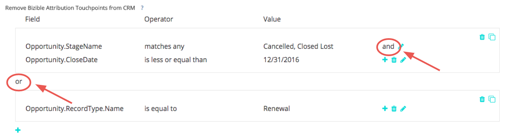

# Rimozione di punti di contatto e soppressione di punti di contatto {#touchpoint-removal-and-touchpoint-suppression}

Scopri come rimuovere o eliminare i punti di contatto che soddisfano criteri specifici dal CRM. Questo può essere utile per liberare spazio dati se si dispone di [!DNL Salesforce] limiti di archiviazione dei dati.

Esiste una differenza chiave tra le regole di rimozione dei punti di contatto e le regole di eliminazione dei punti di contatto:

* Rimozione punto di contatto - [!DNL Marketo Measure] eliminerà (ovvero rimuoverà) tutti i punti di contatto dal CRM che soddisfano i criteri della regola. I dati _può_ sono segnalati all&#39;interno del [!DNL Marketo Measure] Dashboard sul ROI, ma non più nel CRM.
* Soppressione dei punti di contatto : simile alla rimozione dei punti di contatto, ma i dati NON possono essere segnalati all’interno del dashboard del ROI.

Prima di iniziare a creare regole di rimozione/soppressione dei punti di contatto, è consigliabile condividere il piano di implementazione con il team che gestisce le attività di marketing e vendita. Dovresti già avere un&#39;idea dei tipi o valori che desideri rimuovere. Alcuni dei casi d’uso più comuni sono:

* Elimina punti di contatto da opportunità perse chiuse
* Elimina punti di contatto da lead molto vecchi
* Elimina punti di contatto da lead non qualificati

Una volta salvate le regole, [!DNL Marketo Measure] pulirà e ridistribuirà il modello di attribuzione. Ciò significa che le tappe e le posizioni cambieranno, e il credito di attribuzione del tuo canale cambierà! In questo modo i dati verranno modificati, quindi contatta il tuo Success Manager se hai bisogno di assistenza.

`1)` Sono disponibili due sezioni per le impostazioni di rimozione/soppressione. Puoi configurarlo per i punti di contatto dell’acquirente (Lead e contatti) o per i punti di contatto dell’attribuzione dell’acquirente (Contatti, Opportunità e Account).

Inizia con l’aggiunta di una regola e seleziona il Campo che definirà i criteri.

Scegli tra un elenco di Operatori che si relazioneranno al successivo set di valori, che verrà aggiunto nella colonna successiva.

>[!TIP]
>
>Per aggiungere più valori in un campo, utilizza l’operatore &quot;corrisponde a qualsiasi&quot; con virgole che separano ciascun valore.

>[!TIP]
>
>Per tenere conto di un valore vuoto o NULL in un campo, è sufficiente lasciare vuota la casella Valore. Questo terrà conto di scenari come la valutazione rispetto a un punto di contatto senza URL del modulo.

>[!NOTE]
>
>I campi Formula non possono essere utilizzati all&#39;interno delle regole e non verranno visualizzati nell&#39;elenco a discesa. Poiché le formule si calcolano in background e non modificano un record, [!DNL Marketo Measure] impossibile rilevare se un record soddisfa una regola o meno.

`2)` Aggiungi regole all’interno dello stesso gruppo per utilizzare la logica &quot;AND&quot; nell’istruzione.
Oppure, aggiungi nuove istruzioni all’esterno del gruppo per utilizzare la logica &quot;OR&quot; nell’istruzione.

`3)` Se le regole diventano complesse e devi ricreare i gruppi e apportare piccole modifiche a ciascuna istruzione, utilizza l&#39;opzione Clona per semplificare le operazioni.

Se fai un errore, non ti preoccupare. È inoltre possibile eliminare singole righe dell’istruzione o gruppi completi.

`4)` Imposta le regole per i punti di contatto dell’attribuzione dell’acquirente se desideri che vengano applicati a entrambi gli oggetti. La nostra flessibilità consente di impostare regole per un oggetto o per entrambi gli oggetti e può scegliere di impostarle per entrambi, se applicabili.

Per terminare, salvare ed elaborare le regole. Se apporti molte modifiche, accertati di salvare le modifiche durante il processo. [!DNL Marketo Measure] non inizierà effettivamente a rimuovere i tuoi punti di contatto finché non fai clic sul pulsante **Salvataggio e processo** pulsante .

| **Operatore** | **Caso d’uso** |
|---|---|
| È uguale a | Valore singolo - corrispondenza esatta |
| Contiene | Valore singolo - contiene valore |
| Corrisponde a qualsiasi | Valori multipli - Corrispondenza esatta |
| Corrisponde a qualsiasi (contiene) | Valori multipli - &#42;value&#42;, &#42;valore, &#42;value&#42; |

Per i clienti che utilizzano Dynamics che desiderano impostare regole di eliminazione basate su Stato e/o codice di stato, è necessaria la seguente formattazione durante l’impostazione della regola: `[Object].Statecode` è uguale o diverso da `[Status Value]`. Ad esempio, se il codice di stato all’interno di Dynamics riporta &quot;1&quot; su un contatto e lo stato riporta &quot;Inattivo&quot; e si desidera eliminare tutti i contatti, il formato seguente non è corretto per la regola di eliminazione: Contact.State è uguale a 1. Utilizzare invece il formato seguente, dal momento che Statcode e Status funzionano come coppia, [!DNL Marketo Measure] legge il valore da Status nella nostra query: Contact.State è uguale a Inattivo.
