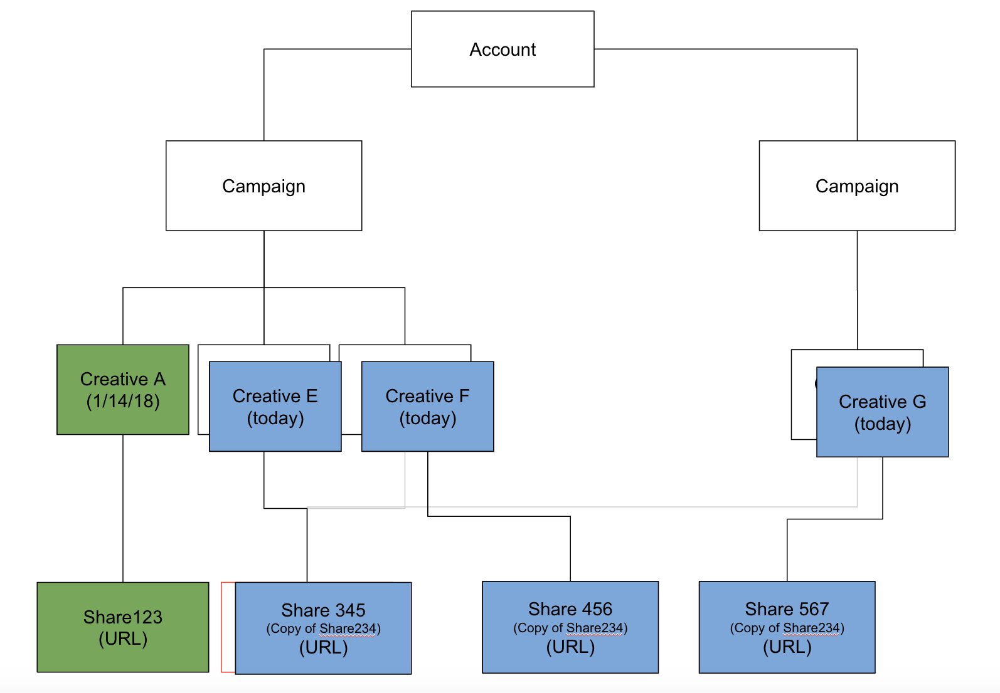
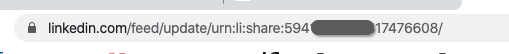

# Integrazione linkedIn {#linkedin-integration}

## Panoramica {#overview}

Il [!DNL Marketo Measure] L’integrazione con LinkedIn è composta da due parti:

Contenuto sponsorizzato: l’integrazione di Contenuto sponsorizzato consente [!DNL Marketo Measure] per assegnare tag agli URL di destinazione su [!DNL LinkedIn] annunci, che alla fine consentono [!DNL Marketo Measure] per seguire un utente attraverso l’intero percorso di punti di contatto e mappare di nuovo l’attività su [!DNL LinkedIn] Campagna e creatività. Questo fornisce informazioni ai clienti sul ROI del [!DNL LinkedIn] attività.

Lead Gen Forms: grazie all&#39;integrazione con LinkedIn Lead Gen Forms, Marketo Measure acquisisce informazioni approfondite sui moduli inviati tramite la piattaforma LinkedIn. Questi riempimenti di modulo vengono confrontati con i lead provenienti dal tuo sistema CRM o [!DNL Marketo Engage] in modo che siano idonei per l’attribuzione. Con informazioni su Campaign, Creative e Form che hanno contribuito a generare i moduli, i team possono ora ottimizzare ulteriormente le spese di marketing e pubblicitarie per LinkedIn.

## Disponibilità {#availability}

Disponibile per tutti gli utenti.

## Requisiti {#requirements}

**Ruoli di Campaign Manager**

Per [!DNL Marketo Measure] per scaricare i dati sui costi di Ads Data &amp; Ads, devi avere uno dei seguenti ruoli in Campaign Manager:

* Amministratore fatturazione
* Account Manager
* Gestione campagne

Ulteriori informazioni: [Ruoli e funzioni utente in Campaign Manager](https://www.linkedin.com/help/lms/answer/a425731/user-roles-and-functions-in-campaign-manager).

**Ruoli di amministratore media a pagamento**

Per [!DNL Marketo Measure] per poter creare/aggiornare i contenuti creati da Sponsorizzati, devi avere uno dei seguenti ruoli di amministratore di Paid Media:

* Poster contenuto sponsorizzato
* Lead Gen Forms Manager

Ulteriori informazioni: [Ruoli di amministratore pagina linkedIn](https://www.linkedin.com/help/linkedin/answer/4783/linkedin-page-admin-roles-overview).

Ci sono altri [!DNL LinkedIn] ruoli che svolgiamo **non** per la nostra integrazione. Questi ruoli vengono spesso scambiati per i ruoli richiesti, quindi tieni presente che c’è una differenza!

**Ruoli di amministratore pagina**

Per [!DNL Marketo Measure] per poter scaricare/integrare i lead dai moduli lead gen, è necessario disporre del seguente ruolo Amministratore pagina:

* Amministratore privilegiato

Ulteriori informazioni: [Ruoli di amministratore pagina linkedIn](https://www.linkedin.com/help/linkedin/answer/4783/linkedin-page-admin-roles-overview).

## Tipi di annunci linkedIn {#linkedin-ad-types}

[!DNL Marketo Measure] supporterà:

**Contenuto sponsorizzato:** I contenuti sponsorizzati consentono di distribuire contenuti al [!DNL LinkedIn] feed di membri oltre a quelli che seguono la tua azienda. I contenuti sponsorizzati possono essere indirizzati a un pubblico specifico e possono aiutare gli inserzionisti a raggiungere [!DNL LinkedIn] membri ovunque e in qualsiasi momento partecipino al programma [!DNL LinkedIn] su desktop, dispositivi mobili e tablet. Sono supportati i contenuti sponsorizzati con Lead Gen Forms.

I tipi di contenuti e formati sponsorizzati supportati da [!DNL Marketo Measure] sono annunci per immagine singola e annunci video (tramite Forms di generazione lead). A causa della complessità dello schema, non sono supportati gli annunci Carosello.

[!DNL Marketo Measure] non supporta i messaggi sponsorizzati, gli annunci di testo o gli annunci dinamici.

>[!TIP]
>
>Per qualsiasi campagna/spesa che ha origine da un&#39;origine di contenuto non sponsorizzato (ad esempio il tipo di campagna &quot;Annuncio testuale&quot; o &quot;InMail sponsorizzato&quot;), [!DNL Marketo Measure] fa _non_ supportano intrinsecamente il tracciamento di questi tipi di campagna. Se desideri tenere traccia della spesa per campagne come queste insieme alla spesa per &quot;contenuti sponsorizzati&quot;, assicurati di utilizzare il CSV della spesa di marketing per registrare manualmente tale spesa.

## Come funziona: contenuti sponsorizzati {#how-it-works-sponsored-content}

>[!NOTE]
>
>Prima del primo utilizzo, questa impostazione della funzione deve essere attivata passando a [!DNL Marketo Measure] [!UICONTROL Settings] > [!UICONTROL Integrations] > [!UICONTROL Ads] > [!UICONTROL Enable LinkedIn Lead Gen Forms].

**[!DNL LinkedIn's]Requisiti univoci di assegnazione tag automatica**

[!DNL Marketo Measure] può aiutare a tenere traccia di [!DNL LinkedIn] prestazioni della campagna assegnando tag automatici alle pagine di destinazione.

[!DNL Marketo Measure] eseguirà la ricerca di creativi con un’unica condivisione LinkedIn e aggiungerà un `?_bl={creativeId}` alla fine di esso.

**Copia delle condivisioni**

Con questo [!DNL Marketo Measure/LinkedIn] Integrazione, chiediamo ai clienti di non copiare, clonare o duplicare contenuti creativi esistenti. Se vengono trovate condivisioni che vengono rilevate per essere utilizzate solo su un elemento creativo, [!DNL Marketo Measure] può assegnare tag allo Share così com’è senza dover ricreare alcun Creatives o Shares e la cronologia di tutti gli annunci (impression, clic, condivisioni) rimarrà.

Non appena un Condivisione viene rilevato come condiviso tra più Creativi, [!DNL Marketo Measure] Per creare un set univoco, è necessario eseguire un processo di pausa, copia e riassegnazione tag. [!DNL Marketo Measure] mette in pausa e archivia i contenuti creativi in tempo reale, cancellando quindi Ad History (Storico annunci) tra cui impression, clic e condivisioni social per assegnare correttamente i tag automatici a tutto.

Progredire, [!DNL Marketo Measure] consiglia di non duplicare [!DNL LinkedIn] Condividi e mantieni tutte le creatività e le condivisioni nel modo più univoco possibile, in modo da poter semplicemente aggiungere il tracciamento senza dover cancellare la cronologia degli annunci.

**URL abbreviati**

Questo passaggio aggiuntivo è motivato dal fatto che LinkedIn consente agli URL di destinazione di essere abbreviati (bit.ly, goog.le, ecc.), il che significa che [!DNL Marketo Measure] non vede l’URL lungo e risolto e [!DNL Marketo Measure] deve aggiungere parametri di tracciamento a un URL risolto. Per ovviare a questo problema, [!DNL Marketo Measure] cerca gli URL abbreviati prima di ricreare un annuncio, espande l’URL, quindi crea il nuovo annuncio con l’URL risolto e tutti i relativi parametri, consentendo [!DNL Marketo Measure] per aggiungere tag. La creazione di un nuovo annuncio cancellerà la cronologia degli annunci (impression, clic, condivisioni), per cui è necessario disporre dell’autorizzazione per assegnare tag agli URL abbreviati.

Se utilizzi URL abbreviati in modo massiccio, questo potrebbe avere un forte impatto sui tuoi creativi. È consigliabile non utilizzare più URL abbreviati in modo che [!DNL Marketo Measure] può assegnare tag alle pagine di destinazione senza dover creare nuovi annunci e cancellare la cronologia degli annunci.

**Il processo**

Cominciamo con alcuni esempi. Supponiamo di sì....

Creativo A: Share 123\
Creative B: Share 234\
Creative C : Share 234\
Creative D : Share 234

`1)` [!DNL Marketo Measure] esaminerà innanzitutto tutte le campagne, i contenuti creativi e le condivisioni con lo stato &quot;Attivo&quot;. [!DNL Marketo Measure] non assegna tag agli annunci in pausa, archiviati o annullati. Se un annuncio è stato messo in pausa, imposta [!UICONTROL active], lo taggeremo una volta che è di nuovo attivo. Se è possibile trovare una Condivisione univoca, ovvero non utilizzata in più creative o campagne (ad esempio, Creativa A: Condivisione 123), [!DNL Marketo Measure] aggiungerà il nostro parametro personalizzato `>> ?_bl={creativeId}` all&#39;URL di condivisione.

`2)` Ora, se la Condivisione è stata condivisa e ha perso la sua unicità (ad esempio, Creativa B: Condivisione 234 e Creativa C: Condivisione 234 e Creativa D: Condivisione 234), [!DNL Marketo Measure] metterà in pausa e archivierà tutti i creativi simili (ovvero Creative B, Creative C e Creative D).

`3)` [!DNL Marketo Measure] creerà 3 nuovi contenuti creativi, Creative E, Creative F e Creative G, che copieranno il contenuto di Creative B, che viene archiviato.

`4)` [!DNL Marketo Measure] creerà anche 3 nuove condivisioni, Share 345, Share 456 e Share 567, che copia il contenuto di Share 234, tranne per il fatto che avrà un proprio `?_bl` assegnazione tag.

`5)` [!DNL Marketo Measure] dovrà verificare regolarmente che le azioni non vengano condivise; in tal caso, il processo verrà riavviato al passaggio 2 di cui sopra.

>[!NOTE]
>
>Implementando questa impostazione, i nostri clienti perderanno la cronologia degli annunci di Creative B: Share 234, Creative C: Share 234 e Creative D: Share 234 perché ora viene ricreato rispettivamente con Creative E: Share 345, Share F: Share 456 e Creative G: Share 567.

## Come Funziona: Lead Gen Forms {#how-it-works-lead-gen-forms}

**[!DNL LinkedIn's]Requisiti univoci di assegnazione tag automatica**

[!DNL Marketo Measure] può aiutare a tenere traccia di [!DNL LinkedIn] prestazioni della campagna assegnando tag automatici alle pagine di destinazione.

[!DNL Marketo Measure] eseguirà la ricerca di creativi con un’unica condivisione LinkedIn e aggiungerà un `?_bl={creativeId}` alla fine di esso.

**Il processo**

Da a [!DNL LinkedIn's] API del modulo di annunci e API di risposta del modulo di annunci, siamo in grado di raccogliere i dati di invio del modulo per un account di annuncio e associare l’indirizzo e-mail a un lead dal sistema di gestione delle relazioni con i clienti o da Marketo.

I moduli linkedIn possono contenere più indirizzi e-mail. Quando scariciamo le risposte al modulo, cercheremo gli indirizzi e-mail con la seguente priorità: E-mail aziendale, Indirizzo e-mail (campo modulo principale) o campi personalizzati con un valore e-mail valido.

Indipendentemente dallo stato della campagna o della creatività, tutte le risposte ai moduli genereranno un punto di contatto. [!DNL Marketo Measure] ha una restrizione di lookback di 90 giorni, quindi [!DNL Marketo Measure] non è in grado di accedere alle risposte del modulo più vecchie di 90 giorni, ma più a lungo [!DNL Marketo Measure] e [!DNL LinkedIn] Se l’integrazione è abilitata, più punti di contatto del modulo della generazione di lead saranno visibili tramite [!DNL Marketo Measure].

>[!NOTE]
>
>I costi di linkedIn vengono ancora scaricati come parte delle campagne di contenuti sponsorizzati.

**Tracciamento della generazione di lead in Forms in CRM o Marketo**

Prima di [!DNL Marketo Measure] E LinkedIn Lead Gen Forms Integration esisteva, era pratica comune per i clienti inviare i propri moduli a un programma Marketo e/o a una campagna CRM per monitorare i moduli e ricevere l’attribuzione a tali attività. Una volta abilitata l’impostazione Lead Gen Forms, vogliamo assicurarci che gli invii dei moduli non vengano conteggiati due volte. Verifica quanto segue:

* Il campo &quot;Abilita punti di contatto buyer&quot; nell’oggetto CRM è impostato su &quot;Nessuno&quot; o &quot;Escludi tutti i membri della campagna&quot;
* Aggiornare eventuali regole di attività del programma Marketo o Marketo correlate
* Aggiorna eventuali regole della campagna CRM correlate

>[!NOTE]
>
>L’API di LinkedIn ha un limite di lookback di 90 giorni, quindi se utilizzi le regole di Marketo o di gestione delle relazioni con i clienti, è consigliabile impostare la data di fine nella regola su 90 giorni prima della data in cui hai abilitato l’integrazione in [!DNL Marketo Measure].

## Dettagli punto di contatto {#touchpoint-details}

Una volta [!DNL Marketo Measure] ha applicato correttamente i tag alla pagina di destinazione nella pagina creativa di LinkedIn, potrai visualizzare i dati degli annunci risolti nel punto di contatto. Di seguito è riportata la mappatura dei valori di dati che si prevede di visualizzare:

<table> 
 <colgroup> 
  <col> 
  <col> 
 </colgroup> 
 <tbody> 
  <tr> 
   <th style="width:30%">Campo punto di contatto</th> 
   <th>Valore di esempio</th> 
  </tr> 
  <tr> 
   <td>ID annuncio</td>
   <td>84186224</td>
  </tr> 
  <tr> 
   <td>Contenuto annuncio</td>
   <td>copy-1-image-2-man Il 95% degli esperti di marketing #B2B considera la strategia di creazione della domanda un successo. Ulteriori informazioni: [!DNL https]://lnkd.in/jgdi50vKrgv</td>
  </tr> 
  <tr> 
   <td>ID gruppo di annunci</td>
   <td>(vuoto)</td>
  </tr> 
  <tr> 
   <td>Nome gruppo di annunci</td>
   <td>(vuoto)</td>
  </tr> 
  <tr> 
   <td>ID campagna pubblicitaria</td>
   <td>138949954</td>
  </tr> 
  <tr> 
   <td>Nome campagna pubblicitaria</td>
   <td>Account SU - COM - Abilità della domanda</td>
  </tr> 
  <tr> 
   <td>URL di destinazione dell’annuncio <b>*</b></td>
   <td>https://www.adobe.com/marketing-attribution-for-demand-generation-leaders?_bl=84186217</td> 
  </tr> 
  <tr> 
   <td>URL modulo</td> 
   <td>info.bizible.com/demo</td> 
  </tr> 
  <tr> 
   <td>URL modulo - Non elaborato</td> 
   <td>info.bizible.com/demo</td> 
  </tr> 
  <tr> 
   <td>ID parola chiave</td> 
   <td>(vuoto)</td> 
  </tr> 
  <tr> 
   <td>Tipo di corrispondenza parole chiave</td> 
   <td>(vuoto)</td> 
  </tr> 
  <tr> 
   <td>Pagina di destinazione</td> 
   <td>https://www.adobe.com/marketing-attribution-for-demand-generation-leaders</td> 
  </tr> 
  <tr> 
   <td>Pagina di destinazione - Raw</td> 
   <td>https://www.adobe.com/marketing-attribution-for-demand-generation-leaders?_bl=84186217</td> 
  </tr> 
  <tr> 
   <td>Canale di marketing</td> 
   <td>Social a pagamento</td> 
  </tr> 
  <tr> 
   <td>Canale di marketing - Percorso</td> 
   <td>Social a pagamento.LinkedIn</td> 
  </tr> 
  <tr> 
   <td>Medium</td> 
   <td>"cpc" o "Modulo generazione lead"</td> 
  </tr> 
  <tr> 
   <td>Pagina referrer</td> 
   <td>www.linkedin.com/</td> 
  </tr> 
  <tr> 
   <td>Pagina referrer - Raw</td> 
   <td>www.linkedin.com/</td> 
  </tr> 
  <tr> 
   <td>Frase di ricerca</td> 
   <td>(vuoto)</td> 
  </tr> 
  <tr> 
   <td>Tipo di punto di contatto</td> 
   <td>Modulo web</td>
  </tr> 
  <tr> 
   <td>Sorgente punto di contatto</td>
   <td>LinkedIn</td>
  </tr> 
 </tbody> 
</table>

**&#42;** _Il campo &quot;URL di destinazione dell’annuncio&quot; è compilato solo per Contenuto sponsorizzato. Non è compilata per la generazione di lead Forms._

 

## Costi {#costs}

Perché [!DNL Marketo Measure] ha un’integrazione diretta con [!DNL LinkedIn], scarichiamo la spesa registrata per ogni campagna e creatività ogni giorno. Non è necessario che un cliente presenti un rapporto su [!DNL LinkedIn] spesa entro il [!DNL Marketo Measure] applicazione.

Come per altre integrazioni di annunci, [!DNL Marketo Measure] ha definito una regola del canale di marketing per inserire tutti [!DNL LinkedIn] campagne, creativi e costi. Per utilizzare la regola, il cliente dovrà inserire una nuova riga per il pagamento [!DNL LinkedIn] degli sforzi. Può essere un canale nuovo o esistente. Nella colonna Referrer, utilizza la definizione &quot;[[!DNL LinkedIn] Paid]&quot; che [!DNL Marketo Measure] ha definito come qualsiasi punto di contatto con una [!DNL Marketo Measure] tag.

## [!DNL Marketo Measure] Scoprire {#marketo-measure-discover}

Sono stati apportati alcuni miglioramenti a [!DNL Marketo Measure] Scopri come supportare la generazione di rapporti per Forms di livello lead.

**Bacheca supporti a pagamento**

Titolo Forms di generazione lead: nuova tessera che include il numero di riempimenti del modulo LinkedIn. Il drill-through di questo conteggio visualizzerà l’ID attività, la data del modulo, il nome del modulo e l’indirizzo e-mail.

**Scheda percorso di coinvolgimento**

Percorso di eventi: include il tipo di evento &quot;Attività&quot; e il supporto &quot;Modulo generazione lead&quot; per i moduli che passano attraverso l’integrazione. La visualizzazione drill-through include i dettagli relativi a campagne, contenuti creativi e moduli.

## Domande frequenti sui contenuti sponsorizzati {#sponsored-content-faq}

**Che cos&#39;è una Condivisione scura?**

Una dark share è un post in cui non viene mai pubblicato sulla pagina dell&#39;azienda e viene immediatamente creato e aggiunto direttamente come creativo. In modo che [!DNL Marketo Measure]I Creativi creati non vengono visualizzati nella parte superiore della pagina di un&#39;azienda e vengono nuovamente promossi; le condivisioni scure vengono utilizzate in modo che possa essere lanciato dietro le quinte.

**Funzionamento degli stati [!DNL Marketo Measure] davvero un tag?**

Ci sono quattro stati diversi su una [!DNL LinkedIn] Campagna e creatività: attiva, in pausa, archiviata e annullata. Eseguiamo il tag solo per le campagne e le creatività attive. Se si assegnano tag ad altri stati, questi verranno impostati nuovamente su Attivo. [!DNL Marketo Measure] non assegnerà tag alle campagne o alle creatività in pausa, archiviate o annullate, ma riprenderà l’assegnazione tag se lo stato diventa Attivo.

**Qual è il valore [!DNL Marketo Measure] sta utilizzando per assegnare tag?**

Alla fine dell’URL di destinazione, [!DNL Marketo Measure] sta aggiungendo il parametro `&_bl={creativeId}`, in cui `{creativeId}` è l&#39;ID creativo di LinkedIn. Con il Creative Id, [!DNL Marketo Measure] può anche determinare l’ID campagna da [!DNL LinkedIn] dispone di una struttura di annunci piuttosto semplice, in quanto ogni elemento creativo può appartenere a una sola campagna.

**Cosa succede una volta al mio vecchio stile creativo? [!DNL Marketo Measure] crea una nuova versione?**

Quando [!DNL Marketo Measure] ricrea un oggetto Share e lo inserisce in un nuovo oggetto Creative, il vecchio oggetto Creative viene archiviato. Anche per questo [!DNL Marketo Measure] non assegnerà tag alle campagne o alle creatività archiviate, altrimenti si ripeterà il ciclo con [!DNL Marketo Measure] cercando di assegnare i tag a tempo indefinito.

**Perché l’URL di destinazione dell’annuncio creato non corrisponde a quello originale?**

[!DNL Marketo Measure] deve aggiungere i parametri di tracciamento a un URL risolto, ma l’URL presentato nell’API può potenzialmente essere un URL abbreviato senza tutti i parametri presenti. Per ovviare a questo problema, [!DNL Marketo Measure] cerca gli URL abbreviati prima di ricreare un’aggiunta, la risolve, quindi crea il nuovo annuncio con l’URL risolto e tutti i relativi parametri, consentendo [!DNL Marketo Measure] per aggiungere tag.

**Assegna tag a tutti i miei annunci? Il parametro bl non viene visualizzato in tutte le pagine di destinazione?**

Abbiamo osservato che alcuni esperti di marketing inseriranno un collegamento immagine nell’URL di destinazione, che [!DNL Marketo Measure] non è possibile assegnare tag, quindi cerchiamo l’URL all’interno del contenuto dell’annuncio. Se [!DNL Marketo Measure] dispone delle autorizzazioni per assegnare tag agli URL abbreviati, espanderemo l’URL e il tag che, ma a causa della struttura di copia di LinkedIn, si riduce automaticamente all’interno del testo. Il tag si troverà nell’URL abbreviato di LinkedIn, che verrà visualizzato nel campo Ad Content (Contenuto annuncio) del punto di contatto anziché nel campo Landing Page - Raw (Pagina di destinazione - Non elaborato).

**Oh no, qualcuno della mia squadra ha clonato accidentalmente una condivisione. Posso metterla in pausa?**

Nessun problema. [!DNL Marketo Measure] verifica a livello di programmazione la presenza di condivisioni non più univoche, ovvero che sono state successivamente copiate in un Creative diverso. Una volta individuata la copia, [!DNL Marketo Measure] seguirà il flusso abituale per assegnare tag e creare nuovi annunci.

**Il mio annuncio era in attesa di revisione prima. Perché è di nuovo in corso di revisione dopo [!DNL Marketo Measure] l&#39;hai taggato?**

LinkedIn richiede che tutti gli annunci creati o modificati vengano sottoposti al normale processo di sicurezza prima della pubblicazione. [!DNL Marketo Measure] tenta di intercettare l’annuncio il più rapidamente possibile, eseguendo la scansione per nuovi annunci ogni 6 ore, ma con [!DNL LinkedIn's] inoltre, può ritardare il lancio di alcune ore.

**Ci sono 2 URL nel mio annuncio. A quale attività vengono assegnati i tag?**

Entrambi. Il [!DNL Marketo Measure] L’integrazione di consente di assegnare un tag all’URL di destinazione dall’immagine click-through nell’annuncio, ma aggiorna anche automaticamente l’URL abbreviato nella descrizione dell’annuncio.

**Ho connesso il mio [!DNL LinkedIn ads] account. Perché non lo è [!DNL Marketo Measure] assegnare tag ai collegamenti?**

La connessione [!DNL LinkedIn] l’utente deve disporre dell’accesso corretto per le modifiche, il che significa che deve essere un Account Manager, Campaign Manager o Creative Manager.

**Come posso sapere se la mia creatività verrà copiata? Posso vedere se i miei creativi usano la stessa condivisione?**

L&#39;ID di condivisione non è specificato in un [!DNL LinkedIn] quindi non esiste un modo chiaro e ovvio per verificare la presenza di mappature &quot;da creatività a condivisione&quot;. Se sospetti che un contenuto creativo possa essere una copia, puoi controllare manualmente aprendo l’annuncio dall’interno di [!DNL LinkedIn] Gestione campagne: l’annuncio verrà aperto in una nuova scheda e nell’URL troverai l’ID di condivisione.

## Domande frequenti su Forms della generazione lead {#lead-gen-forms-faq}

**Qual è il costo di questo miglioramento?**

Questa offerta è inclusa in qualsiasi [!DNL Marketo Measure] abbonamento.

**L&#39;integrazione è retroattiva?**

Sì, scaricheremo le risposte storiche ai moduli pubblicitari da LinkedIn, anche se siamo limitati all’intervallo di lookback di 90 giorni. Più a lungo il [!DNL Marketo Measure] e l’integrazione con LinkedIn è abilitata, più punti di contatto del modulo della generazione di lead saranno visibili tramite [!DNL Marketo Measure].

Non è possibile impostare una data specifica per il download, ma è possibile impostare facoltativamente le regole di eliminazione dei punti di contatto se sono presenti punti di contatto da eliminare.

**Questa opzione verrà attivata automaticamente se si utilizza già [!DNL Marketo Measure] Integrazione di linkedIn ad?**

No, non inizieremo automaticamente a scaricarlo per tutti i clienti, ma è un passaggio molto semplice per abilitare questa funzione nelle impostazioni.

**I dati del modulo sono disponibili?**

I dati del modulo sono disponibili tramite [!DNL Marketo Measure] Scopri come includere ID modulo e nome modulo. I dettagli del modulo non sono ancora disponibili sugli oggetti punto di contatto nel sistema di gestione delle relazioni con i clienti.

**Cosa succede a qualsiasi [!DNL LinkedIn] lead che sono stati precedentemente sincronizzati con programmi Marketo o campagne CRM?**

Si consiglia di regolare qualsiasi [!DNL Marketo Measure] regole per generare punti di contatto da tali programmi o campagne specifici al fine di evitare duplicazioni. L’API di LinkedIn ha un limite di lookback di 90 giorni, quindi se utilizzi le regole di Marketo o di gestione delle relazioni con i clienti, è consigliabile impostare la data di fine nella regola su 90 giorni prima della data in cui hai abilitato l’integrazione in [!DNL Marketo Measure]. Da questo punto in poi, [!DNL Marketo Measure] Puoi scaricare questi lead per te con informazioni approfondite e dettagli.

**È coinvolto l’assegnazione di tag automatici o il tracciamento?**

No, è diverso dagli altri [!DNL Marketo Measure] integrazioni. Invece di modificare la pagina di destinazione (poiché non vi è alcun click-through nella pagina di destinazione), stiamo solo scaricando le informazioni rilevanti da LinkedIn e trattandole come attività in [!DNL Marketo Measure].
