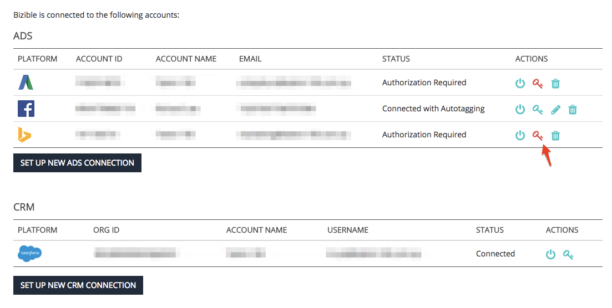

# Autorizzazione di nuovo account collegati {#reauthorizing-connected-accounts}

Quando un account viene disconnesso dall&#39;account [!DNL Marketo Measure], lo stato della piattaforma cambia in &quot;Autorizzazione richiesta&quot; e viene visualizzata un&#39;icona a forma di chiave rossa.

Se la piattaforma pubblicitaria viene disconnessa, [!DNL Marketo Measure] non sarà in grado di scaricare i dati sui costi o, se è abilitata l&#39;assegnazione automatica dei tag, aggiungere i parametri UTM [!DNL Marketo Measure] agli annunci appena creati. [!DNL Marketo Measure] non potrà aggiungere retroattivamente i parametri UTM ai punti di contatto creati dalla piattaforma pubblicitaria mentre l&#39;account è stato disconnesso.

Se la piattaforma CRM viene disconnessa, [!DNL Marketo Measure] non sarà in grado di aggiornare i dati di [!DNL Marketo Measure] né di inviare nuovi punti di contatto all&#39;organizzazione. Una volta ristabilita la connessione CRM, [!DNL Marketo Measure] invierà tutti i dati mancanti durante la disconnessione dell&#39;account.

## Autorizzazione di nuovo account disconnessi {#re-authorizing-disconnected-accounts}

1. Vai a [experience.adobe.com/marketo-measure](https://experience.adobe.com/marketo-measure){target="_blank"} e accedi.
1. Seleziona **[!UICONTROL Settings]** nella scheda [!UICONTROL My Account] nell&#39;angolo in alto a sinistra.
1. Trovare la sezione Integrazioni a sinistra e fare clic su **[!UICONTROL Connections]**.
1. Selezionare il simbolo del tasto rosso accanto all&#39;account da riconnettere.
1. Viene visualizzata una finestra pop-up in cui viene richiesto di fornire i dettagli di accesso per l&#39;account.
