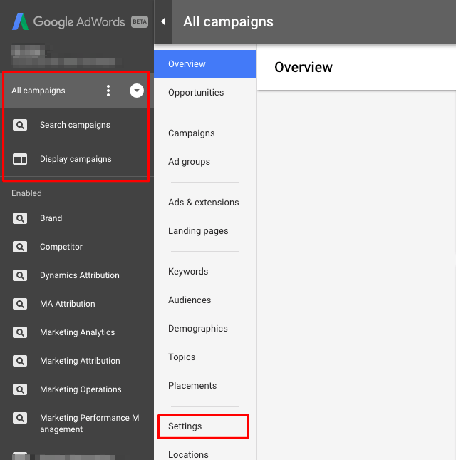

# Informazioni sull&#39;assegnazione tag di [!DNL Marketo Measure] AdWords {#understanding-marketo-measure-adwords-tagging}

Per tenere traccia degli annunci a un livello molto granulare, gli URL di destinazione dell’annuncio devono essere univoci. A questo scopo, l&#39;assegnazione automatica dei tag [!DNL Marketo Measure] aggiunge automaticamente i parametri di tracciamento agli URL di destinazione dell&#39;annuncio degli annunci [!DNL AdWords]. Vediamo un esempio qui sotto.

Il seguente URL non fornirà dati granulari:

* `http://example.com/landing-page?myParam=foo`

Tuttavia, lo stesso URL fornirà dati granulari a causa dei parametri [!DNL Marketo Measure]:

* `http://example.com/landing-page?myParam=foo&_bt={creative}&_bk={keyword}&_bm={matchtype}&_bn={network}&_bg={adgroupid}`

## Funzionamento dell&#39;assegnazione tag automatica a [!DNL Marketo Measure] {#how-marketo-measure-auto-tagging-works}

**Se [!DNL Marketo Measure] trova un modello di tracciamento:**

* [!DNL Marketo Measure] aggiungerà i relativi parametri al modello di tracciamento.
* Se viene trovato un reindirizzamento di terze parti in un modello di tracciamento come Kenshoo o Marin, [!DNL Marketo Measure] non intraprenderà alcuna azione. Devi invece [aggiungere [!DNL Marketo Measure] parametri allo strumento di terze parti nel tuo account](/help/api-connections/utilizing-marketo-measures-api-connections/how-bid-management-tools-affect-marketo-measure.md){target="_blank"}.

Tuttavia, se non viene trovato alcun modello di tracciamento, [!DNL Marketo Measure]:

* Analizza tutti gli URL di destinazione dell&#39;annuncio per i nostri parametri [!DNL Marketo Measure].
* Se ti trovo, sei a posto.
* Se non viene trovato, [!DNL Marketo Measure] aggiungerà i parametri alla fine degli URL di destinazione dell&#39;annuncio. Per i nuovi annunci, [!DNL Marketo Measure] aggiungerà i suoi parametri all&#39;URL di destinazione dell&#39;annuncio entro due ore dalla creazione.
* È importante disporre di un modello di tracciamento prima di abilitare l&#39;assegnazione tag automatica in modo che [!DNL Marketo Measure] possa allegarsi al modello e impedire la reimpostazione della cronologia degli annunci.

[!DNL Marketo Measure] consiglia di utilizzare un modello di tracciamento a livello di account, campagna o gruppo di annunci, in quanto consente di aggiungere e sottrarre parametri per tutti gli annunci senza il rischio di interruzioni o eliminazioni della cronologia degli annunci.

## Modelli di tracciamento {#tracking-templates}

Come spiegato da [!DNL Google AdWords], un modello di tracciamento è l&#39;URL utilizzato per raggiungere una pagina di destinazione. Le informazioni di tracciamento raccolte vengono utilizzate per comprendere il traffico dell’annuncio. [Fare clic qui](https://support.google.com/adwords/answer/7197008?hl=en){target="_blank"} per ulteriori informazioni da Google.

[!DNL Marketo Measure] consiglia di utilizzare un modello di tracciamento a livello di account, campagna o gruppo di annunci, in quanto consente di aggiungere e sottrarre parametri per tutti gli annunci senza il rischio di interruzioni o eliminazioni della cronologia degli annunci.

Esistono due modelli di tracciamento [!DNL Marketo Measure] che si consiglia di utilizzare. Utilizza quanto segue per determinare quale versione è appropriata per te:

* Se tutti gli URL dell’annuncio hanno un &quot;?&quot; in essi, utilizza questo URL:

`{lpurl}&_bt={creative}&_bk={keyword}&_bm={matchtype}&_bn={network}&_bg={adgroupid}`

* Se nessuno degli URL dell’annuncio ha un &quot;?&quot; in essi, utilizza questo URL:

`{lpurl}?_bt={creative}&_bk={keyword}&_bm={matchtype}&_bn={network}&_bg={adgroupid}`

## Impostazione di un modello di verifica a livello di conto {#setting-up-a-tracking-template-at-the-account-level}

1. Accedi al tuo account [!DNL Google AdWords].

1. Fare clic su **[!UICONTROL All campaigns]** e quindi su **[!UICONTROL Settings]** nella finestra di espansione.

   

1. Fai clic su **[!UICONTROL Account Settings]** in alto, quindi su **[!UICONTROL Tracking Template]**. Immetti il modello di tracciamento [!DNL Marketo Measure].

   

1. Fai clic su **[!UICONTROL Save]**.

## Impostazione di un modello di tracciamento a livello di campagna {#setting-up-a-tracking-template-at-the-campaign-level}

1. Fare clic su **[!UICONTROL All campaigns]** e quindi su **[!UICONTROL Campaigns]** nella finestra di espansione.

   

1. Selezionare tutte le campagne applicabili o **[!UICONTROL Select All]**, fare clic su **[!UICONTROL Edit]** e quindi su **[!UICONTROL Change Tracking Templates]**.

   

1. Immettere il modello di verifica [!DNL Marketo Measure] e fare clic su **[!UICONTROL Apply]**.

## Impostazione di un modello di tracciamento a livello di gruppo di annunci: {#setting-up-a-tracking-template-at-the-ad-group-level}

1. Fare clic su **[!UICONTROL All campaigns]** e quindi su **[!UICONTROL Ad Groups]** nella finestra di espansione.

   

1. Selezionare tutti i gruppi di annunci applicabili o Seleziona tutto, fare clic su **[!UICONTROL Edit]** e quindi su **[!UICONTROL Change Tracking Templates]**.

1. Immettere il modello di verifica [!DNL Marketo Measure] e fare clic su **[!UICONTROL Apply]**.

   

## Domande frequenti {#faq}

**D: di quali autorizzazioni ha bisogno l&#39;utente connesso?**

R: userinfo.email

**Q: quanto tempo è necessario per importare i dati di spesa?**

R: 6 ore

**D: quanto tempo ci vuole per importare i dati degli annunci?**

R: 4 ore

**Q: per gli annunci di ricerca dinamica, è possibile tenere traccia della combinazione di titolo, descrizione e così via nella creatività distribuita?**

R: Non è possibile recuperare singoli dettagli creativi per gli annunci di ricerca dinamica, ma se è abilitato il tag automatico possiamo comunque ottenere l’ID creativo e i ricavi degli attributi.

>[!NOTE]
>
>Dopo aver apportato le modifiche, l’operazione è completata. Puoi rivolgerti al [Supporto Marketo](https://nation.marketo.com/t5/support/ct-p/Support){target="_blank"} in caso di domande durante l&#39;installazione.

[Fare clic qui](https://support.google.com/adwords/answer/6076199?hl=en#tracking){target="_blank"} per istruzioni da Google sulla creazione di modelli di verifica a livello di account.
