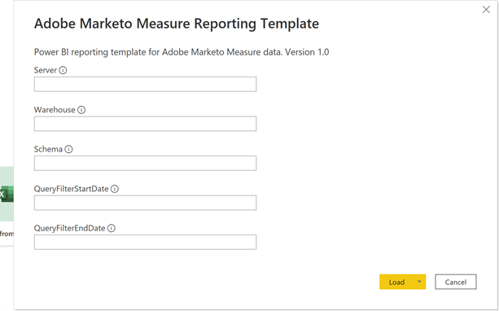
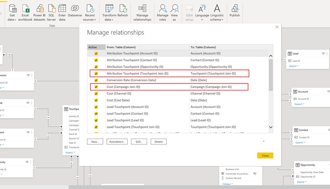
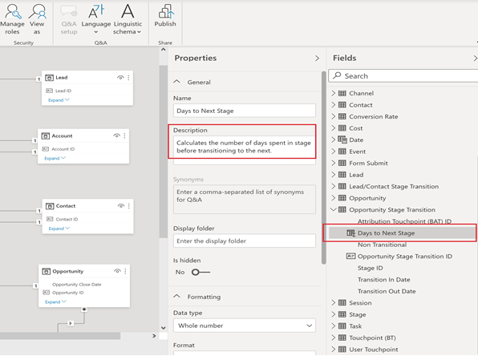

# [!DNL Marketo Measure] Modello di rapporto - Power BI {#marketo-measure-report-template-power-bi}

## Introduzione {#getting-started}

Puoi accedere al modello di rapporto Power BI [qui](https://github.com/adobe/Marketo-Measure-BI-Templates){target="_blank"}.

Apri l’Adobe [!DNL Marketo Measure] File di Power BI del modello di reporting.

Puoi trovare le informazioni specifiche su Server, Warehouse e Schema nella sezione [!DNL Marketo Measure] Interfaccia utente [!DNL Data Warehouse] pagina delle informazioni. Le istruzioni su come individuare questa pagina sono dettagliate [qui](/help/marketo-measure-data-warehouse/data-warehouse-access-reader-account.md){target="_blank"}.

I parametri QueryFilterStartDate e QueryFilterEndDate vengono utilizzati per limitare la quantità di dati importati. Questi parametri devono essere in formato SQL così come vengono utilizzati nelle query inviate a [!DNL Snowflake]. Ad esempio, se si desidera limitare i dati agli ultimi due anni, QueryFilterStartDate sarà aggiunta alla data (anno,-2,current_date()). Questi parametri vengono confrontati con i tipi di dati datetime, pertanto si consiglia di utilizzare la data add (day,1,current_date()) per consentire a QueryFilterEndDate di restituire tutti i dati all&#39;ora corrente.

## Connessione dati {#data-connection}

I parametri immessi all&#39;apertura del file vengono utilizzati per strutturare le query native che importano tabelle dal data warehouse. Sarà comunque necessario impostare una connessione dati al [!DNL Snowflake] istanza. A questo scopo, sono necessari gli stessi nomi server e warehouse insieme al nome utente e alla password. I dettagli su dove trovare il nome utente e reimpostare la password, se necessario, sono documentati [qui](/help/marketo-measure-data-warehouse/data-warehouse-access-reader-account.md){target="_blank"}.

## Importazione dati {#data-import}

Per migliorare le prestazioni del report e sfruttare le funzionalità di trasformazione di Power Query, abbiamo scelto di impostare questo modello utilizzando il metodo di archiviazione delle importazioni.

### Parametri query {#query-parameters}

Per limitare i dati importati nel modello, ogni tabella viene impostata utilizzando una query nativa come origine. Le query native richiedono l’approvazione per essere eseguite, è necessario fare clic su esegui per ogni query. Questo passaggio è necessario solo la prima volta che le query vengono eseguite o se i parametri cambiano.

Tutte le query escludono le righe eliminate e [!UICONTROL facts] le tabelle sono impostate per filtrare le righe con una data di modifica compresa tra le date di inizio e di fine immesse come parametri.

>[!NOTE]
>
>Poiché i filtri data vengono applicati alla data di modifica di una riga, presta attenzione quando esegui il reporting sulle date che non rientrano nell’intervallo di date ristretto. Ad esempio, l’intervallo di date modificato è limitato agli ultimi due anni. Questo può includere un evento con una data di evento di tre anni fa, ma che è stato modificato di recente. Tuttavia, la generazione di rapporti sugli eventi di tre anni fa restituirà risultati incompleti, in quanto non tutte le righe saranno state modificate entro l’intervallo di tempo di due anni.

le tabelle seguenti sono considerate tabelle dei fatti; a queste query sono stati aggiunti i limiti di data alla data modificata.

* Attività
* Punto di contatto
* Punto di contatto lead
* Punto di contatto attribuzione
* Costo
* Modulo del sito
* Sessione
* Membro della campagna
* Attività
* Evento
* Transizione fase lead/contatto
* Transizione fase opportunità

le tabelle seguenti sono trattate come tabelle di dimensioni; per queste query non sono impostati limiti di data.

* Account
* Campaign
* Contatto
* Tasso di conversione
* Opportunità
* Lead
* Fase
* Canale

## Trasformazioni dei dati {#data-transformations}

Sono state applicate alcune trasformazioni ai dati in Power Query. Per visualizzare le trasformazioni specifiche per qualsiasi tabella, aprire Power Query, passare a una tabella e annotare i passi applicati sul lato sinistro della finestra. Di seguito sono descritte alcune delle trasformazioni specifiche.

### Colonne rimosse {#removed-columns}

Per semplificare il modello dati e rimuovere i dati ridondanti e non necessari, abbiamo ridotto il numero di colonne importate in Power BI dall&#39;originale [!DNL Snowflake] tabella. Le colonne rimosse includono chiavi esterne non necessarie, dati dimensionali denormalizzati più sfruttati tramite relazioni con altre tabelle del modello, colonne di controllo e campi utilizzati per le tabelle interne [!DNL Marketo Measure] elaborazione. È possibile aggiungere o rimuovere le colonne in base alle esigenze aziendali. Passa al passaggio &quot;Altre colonne rimosse&quot; dopo il passaggio &quot;Origine&quot; in una tabella, fai clic sull’icona a forma di ingranaggio e aggiorna le colonne selezionate nell’elenco fornito.

>[!NOTE]
>
>* Presta attenzione quando aggiungi ulteriori valori di chiave esterna. Power BI è spesso impostato per rilevare automaticamente le relazioni nel modello e l&#39;aggiunta di valori di chiave esterna può causare collegamenti indesiderati tra tabelle e/o la disabilitazione delle relazioni esistenti.
>
>* La maggior parte delle tabelle [!DNL Marketo Measure] data warehouse contiene dati dimensionali denormalizzati. Abbiamo lavorato per normalizzare e ripulire il modello in Power BI il più possibile per migliorare le prestazioni e l&#39;accuratezza dei dati. Fai attenzione quando includi ulteriori campi denormalizzati nelle tabelle dei fatti, questo può interrompere il filtraggio dimensionale tra le tabelle e potrebbe anche causare una segnalazione imprecisa.

### Colonne rinominate {#renamed-columns}

Le tabelle e le colonne sono state rinominate per renderle più facili da usare e per standardizzare le convenzioni di denominazione. Per visualizzare le modifiche al nome della colonna, passa al passaggio &quot;Rinomina colonne&quot; dopo il passaggio &quot;Altre colonne rimosse&quot; in qualsiasi tabella.

### Segmenti rinominati {#renamed-segments}

Poiché i nomi dei segmenti sono personalizzabili, hanno nomi di colonna generici nel data warehouse di Snowflake. [!DNL BIZ_SEGMENT_NAMES] è una tabella di mappatura che elenca il nome generico del segmento e il nome del segmento personalizzato mappato, definito nella sezione del segmento nel [!DNL Marketo Measure] Interfaccia utente. La tabella Nome segmento viene utilizzata per rinominare le colonne dei segmenti nelle tabelle Punto di contatto lead e Punto di contatto attribuzione. Se non esiste alcun segmento personalizzato, il nome del segmento generico rimane.

### Conversione ID con distinzione tra maiuscole e minuscole {#case-sensitive-id-conversion}

[!DNL Marketo Measure] nei dati sono presenti due tabelle in cui i valori della chiave primaria (ID) fanno distinzione tra maiuscole e minuscole, ovvero Punto di contatto e Campagna. Il motore dati che guida il livello di modeling Power BI non distingue tra maiuscole e minuscole, producendo quindi valori id &quot;duplicati&quot;. Per preservare la distinzione tra maiuscole e minuscole di questi valori chiave, abbiamo implementato passaggi di trasformazione che associano caratteri invisibili ai caratteri minuscoli, conservando l’univocità dell’ID quando valutato nel livello del motore di dati. Maggiori dettagli sul problema e i passaggi dettagliati sul metodo che abbiamo impiegato sono disponibili [qui] (https://blog.crossjoin.co.uk/2019){target="_blank"}. Questi valori ID sensibili all&#39;uso di maiuscole e minuscole sono etichettati come &quot;Join IDs&quot; e vengono utilizzati come chiavi di unione nel livello di relazione. Abbiamo nascosto gli ID di unione dal livello di reporting, mantenendo visibili i valori ID originali da utilizzare nei rapporti, poiché i caratteri invisibili possono interferire con le funzioni Taglia/Incolla e il filtro.

### Righe aggiunte {#rows-added}

Per aggiungere funzionalità di conversione della valuta ai calcoli nel modello, abbiamo aggiunto una colonna del tasso di conversione aziendale sia alle tabelle Opportunità che Costo. Il valore in questa colonna viene aggiunto a livello di riga e viene valutato unendosi alla tabella Tasso di conversione sia in data che in valuta ID. Per ulteriori dettagli sul funzionamento della conversione di valuta in questo modello, consulta la sezione [Conversione valuta](#currency-conversion) in questa documentazione.

Tabella del tasso di conversione memorizzata in [!DNL Snowflake] contiene un intervallo di date per ogni conversione. Power BI non consente criteri di join su un calcolo (ovvero tra un intervallo di date). Per aggiungere una data, abbiamo aggiunto dei passaggi alla tabella Tasso di conversione per espandere le righe in modo che ci sia una riga per ogni data nell’intervallo di date di conversione.

## Modello dati {#data-model}

Fai clic sull’immagine seguente per la versione a dimensione intera.

{target="_blank"}

### Relazioni e flusso di dati {#relationships-and-data-flow}

I dati evento, utilizzati per creare punti di contatto, sono memorizzati nella variabile [!UICONTROL Session], [!UICONTROL Task], [!UICONTROL Event], [!UICONTROL Activity], e tabelle dei membri della campagna. Queste tabelle di eventi si uniscono alla tabella dei punti di contatto tramite i rispettivi ID e, se l’evento ha generato un punto di contatto, i dettagli vengono memorizzati nella tabella dei punti di contatto.

I punti di contatto lead e i punti di contatto di attribuzione sono memorizzati nelle rispettive tabelle, con un collegamento alla tabella dei punti di contatto. La maggior parte dei dati dimensionali per i punti di contatto lead e di attribuzione proviene dal relativo collegamento al punto di contatto corrispondente.

In questo modello, le dimensioni Campagna e Canale sono collegate al punto di contatto, pertanto tutti i rapporti su queste dimensioni passano attraverso questo collegamento e indicano che i rapporti dimensionali sui dati dell’evento possono essere incompleti. Questo perché molti eventi non hanno collegamenti a queste dimensioni finché non vengono elaborati in punti di contatto. Nota: alcuni eventi, come Sessions, dispongono di collegamenti diretti alle dimensioni Campaign e Channel. Se desideri generare rapporti a livello di sessione su queste dimensioni, è consigliabile creare a questo scopo un modello dati separato.

I dati dei costi vengono memorizzati a diversi livelli di aggregazione all&#39;interno dell&#39;area [!DNL Snowflake] tabella dei costi di data warehouse. Per tutti i provider di annunci, i dati a livello di campagna possono essere aggregati a livello di canale. Per questo motivo, questo modello richiama i dati dei costi in base al flag &quot;campaign_is_aggregatable_cost&quot;. I costi segnalati autonomamente possono essere inviati solo a livello di canale e non devono disporre di dati di Campaign. Per fornire il reporting dei costi più accurato possibile, i costi autosegnalati vengono richiamati in base al flag &quot;channel_is_aggregatable_cost&quot;. La query che importa i dati dei costi viene scritta con la logica seguente: Se ad_provider = &quot;SelfReported&quot;, channel_is_aggregatable_cost = true, else campaign_is_aggregatable_cost = true.

I dati dei costi e i dati dei punti di contatto hanno alcune dimensioni comuni, pertanto entrambe le tabelle dei fatti hanno relazioni con le tabelle delle dimensioni Campaign e Channel.

Nel contesto di tale modello, [!UICONTROL Lead], [!UICONTROL Contact], [!UICONTROL Account]e [!UICONTROL Opportunity] i dati vengono considerati come dati dimensionali e uniti direttamente al [!UICONTROL Lead] punto di contatto e [!UICONTROL Attribution] Tabelle a punti di contatto.

### Tabelle aggiunte {#added-tables}

**Data**

Poiché Power BI consente solo le relazioni tra tabelle in una colonna, è stata aggiunta una tabella della dimensione Data per facilitare il join necessario tra le tabelle contenenti gli importi (Opportunità e Costo) e la tabella del tasso di conversione. Per ulteriori informazioni sul calcolo delle conversioni di valuta in questo modello, consulta la sezione Conversione di valuta .

**Misure**

Tutte le misure sono state aggiunte a una tabella specifica sulle misure. Non è collegato al modello, ma funge da unico punto in cui memorizzare tutte le misure, per facilità d&#39;uso.

**Modello di attribuzione**

È stata aggiunta una tabella separata per memorizzare i nomi dei modelli di attribuzione. Questa tabella viene utilizzata per creare filtri che consentono all’utente di passare da un modello di attribuzione all’altro per il calcolo dei ricavi attribuiti.

### Conversione valuta {#currency-conversion}

I tassi nella tabella Tasso di conversione rappresentano il valore necessario per convertire un importo dalla valuta aziendale. Le conversioni in qualsiasi valuta richiedono una conversione doppia, prima dalla valuta originale alla valuta aziendale, e poi dalla valuta aziendale alla valuta selezionata. Il primo passo di questa catena nel modello è l&#39;aggiunta di una colonna con il tasso di conversione alle tabelle con importi, opportunità e costo. Questi passaggi sono descritti in dettaglio nell’intestazione Righe aggiunte della sezione Trasformazioni dati di questo documento. La conversione dalla valuta originale alla valuta societaria consiste nel dividere il valore per questa colonna aggiunta. Il passaggio successivo consiste nel moltiplicare il valore della valuta aziendale per il tasso nella tabella Tasso di conversione che corrisponde alla valuta selezionata.

* Converti il valore originale in valore di valuta aziendale / tasso di conversione aziendale = valore in valuta aziendale
* Converti il valore da valuta aziendale a quello selezionato in valuta aziendale `*` tasso di conversione della valuta selezionata = valore nella valuta selezionata

Poiché i tassi di conversione non devono essere statici e possono variare in base a intervalli di date specificati, tutti i calcoli di conversione della valuta devono essere eseguiti a livello di riga. Anche in questo caso, poiché i tassi di conversione si riferiscono a un intervallo di date specifico, il calcolo della ricerca deve essere eseguito all&#39;interno del DAX della misura, in modo che la relazione possa essere definita sia sul codice della valuta che sulla data.

Le misure di conversione della valuta in questo modello sostituiscono un valore di 1,0 per il tasso se non è possibile identificare alcun tasso di conversione. Sono state create misure separate per visualizzare il valore della valuta per la misura e viene visualizzato un avviso se un calcolo include più di un valore della valuta (ovvero, non è possibile convertire un valore nella valuta selezionata).

## Definizioni dei dati {#data-definitions}

Sono state aggiunte definizioni al modello Power BI per tabelle, colonne personalizzate e misure.

Per visualizzare le definizioni delle colonne provenienti direttamente da [!DNL Snowflake], vedi [documentazione di data warehouse](/help/marketo-measure-data-warehouse/data-warehouse-schema.md){target="_blank"}

## Discrepanze tra modelli e individuazione {#discrepancies-between-templates-and-discover}

### Entrate attribuite {#attributed-revenue}

I punti di contatto lead e i punti di contatto di attribuzione ereditano i dati dimensionali dal punto di contatto originale. Il modello di reporting esegue l&#39;origine di tutti i dati dimensionali ereditati dalla relazione con punto di contatto, mentre nel modello Discover i dati dimensionali vengono denormalizzati nei record Lead e Attribution punto di contatto. I ricavi totali attribuiti o i valori delle entrate provenienti dalla pipeline dovrebbero essere allineati tra le due relazioni. Tuttavia, è possibile osservare discrepanze quando i ricavi vengono suddivisi o filtrati per dati dimensionali (canale, canale secondario o campagna). Se gli importi dei ricavi dimensionali non corrispondono tra il modello e Discover, è probabile che nel set di dati del rapporto modello non siano presenti record dei punti di contatto. Questo accade quando è presente un record Punto di contatto lead o di attribuzione, ma non un record corrispondente nella tabella Punto di contatto all’interno del set di dati importato nel rapporto. Poiché queste tabelle vengono filtrate per data di modifica, è possibile che il record Punto di contatto lead/attribuzione sia stato modificato più di recente rispetto al record Punto di contatto, e quindi che il punto di contatto lead/attribuzione sia stato importato nel set di dati mentre il record del punto di contatto originale non lo era. Per risolvere il problema, allarga l’intervallo di date filtrato per la tabella Punto di contatto oppure considera la possibilità di rimuovere il vincolo di data tutti insieme. Nota: Il punto di contatto è una tabella di grandi dimensioni, quindi considera gli scambi di un set di dati più completo rispetto alla quantità di dati da importare.

### Costo {#cost}

La generazione di rapporti sui costi nei modelli è disponibile solo a livello di campagna e di canale, tuttavia, Scopri le offerte che segnalano a livelli più bassi di granularità per alcuni fornitori di annunci (ad esempio, creativi, parole chiave, gruppi di annunci, ecc.). Per ulteriori informazioni sulla modellazione dei dati dei costi nei modelli, consulta la sezione Modello dati di questa documentazione. Se la dimensione viene filtrata in [!UICONTROL Discover] è impostato su canale o campagna, i costi a livello di canale, canale secondario e campagna devono essere allineati tra Discover e i modelli di report.

### RITORNO SULL&#39;INVESTIMENTO {#roi}

Poiché il ROI è calcolato a partire da Ricavi e costi attribuiti, le stesse discrepanze che potrebbero sorgere in uno di questi calcoli possono sorgere nel ROI e per gli stessi motivi, come indicato in tali sezioni.

### Punti di contatto {#touchpoints}

Queste metriche, come mostrato nei modelli di reporting, non si riflettono in Discover. Attualmente non è possibile effettuare un confronto diretto tra i due.

### Traffico web {#web-traffic}

Il modello di dati del modello di reporting normalizza i dati dimensionali di canale, canale secondario e campagna tramite la relazione tra Sessione e punto di contatto. Questo è diverso dal modello dati Discover, che denormalizza queste dimensioni in Session. A causa di questa distinzione, i conteggi totali per visite e visitatori devono corrispondere tra Discover e il modello di reporting, tuttavia, una volta visualizzati o filtrati per dimensione, questi numeri non devono allinearsi. Questo perché i dati dimensionali nel modello sono disponibili solo per gli eventi web che hanno generato un punto di contatto (cioè eventi non anonimi). Per maggiori dettagli, fai riferimento al [Modello dati](#data-model) di questa documentazione.

Possono esserci piccole discrepanze nei conteggi totali dei moduli del sito tra [!DNL Discover] e il modello. Questo perché il modello dati nel modello di reporting ottiene dati dimensionali per Modulo sito tramite una relazione con Sessione e quindi punto di contatto; ci sono alcune istanze in cui i dati del modulo del sito non hanno una sessione correlata.

### Lead e account {#leads-and-accounts}

Il rapporto dimensionale per i conti interessati può variare leggermente tra Discover e il modello, anche a causa della modellazione dimensionale proveniente dalla relazione tra Punto di contatto e Punto di contatto lead o Punto di contatto attribuzione. Per ulteriori informazioni, fai riferimento ai dettagli descritti nella sezione Entrate attribuite .

Tutti i conteggi dei lead in Scopri sono attribuiti ai conteggi dei lead e nel modello di rapporto i lead vengono toccati. Non è pertanto possibile effettuare un confronto diretto tra le due relazioni relative a questa misura.

### Percorso di coinvolgimento {#engagement-path}

Non esiste un confronto diretto tra [!UICONTROL Engagement Path] in Discover e il modello. Il rapporto in [!DNL Discover] è modellato dal punto di contatto, mentre il rapporto nel modello è modellato dal punto di contatto di attribuzione. Il modello si concentra esclusivamente sulle opportunità e sui relativi punti di contatto, anziché mostrare tutti i dati dei punti di contatto.

### Velocità del contratto {#deal-velocity}

Non dovrebbe esserci alcuna discrepanza tra questo rapporto nel modello e il riquadro Velocity offerta nel dashboard Velocity in Discover.
