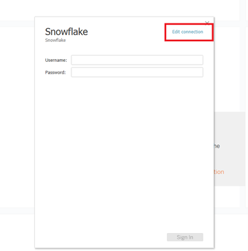
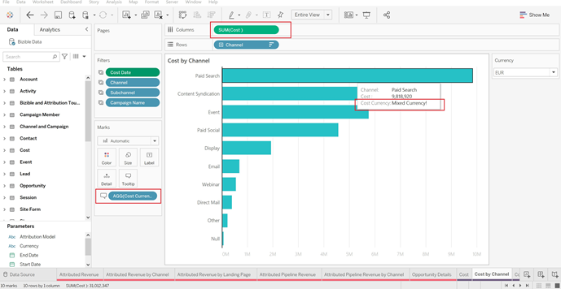
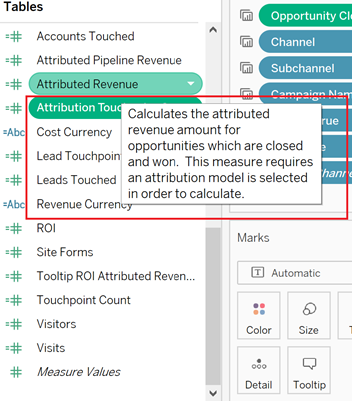

# [!DNL Marketo Measure] Modello di rapporto - Tableau {#marketo-measure-report-template-tableau}

## Guida introduttiva {#getting-started}

È possibile accedere a [!DNL Tableau] modello di report [qui](https://github.com/adobe/Marketo-Measure-BI-Templates){target="_blank"}.

Apri [!DNL Adobe Marketo Measure] File della cartella di lavoro Tableau del modello di reporting.

È necessario aggiornare i dati di connessione esistenti alle informazioni di connessione di Snowflake specifiche. Fai clic su [!UICONTROL Edit Connection] e seguire i passaggi descritti nel [[!UICONTROL Data Connection]](#data-connection) sezione di questa documentazione.



## Connessione dati {#data-connection}

Devi impostare una connessione dati all’istanza del Snowflake. A questo scopo, è necessario specificare il nome del server insieme al nome utente e alla password. I dettagli su dove trovare queste informazioni e reimpostare la password, se necessario, sono documentati [qui](/help/marketo-measure-data-warehouse/data-warehouse-access-reader-account.md){target="_blank"}.


È inoltre necessario immettere un comando SQL iniziale. In questo modo è possibile utilizzare query personalizzate nel modello dati. Il comando da immettere è &quot;Usa schema `<your schema name>`&quot;. Puoi individuare il nome dello schema in [!UICONTROL data warehouse connections] , consulta la documentazione di cui sopra.


### Query SQL personalizzate {#custom-sql-queries}

Perché [!DNL Tableau] applica i filtri dell&#39;origine dati alla query complessiva e non alla singola tabella a cui è impostato il filtro. Si è scelto di utilizzare SQL personalizzato per ogni tabella del modello. Questo consente al modello di filtrare le righe eliminate e duplicate a livello di tabella. Ad esempio, se applicato come filtro dell’origine dati, sessione._deleted_date è null verrà aggiunto alla clausola where della query, generando la query seguente.

**Filtri aggiunti all’origine dati**

```
--A deleted session removes this row completely and the touchpoint data is lost. Select *
   From Touchpoint    tp
      join Session sn
      on tp.session_id = sn.session_id 
 Where tp._deleted_date is null
    and sn._deleted_date is null
```

Tuttavia, ciò non è corretto in quanto se una sessione è stata eliminata, ma il punto di contatto corrispondente non viene eliminato, i dati del punto di contatto vengono rimossi dal set di dati. Vogliamo che i dati del punto di contatto siano presenti nel set di dati, poiché il punto di contatto non è stato eliminato. L’aggiunta di istruzioni SQL personalizzate garantisce che i criteri di filtro vengano applicati a livello di tabella, generando la seguente query.

**Filtri applicati tramite SQL personalizzato**

```
--A deleted session only removes the session related data, and the touchpoint data is preserved. Select *
   From Touchpoint       tp
      join Session sn
      on tp.session_id          = sn.session_id 
      and sn._deleted_date      is null
  Where tp._deleted_date is null
```

## Trasformazioni dati {#data-transformations}

Sono state applicate alcune trasformazioni ai dati in [!DNL Tableau] dal suo stato originale in Snowflake. La maggior parte di queste trasformazioni viene applicata nelle query SQL personalizzate che generano le tabelle in [!DNL Tableau] modello. Per visualizzare l&#39;istruzione SQL personalizzata utilizzata per generare una tabella, fare clic con il pulsante destro del mouse sul nome della tabella e selezionare &quot;Modifica query SQL personalizzata&quot;. Alcune delle trasformazioni specifiche sono descritte di seguito.


### Colonne rimosse {#removed-columns}

Per semplificare il modello dati e rimuovere i dati ridondanti e non necessari, abbiamo ridotto il numero di colonne importate in Tableau dalla tabella del Snowflake originale. Le colonne rimosse includono chiavi esterne non necessarie, dati dimensionali denormalizzati utilizzati in modo migliore tramite relazioni con altre tabelle nel modello, colonne di controllo e campi utilizzati per [!DNL Marketo Measure] elaborazione. È possibile aggiungere o rimuovere colonne in base alle esigenze aziendali modificando l&#39;elenco delle colonne importate nella sezione Select dell&#39;istruzione SQL personalizzata.

>[!NOTE]
>
>La maggior parte delle tabelle del data warehouse contiene dati dimensionali denormalizzati. Abbiamo lavorato per normalizzare e ripulire il modello in [!DNL Tableau] per migliorare le prestazioni e la precisione dei dati. Prestare attenzione quando si includono campi denormalizzati aggiuntivi nelle tabelle dei fatti. Questo può interrompere il filtro dimensionale tra le tabelle e può inoltre causare rapporti non accurati.

### Colonne rinominate {#renamed-columns}

Le tabelle e le colonne sono state rinominate per renderle più facili da usare e per standardizzare le convenzioni di denominazione. Per visualizzare le modifiche al nome della colonna, fare riferimento alle istruzioni SQL personalizzate che creano le tabelle.

### Righe aggiunte {#rows-added}

Per aggiungere le funzionalità di conversione della valuta ai calcoli nel modello, sono stati aggiunti un tasso di conversione aziendale e una colonna del tasso di conversione target alle tabelle Opportunità e Costo. Il valore in queste colonne viene aggiunto a livello di riga e viene valutato unendo alla tabella Tasso di conversione sia la data che l&#39;ID valuta. Poiché Tableau non consente alle tabelle dei fatti di condividere più di una tabella delle dimensioni, i tassi di conversione sono stati aggiunti direttamente alle tabelle che la utilizzano. Per ulteriori dettagli sul funzionamento della conversione di valuta in questo modello, vedi [Conversione valuta](#currency-conversion) in questa documentazione.


Ci sono alcuni luoghi da cui due tabelle [!DNL Snowflake] sono stati combinati con un’unione per creare una tabella nella sezione [!DNL Tableau] modello dati. In questi casi, è stata aggiunta una colonna &quot;Tipo&quot; per indicare quale [!DNL Snowflake] tabella da cui proviene e designare l&#39;entità rappresentata dalla riga. Per ulteriori dettagli sulle tabelle che sono state combinate, consulta la sezione Relazioni e flusso di dati in questa documentazione.


### Nomi segmenti {#segment-names}

Poiché i nomi dei segmenti sono personalizzabili, nel data warehouse di Snowflake sono presenti nomi di colonna generici. [!DNL BIZ_SEGMENT_NAMES] è una tabella di mappatura che elenca il nome del segmento generico con il nome del segmento personalizzato a cui è mappato, come definito nella sezione del segmento in [!DNL Marketo Measure] UI. Se utilizzi nomi di segmento personalizzati e desideri aggiornare la tua [!DNL Tableau] per incorporarli, utilizzate questa tabella e rinominate manualmente le colonne all&#39;interno del modello Tableau. Le colonne del segmento si trovano nella tabella dei punti di contatto Lead e Attribution e dovranno essere rinominate una sola volta.

Il [!UICONTROL CATEGORY] Nella colonna è riportato il numero della categoria e nella colonna SEGMENT_NAME è associato il nome del segmento personalizzato.


I nomi possono essere aggiornati in due modi. La prima opzione consiste nell&#39;aggiornare l&#39;istruzione SQL personalizzata. In questo esempio le categorie da 1 a 6 sono state rinominate in base al mapping dalla tabella Nomi segmenti.


L’altra opzione consiste nel rinominare le colonne direttamente nel [!DNL Tableau] tabella.


## Modello dati {#data-model}

Fai clic sull’immagine seguente per la versione di dimensioni intere.

[](/help/bi-report-templates/assets/tableau-data-model.png){target="_blank"}

### Relazioni e flusso di dati {#relationships-and-data-flow}

I dati dell’evento, utilizzati per creare punti di contatto, vengono memorizzati nel [!UICONTROL Session], [!UICONTROL Task], [!UICONTROL Event], [!UICONTROL Activity], e [!UICONTROL Campaign Member] tabelle. Queste tabelle degli eventi si uniscono alla tabella dei punti di contatto tramite i rispettivi ID e, se l’evento ha generato un punto di contatto, i dettagli vengono memorizzati nella tabella dei punti di contatto.

I punti di contatto lead e i punti di contatto di attribuzione vengono combinati in un’unica tabella in questo modello, con un collegamento alla tabella dei punti di contatto. È stata aggiunta la colonna &quot;Tipo di punto di contatto&quot; per designare se una riga è un lead o un punto di contatto di attribuzione. La maggior parte dei dati dimensionali per i punti di contatto di lead e attribuzione proviene dal collegamento al punto di contatto corrispondente.

Le transizioni della fase dell&#39;opportunità e della fase del lead vengono combinate in un&#39;unica tabella in questo modello, con un collegamento [!UICONTROL Lead and Attribution] Tabella dei punti di contatto. È stata aggiunta la colonna &quot;Tipo di transizione&quot; per indicare se una riga è una transizione di fase di opportunità o lead.

Condivisione di dati relativi a costi e punti di contatto nelle dimensioni Canale e Campagna. Tuttavia, Tableau ha una capacità limitata di modellare le dimensioni condivise tra le tabelle dei fatti. Poiché siamo limitati a una sola tabella di dimensioni condivisa, i dati di Canale e Campagna sono stati combinati in un’unica tabella. Vengono combinate utilizzando un cross join delle due dimensioni in una tabella in Tableau: Canale e Campaign. L’ID univoco viene creato concatenando gli ID del canale e della campagna. Lo stesso valore ID viene aggiunto alle tabelle Punto di contatto e Costo per creare una relazione con questa tabella dimensione combinata.


In questo modello, le dimensioni Campaign e Canale sono collegate al punto di contatto, pertanto tutti i rapporti su tali dimensioni si basano su questo collegamento e indicano che il reporting dimensionale sui dati dell’evento può essere incompleto. Questo perché molti eventi non dispongono di collegamenti a queste dimensioni fino a quando non vengono elaborati in punti di contatto.

>[!NOTE]
>
>Alcuni eventi, come Sessioni, dispongono di collegamenti diretti alle dimensioni Campaign e Canale. Per generare rapporti a livello di sessione su queste dimensioni, si consiglia di creare un modello dati separato a questo scopo.

I dati relativi ai costi vengono memorizzati a diversi livelli di aggregazione all&#39;interno della tabella dei costi del data warehouse di Snowflake. Per tutti i provider di annunci, è possibile eseguire il rollup dei dati a livello di campagna fino al livello di canale. Per questo motivo, questo modello richiama i dati dei costi in base al flag &quot;campaign_is_aggregatable_cost&quot;. I costi autodichiarati possono essere inviati solo a livello di canale e non è necessario che dispongano di dati di Campaign. Per fornire una dichiarazione dei costi il più accurata possibile, i costi autodichiarati vengono estratti in base al flag &quot;channel_is_aggregatable_cost&quot;. La query che importa i dati sui costi viene scritta con la seguente logica: Se ad_provider = &quot;SelfReported&quot; then channel_is_aggregatable_cost = true, else campaign_is_aggregatable_cost = true.

Nel contesto di questo modello, Lead, [!UICONTROL Contact], [!UICONTROL Account], e [!UICONTROL Opportunity] I dati vengono considerati come dati dimensionali e uniti direttamente alla tabella dei punti di contatto Lead e Attribution.

### Conversione valuta {#currency-conversion}

I tassi nella tabella Tasso di conversione rappresentano il valore necessario per convertire un importo dalla valuta aziendale. Le conversioni in qualsiasi valuta richiedono una doppia conversione, prima dalla valuta originale alla valuta aziendale e quindi dalla valuta aziendale alla valuta selezionata. Il primo passo di questa catena nel modello consiste nell&#39;aggiungere due colonne con questi tassi di conversione alle tabelle con importi, Opportunità e Costo. Questi passaggi sono descritti nella sezione Righe aggiunte del presente documento. Poiché i tassi di conversione non devono necessariamente essere statici e possono variare in base a intervalli di date specifici, tutti i calcoli di conversione della valuta devono essere eseguiti a livello di riga. La conversione dalla valuta originale alla valuta aziendale consiste nel dividere il valore per il tasso di conversione aziendale e quindi moltiplicarlo per il tasso di conversione target. Il tasso di conversione target è determinato dal valore del parametro di valuta selezionato.

* Converti il valore originale in valuta aziendale / tasso di conversione aziendale = valore in valuta aziendale
* Converte il valore da società a valuta selezionata in valuta aziendale `*` tasso di conversione della valuta selezionata = valore nella valuta selezionata


Se non è possibile identificare un tasso di conversione, le misure di conversione della valuta in questo modello sostituiscono il valore 1,0 per il tasso. Sono state create misure separate per visualizzare il valore di valuta della misura e avvisare se un calcolo include più di un valore di valuta, ovvero se non è stato possibile convertire un valore nella valuta selezionata. Queste misure, Divisa costi e Divisa ricavi, vengono incluse come descrizioni comandi in qualsiasi elemento visivo che visualizza i dati relativi a Costo o Ricavo.



## Definizioni dei dati {#data-definitions}

Le definizioni sono state aggiunte al [!DNL Tableau model] per parametri, colonne personalizzate e misure.



Per visualizzare le definizioni per le colonne provenienti direttamente da [!DNL Snowflake], vedere [documentazione di data warehouse](/help/marketo-measure-data-warehouse/data-warehouse-schema.md){target="_blank"}.

## Discrepanze tra modelli e individuazione {#discrepancies-between-templates-and-discover}

### Reddito Attribuito {#attributed-revenue}

I punti di contatto lead e i punti di contatto di attribuzione ereditano i dati dimensionali dal punto di contatto originale. Il modello di modello di reporting origina tutti i dati dimensionali ereditati dalla relazione con il punto di contatto, mentre nel modello Discover i dati dimensionali vengono denormalizzati nei record Punto di contatto lead e attribuzione. I valori complessivi dei ricavi attribuiti o dei ricavi attribuiti della pipeline devono essere allineati tra i due rapporti. Tuttavia, possono essere osservate discrepanze quando i ricavi vengono suddivisi o filtrati per dati dimensionali (canale, sottocanale o campagna). Se gli importi delle entrate dimensionali non corrispondono tra il modello e Discover, è probabile che manchino record di punti di contatto nel set di dati del rapporto del modello. Ciò si verifica quando è presente un record di lead o punto di contatto attribuzione, ma nessun record corrispondente nella tabella dei punti di contatto all’interno del set di dati importato nel rapporto. Poiché queste tabelle vengono filtrate in base alla data di modifica, è possibile che il record Punto di contatto Lead/Attribuzione sia stato modificato più di recente rispetto al record Punto di contatto e che quindi il punto di contatto Lead/Attribuzione sia stato importato nel set di dati, mentre il record Punto di contatto originale non lo era. Per risolvere questo problema, allarga l’intervallo di date filtrato per la tabella dei punti di contatto oppure prova a rimuovere il vincolo di data che lo vincola completamente.

>[!NOTE]
>
>Il punto di contatto è una tabella di grandi dimensioni, pertanto considera i compromessi di un set di dati più completo rispetto alla quantità di dati che deve essere importata.

### Costo {#cost}

La generazione di rapporti sui costi nei modelli è disponibile solo a livello di campagna e di canale, tuttavia, Scopri le offerte con livelli di granularità inferiori per alcuni provider di annunci (ad esempio creativi, parole chiave, gruppi di annunci, ecc.). Per ulteriori dettagli sulla modalità di modellazione dei dati sui costi nei modelli, fare riferimento alla [!UICONTROL Data Model] sezione di questa documentazione. Se il filtro dimensione in [!UICONTROL Discover] è impostato su canale o campagna, i costi a livello di canale, sottocanale e campagna devono essere allineati tra Discover e i modelli di rapporto.

### ROI {#roi}

Poiché il ROI è calcolato in base ai ricavi e ai costi attribuiti, le stesse discrepanze che potrebbero sorgere in uno di questi calcoli possono sorgere nel ROI e per gli stessi motivi, come indicato in tali sezioni.

### Punti di contatto {#touchpoints}

Queste metriche, come mostrato nei modelli di reporting, non si riflettono in Discover. Attualmente non è possibile alcun confronto diretto tra i due.

### Traffico web {#web-traffic}

Il modello dati del modello di reporting normalizza i dati dimensionali di canale, sottocanale e campagna tramite la relazione tra sessione e punto di contatto. Questa funzione è diversa dal modello di dati Discover, che denormalizza queste dimensioni in Session. A causa di questa distinzione, i conteggi complessivi per visite e visitatori devono corrispondere tra Discover e il modello di reporting; tuttavia, una volta visualizzati o filtrati per dimensione, non è previsto che tali numeri si allineino. Questo perché i dati dimensionali nel modello sono disponibili solo per gli eventi web che hanno generato un punto di contatto (ovvero eventi non anonimi). Per ulteriori informazioni, consulta [Modello dati](#data-model) sezione di questa documentazione.

Potrebbero esserci piccole discrepanze nel conteggio totale dei moduli del sito tra [!DNL Discover] e il modello. Questo perché il modello dati nel modello di reporting ottiene i dati dimensionali per il modulo del sito tramite una relazione con Session e quindi Touchpoint; esistono alcune istanze in cui i dati del modulo del sito non hanno una sessione correlata.

### Lead e account {#leads-and-accounts}

La segnalazione dimensionale per i conti toccati può differire leggermente tra [!DNL Discover] e il modello, anche questo è dovuto alla modellazione dimensionale proveniente dalla relazione tra punto di contatto e punto di contatto lead o punto di contatto attribuzione. Fai riferimento ai dettagli descritti nella sezione Entrate attribuite per ulteriori dettagli.

Tutti i conteggi di lead in [!UICONTROL Discover] sono conteggi di lead attribuiti e nel modello di reporting la metrica è [!UICONTROL leads] toccato. Pertanto, non è possibile un confronto diretto tra le due relazioni per questa misura.

### Percorso di coinvolgimento {#engagement-path}

Non esiste un confronto diretto tra [!UICONTROL Engagement Path] rapporto in [!DNL Discover] e il modello. Il rapporto in [!DNL Discover] è modellato sul punto di contatto, mentre il rapporto nel modello è modellato sul punto di contatto di attribuzione. Invece di visualizzare tutti i dati dei punti di contatto, il modello si concentra solo sulle opportunità e sui relativi punti di contatto.

### Velocità offerta {#deal-velocity}

Non dovrebbe esserci alcuna discrepanza tra questo rapporto nel modello e la sezione Velocità di offerta nel dashboard Velocità in Discover.
