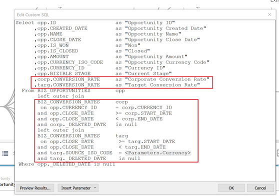

# [!DNL Marketo Measure] Modello di rapporto - Tableau {#marketo-measure-report-template-tableau}

## Introduzione {#getting-started}

Puoi accedere al [!DNL Tableau] modello di rapporto [qui](https://github.com/adobe/Marketo-Measure-BI-Templates){target=&quot;_blank&quot;}.

Apri [!DNL Adobe Marketo] File della cartella di lavoro Tableau del modello di rapporto delle misurazioni.

Sarà necessario aggiornare i dati di connessione esistenti alle informazioni di connessione del Snowflake specifiche. Fai clic sul pulsante [!UICONTROL Edit Connection] e segui i passaggi descritti in [[!UICONTROL Data Connection]](#data-connection) di questa documentazione.


## Connessione dati {#data-connection}

Sarà necessario impostare una connessione dati all’istanza di Snowflake. A questo scopo è necessario il nome del server insieme al nome utente e alla password. I dettagli su dove trovare queste informazioni e reimpostare la password, se necessario, sono documentati [qui](/help/marketo-measure-data-warehouse/data-warehouse-access-reader-account.md){target=&quot;_blank&quot;}.


Sarà inoltre necessario immettere un comando SQL iniziale. Questo supporta l’utilizzo di query personalizzate in questo modello dati. Il comando da immettere è &quot;Usa schema&quot; `<your schema name>`&quot;. Puoi individuare il nome dello schema nel [!UICONTROL data warehouse connections] , consulta la documentazione di cui sopra.


### Query SQL personalizzate {#custom-sql-queries}

Perché [!DNL Tableau] applica i filtri dell&#39;origine dati alla query complessiva e non alla singola tabella a cui è impostato il filtro, abbiamo scelto di utilizzare SQL personalizzato per ogni tabella del modello. Questo consente al modello di filtrare le righe eliminate e duplicate a livello di tabella. Ad esempio, se applicato come filtro dell’origine dati, sessione._delete_date è nullo verrà aggiunto alla clausola where della query, dando luogo alla seguente query.

**Filtri aggiunti all’origine dati**

```
--A deleted session removes this row completely and the touchpoint data is lost. Select *
   From Touchpoint    tp
      join Session sn
      on tp.session_id = sn.session_id 
 Where tp._deleted_date is null
    and sn._deleted_date is null
```

Tuttavia, questo non è corretto in quanto se una sessione è stata eliminata ma il punto di contatto corrispondente non viene eliminato, i dati del punto di contatto vengono rimossi dal set di dati. Desideriamo che i dati dei punti di contatto siano presenti nel set di dati, in quanto il punto di contatto non è stato eliminato. L&#39;aggiunta di SQL personalizzato assicura che i criteri di filtro vengano applicati a livello di tabella, con conseguente query di seguito.

**Filtri applicati tramite SQL personalizzato**

```
--A deleted session only removes the session related data, and the touchpoint data is preserved. Select *
   From Touchpoint       tp
      join Session sn
      on tp.session_id          = sn.session_id 
      and sn._deleted_date      is null
  Where tp._deleted_date is null
```

## Trasformazioni dei dati {#data-transformations}

Sono state applicate alcune trasformazioni ai dati in [!DNL Tableau] dal suo stato originale in Snowflake. La maggior parte di queste trasformazioni viene applicata nelle query SQL personalizzate che generano le tabelle nel [!DNL Tableau] modello. Per visualizzare l&#39;SQL personalizzato utilizzato per generare una tabella, fare clic con il pulsante destro del mouse sul nome della tabella e selezionare &quot;Modifica query SQL personalizzata&quot;. Di seguito sono descritte alcune delle trasformazioni specifiche.


### Colonne rimosse {#removed-columns}

Per semplificare il modello dati e rimuovere i dati ridondanti e non necessari, abbiamo ridotto il numero di colonne importate in Tableau dalla tabella di Snowflake originale. Le colonne rimosse includono chiavi esterne non necessarie, dati dimensionali denormalizzati più sfruttati tramite relazioni con altre tabelle del modello, colonne di controllo e campi utilizzati per le tabelle interne [!DNL Marketo Measure] elaborazione. È possibile aggiungere o rimuovere le colonne in base alle esigenze aziendali modificando l&#39;elenco delle colonne importate nella sezione Seleziona del SQL personalizzato.

>[!NOTE]
>
>La maggior parte delle tabelle nel data warehouse contiene dati dimensionali denormalizzati. Abbiamo lavorato per normalizzare e ripulire il modello in [!DNL Tableau] il più possibile per migliorare le prestazioni e l’accuratezza dei dati. Fai attenzione quando includi ulteriori campi denormalizzati nelle tabelle dei fatti, questo può interrompere il filtraggio dimensionale tra le tabelle e potrebbe anche causare una segnalazione imprecisa.

### Colonne rinominate {#renamed-columns}

Le tabelle e le colonne sono state rinominate per renderle più facili da usare e per standardizzare le convenzioni di denominazione. Per visualizzare le modifiche al nome della colonna, fare riferimento alle istruzioni SQL personalizzate che creano le tabelle.

### Righe aggiunte {#rows-added}

Per aggiungere funzionalità di conversione della valuta ai calcoli nel modello, abbiamo aggiunto una colonna relativa al tasso di conversione aziendale e a un tasso di conversione target sia nelle tabelle Opportunità che Costo. Il valore in queste colonne viene aggiunto a livello di riga e viene valutato unendosi alla tabella Tasso di conversione sia in data che in ID valuta. Poiché Tableau non consente la condivisione di più tabelle di dati, i tassi di conversione sono stati aggiunti direttamente alle tabelle che li utilizzano. Per ulteriori dettagli sul funzionamento della conversione di valuta in questo modello, consulta la sezione [Conversione valuta](#currency-conversion) in questa documentazione.



Ci sono alcuni posti in cui due tabelle da [!DNL Snowflake] sono stati combinati con un&#39;unione per creare una tabella nel [!DNL Tableau] modello dati. In queste istanze, è stata aggiunta una colonna &quot;Tipo&quot; per indicare quale [!DNL Snowflake] tabella di origine e specifica l’entità rappresentata dalla riga. Per ulteriori dettagli sulle tabelle combinate, consulta la sezione Relazione e flusso di dati in questa documentazione.


### Nomi dei segmenti {#segment-names}

Poiché i nomi dei segmenti sono personalizzabili, hanno nomi di colonna generici nel data warehouse di Snowflake. [!DNL BIZ_SEGMENT_NAMES] è una tabella di mappatura che elenca il nome generico del segmento con il nome del segmento personalizzato a cui è mappato, come definito nella sezione del segmento nel [!DNL Marketo Measure] Interfaccia utente. Se utilizzi nomi di segmento personalizzati e desideri aggiornarli [!DNL Tableau] per incorporarle, utilizzare questa tabella e rinominare manualmente le colonne all&#39;interno del modello Tableau. Le colonne dei segmenti si trovano nella tabella Lead e Attribution Touchpoint e dovranno essere rinominate una sola volta.

La [!UICONTROL CATEGORY] elenca il numero della categoria e la colonna SEGMENT_NAME ha il nome del segmento personalizzato a cui è associato.


I nomi possono essere aggiornati in due modi. La prima opzione consiste nell&#39;aggiornare l&#39;SQL personalizzato. In questo esempio le categorie da 1 a 6 sono state rinominate in base alla mappatura dalla tabella Nomi segmento .


L’altra opzione consiste nel rinominare le colonne direttamente nel [!DNL Tableau] tabella.


## Modello dati {#data-model}

Fai clic sull’immagine seguente per la versione a dimensione intera.

[](/help/bi-report-templates/assets/tableau-data-model.png){target=&quot;_blank&quot;}

### Relazioni e flusso di dati {#relationships-and-data-flow}

I dati evento, utilizzati per creare punti di contatto, sono memorizzati nella variabile [!UICONTROL Session], [!UICONTROL Task], [!UICONTROL Event], [!UICONTROL Activity]e [!UICONTROL Campaign Member] tabelle. Queste tabelle di eventi si uniscono alla tabella dei punti di contatto tramite i rispettivi ID e, se l’evento ha generato un punto di contatto, i dettagli vengono memorizzati nella tabella dei punti di contatto.

In questo modello, i punti di contatto lead e i punti di contatto di attribuzione vengono combinati in una tabella con un collegamento alla tabella dei punti di contatto. È stata aggiunta la colonna &quot;Tipo di punto di contatto&quot; per indicare se una riga è un punto di contatto Lead o Attribution. La maggior parte dei dati dimensionali per i punti di contatto lead e di attribuzione proviene dal relativo collegamento al punto di contatto corrispondente.

Le Transizioni fase opportunità e le Transizioni fase lead sono combinate in una tabella in questo modello, con un collegamento alla [!UICONTROL Lead and Attribution] Tabella dei punti di contatto. È stata aggiunta la colonna &quot;Tipo di transizione&quot; per indicare se una riga è una transizione di fase Opportunità o Lead.

Le dimensioni Canale e Campaign condividono i dati di Cost e Touchpoint. Tuttavia, Tableau è limitato nella sua capacità di modellare dimensioni condivise tra tabelle di fatti. Poiché siamo limitati a una sola tabella di dimensioni condivise, i dati di Canale e Campagna sono stati combinati in un’unica tabella. Vengono combinati utilizzando un join incrociato delle due dimensioni in un’unica tabella di Tableau: Canale e campagna. L’id univoco viene creato concatenando gli ID canale e campagna. Lo stesso valore id viene aggiunto alle tabelle Punto di contatto e Costo per creare una relazione con questa tabella di dimensioni combinate.


In questo modello, le dimensioni Campagna e Canale sono collegate al punto di contatto, pertanto tutti i rapporti su queste dimensioni passano attraverso questo collegamento e indicano che i rapporti dimensionali sui dati dell’evento possono essere incompleti. Questo perché molti eventi non hanno collegamenti a queste dimensioni finché non vengono elaborati in punti di contatto.

>[!NOTE]
>
>Alcuni eventi, come Sessions, hanno collegamenti diretti alle dimensioni Campaign e Channel. Se desideri generare rapporti a livello di sessione su queste dimensioni, è consigliabile creare a questo scopo un modello dati separato.

I dati di costo vengono memorizzati a diversi livelli di aggregazione all&#39;interno della tabella Costo warehouse di dati di Snowflake. Per tutti i provider di annunci, i dati a livello di campagna possono essere aggregati a livello di canale. Per questo motivo, questo modello richiama i dati dei costi in base al flag &quot;campaign_is_aggregatable_cost&quot;. I costi segnalati autonomamente possono essere inviati solo a livello di canale e non devono disporre di dati di Campaign. Per fornire il reporting dei costi più accurato possibile, i costi autosegnalati vengono richiamati in base al flag &quot;channel_is_aggregatable_cost&quot;. La query che importa i dati dei costi viene scritta con la logica seguente: Se ad_provider = &quot;SelfReported&quot;, channel_is_aggregatable_cost = true, else campaign_is_aggregatable_cost = true.

Nel contesto di questo modello, lead, [!UICONTROL Contact], [!UICONTROL Account]e [!UICONTROL Opportunity] i dati sono considerati dati dimensionali e sono collegati direttamente alla tabella Lead e Attribution Touchpoint .

### Conversione valuta {#currency-conversion}

I tassi nella tabella Tasso di conversione rappresentano il valore necessario per convertire un importo dalla valuta aziendale. Le conversioni in qualsiasi valuta richiedono una conversione doppia, prima dalla valuta originale alla valuta aziendale, e poi dalla valuta aziendale alla valuta selezionata. Il primo passo di questa catena nel modello è l&#39;aggiunta di due colonne con questi tassi di conversione alle tabelle con importi, opportunità e costo. Questi passaggi sono descritti in dettaglio nella sezione Righe aggiunte in questo documento. Poiché i tassi di conversione non devono essere statici e possono variare in base a intervalli di date specificati, tutti i calcoli di conversione della valuta devono essere eseguiti a livello di riga. La conversione dalla valuta originale alla valuta aziendale consiste nel dividere il valore per il tasso di conversione aziendale e poi moltiplicarsi per il tasso di conversione target. Il tasso di conversione target è determinato dal valore del parametro della valuta selezionato.

* Converti il valore originale in valore di valuta aziendale / tasso di conversione aziendale = valore in valuta aziendale
* Converti il valore da valuta aziendale a quello selezionato in valuta aziendale `*` tasso di conversione della valuta selezionata = valore nella valuta selezionata


Le misure di conversione della valuta in questo modello sostituiscono un valore di 1,0 per il tasso se non è possibile identificare alcun tasso di conversione. Sono state create misure separate per visualizzare il valore della valuta per la misura e viene visualizzato un avviso se un calcolo include più di un valore della valuta (ovvero se non è stato possibile convertire un valore nella valuta selezionata). Queste misure, Divisa costo e Valuta ricavi, sono incluse come descrizioni a comparsa in qualsiasi elemento visivo che visualizza i dati di Costo o Ricavo.


## Definizioni dei dati {#data-definitions}

Sono state aggiunte definizioni al [!DNL Tableau model] per parametri, colonne personalizzate e misure.


Per visualizzare le definizioni delle colonne provenienti direttamente da [!DNL Snowflake], vedi [documentazione di data warehouse](/help/marketo-measure-data-warehouse/data-warehouse-schema.md){target=&quot;_blank&quot;}.

## Discrepanze tra modelli e individuazione {#discrepancies-between-templates-and-discover}

### Entrate attribuite {#attributed-revenue}

I punti di contatto lead e i punti di contatto di attribuzione ereditano i dati dimensionali dal punto di contatto originale. Il modello di reporting esegue l&#39;origine di tutti i dati dimensionali ereditati dalla relazione con punto di contatto, mentre nel modello Discover i dati dimensionali vengono denormalizzati nei record Lead e Attribution punto di contatto. I ricavi totali attribuiti o i valori delle entrate provenienti dalla pipeline dovrebbero essere allineati tra le due relazioni. Tuttavia, è possibile osservare discrepanze quando i ricavi vengono suddivisi o filtrati per dati dimensionali (canale, canale secondario o campagna). Se gli importi dei ricavi dimensionali non corrispondono tra il modello e Discover, è probabile che nel set di dati del rapporto modello non siano presenti record dei punti di contatto. Questo accade quando è presente un record Punto di contatto lead o di attribuzione, ma non un record corrispondente nella tabella Punto di contatto all’interno del set di dati importato nel rapporto. Poiché queste tabelle vengono filtrate per data di modifica, è possibile che il record Punto di contatto lead/attribuzione sia stato modificato più di recente rispetto al record Punto di contatto, e quindi che il punto di contatto lead/attribuzione sia stato importato nel set di dati mentre il record del punto di contatto originale non lo era. Per risolvere il problema, allarga l’intervallo di date filtrato per la tabella Punto di contatto oppure considera la possibilità di rimuovere il vincolo di data tutti insieme.

>[!NOTE]
>
>Il punto di contatto è una tabella di grandi dimensioni, quindi considera gli scambi di un set di dati più completo rispetto alla quantità di dati da importare.

### Costo {#cost}

La generazione di rapporti sui costi nei modelli è disponibile solo a livello di campagna e di canale, tuttavia, Scopri le offerte che segnalano a livelli più bassi di granularità per alcuni fornitori di annunci (ad esempio, creativi, parole chiave, gruppi di annunci, ecc.). Per ulteriori dettagli sulla modellazione dei dati di costo nei modelli, fai riferimento alla [!UICONTROL Data Model] di questa documentazione. Se la dimensione viene filtrata in [!UICONTROL Discover] è impostato su canale o campagna, i costi a livello di canale, canale secondario e campagna devono essere allineati tra Discover e i modelli di report.

### RITORNO SULL&#39;INVESTIMENTO {#roi}

Poiché il ROI è calcolato a partire da Ricavi e costi attribuiti, le stesse discrepanze che potrebbero sorgere in uno di questi calcoli possono sorgere nel ROI e per gli stessi motivi, come indicato in tali sezioni.

### Punti di contatto {#touchpoints}

Queste metriche, come mostrato nei modelli di reporting, non si riflettono in Discover. Attualmente non è possibile effettuare un confronto diretto tra i due.

### Traffico web {#web-traffic}

Il modello di dati del modello di reporting normalizza i dati dimensionali di canale, canale secondario e campagna tramite la relazione tra Sessione e punto di contatto. Questo è diverso dal modello dati Discover, che denormalizza queste dimensioni in Session. A causa di questa distinzione, i conteggi totali per visite e visitatori devono corrispondere tra Discover e il modello di reporting, tuttavia, una volta visualizzati o filtrati per dimensione, questi numeri non devono allinearsi. Questo perché i dati dimensionali nel modello sono disponibili solo per gli eventi web che hanno generato un punto di contatto (cioè eventi non anonimi). Per maggiori dettagli, fai riferimento al [Modello dati](#data-model) di questa documentazione.

Possono esserci piccole discrepanze nei conteggi totali dei moduli del sito tra [!DNL Discover] e il modello. Questo perché il modello dati nel modello di reporting ottiene dati dimensionali per Modulo sito tramite una relazione con Sessione e quindi punto di contatto; ci sono alcune istanze in cui i dati del modulo del sito non hanno una sessione correlata.

### Lead e account {#leads-and-accounts}

La generazione di rapporti dimensionali per i conti interessati può variare leggermente tra [!DNL Discover] e il modello, questo è ancora dovuto alla modellazione dimensionale proveniente dalla relazione tra punto di contatto e punto di contatto lead o punto di contatto attribuzione. Per ulteriori informazioni, fai riferimento ai dettagli descritti nella sezione Entrate attribuite .

Tutti i conteggi dei lead in [!UICONTROL Discover] sono attribuiti ai conteggi dei lead e nel modello di reporting la metrica è [!UICONTROL leads] commosso. Non è pertanto possibile effettuare un confronto diretto tra le due relazioni relative a questa misura.

### Percorso di coinvolgimento {#engagement-path}

Non esiste un confronto diretto tra [!UICONTROL Engagement Path] in [!DNL Discover] e il modello. Il rapporto in [!DNL Discover] è modellato dal punto di contatto, mentre il rapporto nel modello è modellato dal punto di contatto di attribuzione. Il modello si concentra esclusivamente sulle opportunità e sui relativi punti di contatto, anziché mostrare tutti i dati dei punti di contatto.

### Velocità del contratto {#deal-velocity}

Non dovrebbe esserci alcuna discrepanza tra questo rapporto nel modello e il riquadro Velocity offerta nel dashboard Velocity in Discover.
