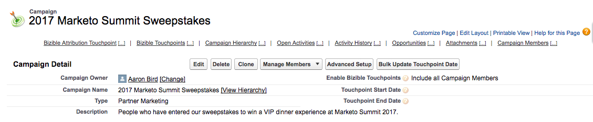

# Campagne e membri della campagna {#campaigns-and-campaign-members}

[!DNL Salesforce] Le campagne hanno lo scopo di tenere traccia degli elenchi dei lead e dei contatti associati a un programma o a un&#39;attività di marketing. Questo è stato comunemente webinar, registrazioni, o entrambe le visite, per esempio. Gli addetti al marketing possono scegliere se accreditare o meno una campagna in un percorso di punti di contatto.

## Abilitazione dei punti di contatto {#enabling-touchpoints}

La [!DNL Marketo Measure] [!DNL Salesforce] Il pacchetto includerà un campo con l’etichetta &quot;Abilita punti di contatto dell’acquirente&quot; sull’oggetto Campaign. Dopo l’aggiunta del campo al layout di pagina, il relativo aspetto sarà simile al seguente:

Le opzioni disponibili nell’elenco di selezione sono:

* Includi tutti i membri della campagna: ogni singolo lead o contatto aggiunto alla campagna riceverà un punto di contatto associato a tale campagna.
* Includi solo i membri della campagna &quot;Rispondi&quot;: solo i lead o i contatti con uno stato membro della campagna &quot;Rispondi&quot; riceveranno un punto di contatto associato a tale campagna.
* Escludi tutti i membri della campagna: nessuno dei lead o dei contatti riceverà un punto di contatto associato alla campagna.

Tieni presente che i membri della campagna devono avere un indirizzo e-mail associato al proprio record al fine di [!DNL Marketo Measure] per creare un punto di contatto. Senza un indirizzo e-mail, [!DNL Marketo Measure] non assegna un punto di contatto al membro della campagna.

## Date di sincronizzazione della campagna {#campaign-sync-dates}

Con l&#39;installazione del pacchetto, [!DNL Marketo Measure] includerà anche 2 campi data nell’oggetto Campaign: Data inizio punto di contatto e Data fine punto di contatto.

Queste date dicono [!DNL Marketo Measure] quando dovremmo iniziare o interrompere l’inclusione dei membri di Campaign dalla campagna nel percorso dei punti di contatto. Puoi impostare una data, o entrambe, o nessuna.

## Caso d’uso per la data di inizio del punto di contatto {#use-case-for-touchpoint-start-date}

La data di inizio può essere utilizzata nel caso in cui una campagna esistente venga utilizzata per il tracciamento di lead e contatti, ma l’utente desidera iniziare a misurare solo una volta che sono stati implementati nuovi sistemi o processi, quindi decide di impostare una data di inizio una volta [!DNL Marketo Measure] dovrebbe iniziare a tenere traccia dei membri della campagna.

## Caso d’uso per la data di fine del punto di contatto {#use-case-for-touchpoint-end-date}

Se prima di utilizzare [!DNL Marketo Measure], hai utilizzato una piattaforma di automazione di marketing che ha monitorato le interazioni digitali dei lead (invii di moduli IE), quindi caricato tali lead in un [!DNL Saleforce] Campaign, puoi sfruttare il campo Data fine punto di contatto . Imposta la data di fine del punto di contatto come data di inizio con [!DNL Marketo Measure] e abilitare i punti di contatto dell&#39;acquirente, ciascuna interazione digitale di questi lead verrebbe creata come punto di contatto. Il motivo per cui imposta la data di fine del punto di contatto come data di inizio con [!DNL Marketo Measure] perché, andando avanti, seguiremo queste interazioni digitali attraverso il nostro javascript.

## Membri della campagna {#campaign-members}

I membri della campagna sono nidificati in [!UICONTROL Campaigns]e sono correlati a un lead o a un contatto. Un lead o un contatto può essere aggiunto una sola volta a una campagna, il che può essere problematico a seconda del caso d’uso della campagna. Quando una campagna viene sincronizzata, l’iscrizione alla campagna viene utilizzata come attività di marketing inserita nel percorso di punti di contatto e trattata come una compilazione del modulo.

## Stato punto di contatto dell’acquirente {#buyer-touchpoint-status}

Se attivato, [!DNL Marketo Measure] invia un valore di stato al membro della campagna in 4 campi diversi inclusi nel pacchetto installato: Stato punto di contatto (lead), stato punto di contatto (contatto), stato punto di contatto (opportunità) e data stato punto di contatto. Questo consente ai clienti di verificare se un punto di contatto è stato creato o meno come punto di contatto per l’acquisto o come punto di contatto per l’attribuzione per l’acquisto, a seconda dell’oggetto a cui è correlato. La data dello stato del punto di contatto è semplicemente l’ultima data in cui lo stato è stato aggiornato sul membro della campagna.

## Data punto di contatto dell&#39;acquirente {#buyer-touchpoint-date}

Con l&#39;installazione del pacchetto, [!DNL Marketo Measure] include anche un campo sul membro della campagna con etichetta &quot;Data punto di contatto dell’acquirente&quot;. Questo consente all’utente di ignorare la data che [!DNL Marketo Measure] viene utilizzato per la data del punto di contatto nel record del punto di contatto.

Questo potrebbe essere necessario se un elenco è stato caricato giorni/settimane/mesi dopo il verificarsi di un evento. Esistono modi per aggiornare tutti i record contemporaneamente, come illustrato di seguito.

Per sapere se è necessario utilizzare o meno la data del punto di contatto dell&#39;acquirente, ecco come vengono determinate le date [!DNL Marketo Measure] a seconda del [!UICONTROL Sync Type] selezionata per la campagna.

Se la [!UICONTROL Sync Type] è impostato su &quot;Includi tutti i membri della campagna&quot;, la priorità dell’impostazione della data del punto di contatto è dall’alto verso il basso:

* Data punto di contatto dell&#39;acquirente
* Data creazione membro della campagna

Se la [!UICONTROL Sync Type] è impostato su &quot;Includi solo i membri della campagna &quot;Rispondi&quot;,&quot; la priorità dell’impostazione della data del punto di contatto è dall’alto verso il basso:

* Data punto di contatto dell&#39;acquirente
* Prima data di risposta
   * La prima data di risposta viene impostata automaticamente non appena lo stato viene modificato in &quot;Rispondato&quot; ed è uno standard [!DNL Salesforce] campo che non può essere modificato

* Data creazione membro della campagna

## Aggiornamento in blocco della data del punto di contatto {#bulk-update-touchpoint-date}

La data del punto di contatto dell&#39;aggiornamento in blocco è inclusa nella [!DNL Marketo Measure] [!DNL Salesforce] Il pacchetto e il pulsante devono essere aggiunti al layout di pagina.

Se è necessario aggiornare un numero elevato di record dei membri della campagna, puoi utilizzare il [!UICONTROL Bulk Update Touchpoint Date] pulsante per l&#39;editing di massa.

Se ci sono casi d&#39;uso unici che questa interfaccia non copre, puoi anche utilizzare il [Caricatore dati](https://dataloader.io/){target=&quot;_blank&quot;} per esportare i record, apportare la modifica e caricare nuovamente i record.

Per iniziare, cerca i record e filtra quelli per i quali vuoi impostare una data punto di contatto dell’acquirente.

>[!CAUTION]
>
>Una ricerca non funziona, come illustrato nell’esempio seguente. L’interfaccia utente non supporta la ricerca di date punto di contatto dell’acquirente nulle (la ricerca seguente non funzionerebbe):

Se non devi utilizzare la ricerca e applicare le date a ogni record membro della campagna, utilizza il &quot;[!UICONTROL Include All Records]&quot; casella di controllo (vedi schermata sottostante), che controllerà tutti i record su tutte le pagine.

Seleziona la data e l’ora dal selettore del calendario. Se desideri selezionare la data e l’ora correnti, fai clic sulla data/ora visualizzata accanto al selettore del calendario.

Una volta impostata la data e l’ora, fai clic sul pulsante **[!UICONTROL Update Selected Records]** per applicare le modifiche.

## Costi della campagna {#campaign-costs}

Scopri tutti i costi di Campaign [nel presente articolo](/help/marketing-spend/spend-management/crm-campaign-costs.md).

## Rimozione membri campagna {#campaign-member-removal}

Il modo in cui [!DNL Marketo Measure] tiene il passo con tutti i record eliminati in Salesforce, sia che vengano eliminati Lead o Account o Opportunità, consiste nel vedere tali record nell&#39;API e tenere traccia del fatto che una voce è contrassegnata come &quot;IsDeleted&quot;. Purtroppo con i membri della campagna, Salesforce ha introdotto un modo diverso di eliminare questi membri della campagna da una campagna e sono in realtà contrassegnati solo come &quot;rimossi&quot; invece di &quot;cancellati&quot;, quindi il problema è che i punti di contatto vivevano ancora in Salesforce che erano correlati ai membri della campagna cancellati.

Per aggirare questo problema, [!DNL Marketo Measure] creato [!DNL Marketo Measure] Oggetto History e un trigger da monitorare ogni volta che i membri di Campaign vengono rimossi e quindi eliminare il punto di contatto corrispondente. **Avrà bisogno di [!DNL Marketo Measure] Pacchetto Marketing Analytics V6.15 o versione successiva** per utilizzare questa funzione.

>[!CAUTION]
>
>Tieni presente che questo trigger non tiene traccia dei membri della campagna rimossi in passato, pertanto funziona solo in futuro. Se devi rimuovere un numero elevato di punti di contatto dei membri della campagna precedente, contatta [Supporto Marketo](https://nation.marketo.com/t5/support/ct-p/Support){target=&quot;_blank&quot;}.

>[!MORELIKETHIS]
>
>[[!DNL Marketo Measure] Università: Campi oggetto campagna](https://universityonline.marketo.com/courses/bizible-fundamentals-channel-management/#/page/5c63007334d9f0367662b758)
>
>[[!DNL Marketo Measure] Università: Mappatura dei canali offline](https://universityonline.marketo.com/courses/bizible-fundamentals-channel-management/#/page/5c630eca34d9f0367662b77f)
