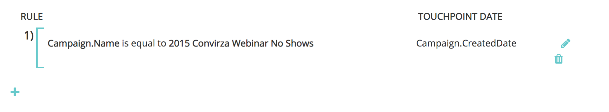
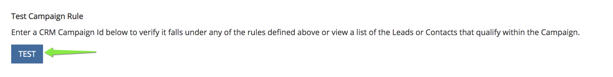
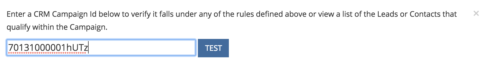

# Sincronizzazione campagna personalizzata {#custom-campaign-sync}

Oggi, con il [!DNL Marketo Measure] , è possibile indicare le campagne da includere come punto di contatto idoneo. Ci sono diversi ostacoli a questo come in precedenza esisteva. Una volta [!DNL Marketo Measure] è installato nel CRM, può richiedere del tempo per essere approvato dal team di sicurezza. Inoltre, l’utilizzo di un singolo elenco di selezione sull’oggetto Campaign non è flessibile. Con questa nuova funzionalità, non è necessario installare un pacchetto per iniziare a utilizzare i record dei membri di Campaign e Campaign. È possibile creare regole per definire esattamente quali record possono essere generati per definire esattamente quali record sono idonei.

## Requisiti {#requirements}

* La sincronizzazione delle campagne è disponibile in tutti i livelli
* Per importare i dati, è comunque necessario collegare il CRM al tuo [!DNL Marketo Measure] account

## Come funziona {#how-it-works}

1. Con le autorizzazioni AccountAdmin, puoi passare a **[!UICONTROL Settings]** > **[!UICONTROL Campaigns]** e consulta l’interfaccia utente Sincronizza regole membri della campagna.
1. Fai clic su **+** per iniziare a creare una regola.

   

1. È possibile creare una regola da [!UICONTROL Campaign] o [!UICONTROL Campaign Member] campi. Compila il resto della regola con l’Operatore e il Valore che si prevede di convalidare. Nell’esempio seguente, stiamo verificando la presenza di una specifica campagna in base al suo nome.

   

   >[!NOTE]
   >
   >I campi formula non possono essere utilizzati nelle regole e non verranno visualizzati nell&#39;elenco a discesa. Poiché le formule vengono calcolate in background senza modificare un record, [!DNL Marketo Measure] non è in grado di rilevare se un record soddisfa o meno una regola.

1. Scegliere la data del punto di contatto. L&#39;elenco delle date possibili verrà visualizzato dopo aver inserito una parentesi graffa `{` - quindi puoi selezionare la data che desideri applicare a tutti i punti di contatto creati dalla regola.

   

   >[!NOTE]
   >
   >Se utilizzi regole di sincronizzazione campagne personalizzate, [!DNL Marketo Measure] non legge gli aggiornamenti che hai apportato utilizzando il pulsante Bulk Update Touchpoint Date (Data di contatto per aggiornamento in blocco).

1. Fai clic sul segno di spunta, quindi aggiungi ulteriori regole per le campagne aggiuntive in base alle esigenze.

   

   >[!NOTE]
   >
   >Ora che le regole sono definite insieme alla sincronizzazione CRM, le regole dichiarate inizieranno naturalmente a entrare in conflitto. Se scegli di continuare a utilizzare sia la sincronizzazione personalizzata di Campaign _e_ Tipo di sincronizzazione CRM, è fondamentale creare regole in modo che i Tipi di sincronizzazione CRM non vengano ignorati.

   

   >[!NOTE]
   >
   >Se stai valutando la possibilità di interrompere l’utente di [!UICONTROL CRM Sync Type], è ideale per creare regole che non fanno riferimento al &quot;Tipo di sincronizzazione&quot; ma _fermo_ mantenere i punti di contatto CRM correnti. In questo modo le regole funzionano ancora se/quando viene effettuato il passaggio.

Ecco un esempio di come apparirebbe, in modo che non vadano persi punti di contatto CRM esistenti:

## Convalida {#validation}

Puoi controllare facilmente i record Punti di contatto Buyer e Punti di contatto di attribuzione Buyer all’interno di Campaign per verificare che le regole funzionino correttamente. Ecco una mazza che [!DNL Marketo Measure] creato con la data del punto di contatto dinamico appropriata, prelevato dalla campagna. Il campo Data di creazione è nell&#39;immagine sottostante.

## Test {#testing}

1. La funzione di sincronizzazione di Campaign è dotata di una funzione di test che consente di verificare se le regole create soddisfano effettivamente i criteri di Campaign. Per iniziare, fai clic su [!UICONTROL Test] pulsante. Prima di iniziare il test, è necessario salvare le regole.

   

   Verrà visualizzato un pop-up in cui puoi immettere un ID campagna (15 o 18 caratteri dal CRM) da testare. Il punto è quello di inserire l’ID campagna dal sistema di gestione delle relazioni con i clienti che stavi tentando di sincronizzare per assicurarti che corrisponda alla regola creata.

   

1. Dopo aver fatto clic su [!UICONTROL Test], verranno visualizzati il nome della campagna e il numero di membri della campagna idonei per i punti di contatto. Di seguito verrà visualizzata una tabella che mostra tutte le regole che corrispondono al tuo ID campagna. Verranno visualizzate solo le corrispondenze.

   

1. Puoi anche fare clic sul conteggio dei membri per visualizzare un elenco dei lead e dei contatti e dei relativi ID che fanno parte dell’idoneità della regola Campaign. Questo è solo un set di esempio e visualizzerà fino a 50 in modo da poter avere un’idea di quali record sono idonei.

   
