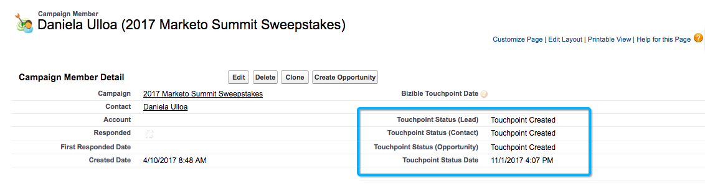

# Campagne e membri della campagna {#campaigns-and-campaign-members}

Le campagne [!DNL Salesforce] hanno lo scopo di tenere traccia degli elenchi di lead e contatti associati a un programma o a un&#39;attività di marketing. Si tratta solitamente di webinar, registrazioni o visite allo stand, ad esempio. Gli addetti al marketing possono scegliere se accreditare o meno una campagna in un percorso di punti di contatto.

>[!NOTE]
>Questo articolo riguarda un processo obsoleto. Invitiamo gli utenti a utilizzare il [nuovo processo in-app migliorato](/help/channel-tracking-and-setup/offline-channels/custom-campaign-sync.md){target="_blank"}.

## Abilitazione dei punti di contatto {#enabling-touchpoints}

Il pacchetto [!DNL Marketo Measure] [!DNL Salesforce] includerà un campo con etichetta &quot;Abilita punti di contatto dell&#39;acquirente&quot; sull&#39;oggetto Campaign. Una volta aggiunto il campo al layout di pagina, sarà simile al seguente:

Le opzioni disponibili nell’elenco a discesa sono:

* Includi tutti i membri della campagna: ogni lead o contatto aggiunto alla campagna riceverà un punto di contatto associato alla campagna.
* Includi solo i membri della campagna &quot;Rispondenti&quot;: solo i lead o i contatti con lo stato di membro della campagna &quot;Risponduto&quot; riceveranno un punto di contatto associato alla campagna.
* Escludi tutti i membri della campagna: nessuno dei lead o dei contatti riceverà un punto di contatto associato alla campagna.

I membri della campagna devono avere un indirizzo e-mail associato al proprio record affinché [!DNL Marketo Measure] possa creare un punto di contatto. Senza un indirizzo e-mail, [!DNL Marketo Measure] non assegnerà un punto di contatto al membro della campagna.

## Date di sincronizzazione della campagna {#campaign-sync-dates}

Con l&#39;installazione del pacchetto, [!DNL Marketo Measure] includerà anche 2 campi data sull&#39;oggetto Campaign: Data inizio punto di contatto e Data fine punto di contatto.

Queste date indicano a [!DNL Marketo Measure] quando iniziare o interrompere l&#39;inclusione dei membri della campagna dal percorso del punto di contatto. È possibile impostare una data o entrambe oppure nessuna.

## Caso d’uso per la data di inizio del punto di contatto {#use-case-for-touchpoint-start-date}

La data di inizio può essere utilizzata nel caso in cui una campagna esistente venga utilizzata per il tracciamento di lead e contatti, ma l’utente desidera iniziare la misurazione solo dopo che sono stati implementati nuovi sistemi o processi, pertanto decide di impostare una data di inizio una volta che [!DNL Marketo Measure] deve iniziare a monitorare tali membri della campagna.

## Caso d’uso per data di fine punto di contatto {#use-case-for-touchpoint-end-date}

Se prima di utilizzare [!DNL Marketo Measure], si utilizzava una piattaforma di automazione marketing che teneva traccia delle interazioni digitali dei lead (invio di moduli IE) e quindi li si caricava in una campagna [!DNL Saleforce], è possibile utilizzare il campo Data fine punto di contatto. Se si imposta la data di fine del punto di contatto come data di inizio con [!DNL Marketo Measure] e si abilitano i punti di contatto dell&#39;acquirente, l&#39;interazione digitale di ciascuno di questi lead verrà creata come punto di contatto. Il motivo per cui imposterai la data di fine del punto di contatto come data di inizio con [!DNL Marketo Measure] è che, andando avanti, monitoreremo queste interazioni digitali attraverso il nostro JavaScript.

## Membri della campagna {#campaign-members}

I membri della campagna sono nidificati in [!UICONTROL Campaigns] e sono correlati a un lead o a un contatto. Un lead o un contatto può essere aggiunto solo una volta a una campagna, il che può essere problematico a seconda del caso di utilizzo della campagna. Quando una campagna viene sincronizzata, l’iscrizione alla campagna viene utilizzata come un’attività di marketing che viene inserita nel percorso dei punti di contatto e trattata come una compilazione di modulo.

## Stato Buyer Touchpoint {#buyer-touchpoint-status}

Se attivato, [!DNL Marketo Measure] invierà un valore di stato al membro della campagna in 4 campi diversi inclusi nel pacchetto installato: Stato punto di contatto (lead), Stato punto di contatto (contatto), Stato punto di contatto (opportunità) e Data stato punto di contatto. Questo consente ai clienti di controllare se un punto di contatto è stato creato o meno come Buyer Touchpoint o Buyer Attribution Touchpoint, a seconda dell’oggetto a cui è correlato. La Data stato punto di contatto è semplicemente l’ultima data in cui lo stato è stato aggiornato sul membro della campagna.

## Data Buyer Touchpoint {#buyer-touchpoint-date}

Con l&#39;installazione del pacchetto, [!DNL Marketo Measure] include anche un campo sul membro della campagna con l&#39;etichetta &quot;Buyer Touchpoint Date&quot;. Ciò consente all&#39;utente di ignorare la data che [!DNL Marketo Measure] utilizzerebbe per la data del punto di contatto nel record del punto di contatto.

Questo potrebbe essere necessario se un elenco è stato caricato giorni/settimane/mesi dopo che si è verificato effettivamente un evento. Esistono diversi modi per aggiornare tutti i record contemporaneamente, come illustrato di seguito.

Per sapere se è necessario utilizzare o meno la data di Buyer Touchpoint, ecco come vengono determinate le date da [!DNL Marketo Measure] a seconda di [!UICONTROL Sync Type] selezionato per la campagna.

Se [!UICONTROL Sync Type] è impostato su &quot;Includi tutti i membri della campagna&quot;, la priorità dell&#39;impostazione della data del punto di contatto è dall&#39;alto verso il basso:

* Data Buyer Touchpoint
* Data di creazione del membro della campagna

Se [!UICONTROL Sync Type] è impostato su &quot;Includi solo i membri della campagna &#39;Rispondenti&#39;&quot;, la priorità dell&#39;impostazione della data del punto di contatto è dall&#39;alto verso il basso:

* Data Buyer Touchpoint
* Data della prima risposta
   * La prima data di risposta viene impostata automaticamente non appena lo stato viene modificato in &quot;Risposta&quot; ed è un campo [!DNL Salesforce] standard che non può essere modificato

* Data di creazione del membro della campagna

## Data punto di contatto per aggiornamento in blocco {#bulk-update-touchpoint-date}

La data del punto di contatto per l&#39;aggiornamento in blocco è inclusa nel pacchetto [!DNL Marketo Measure] [!DNL Salesforce] installato e il pulsante dovrà essere aggiunto al layout della pagina.

Se è necessario aggiornare un numero elevato di record Membro della campagna, è possibile utilizzare il pulsante [!UICONTROL Bulk Update Touchpoint Date] per apportare modifiche di massa.

Se l&#39;interfaccia non copre casi d&#39;uso specifici, è possibile utilizzare anche il [caricatore dati](https://dataloader.io/){target="_blank"} per esportare i record, apportare la modifica e caricare nuovamente i record.

Inizia cercando i record e filtrando quelli per i quali desideri impostare una data Buyer Touchpoint.

>[!CAUTION]
>Una ricerca non funziona, come illustrato nell’esempio seguente. L’interfaccia utente non supporta la ricerca di date Buyer Touchpoint nulle (la ricerca seguente non funzionerebbe):

Se non è necessario utilizzare la ricerca e applicare semplicemente le date a ogni record Membro di Campaign, utilizzare la casella di controllo &quot;[!UICONTROL Include All Records]&quot; (vedere la schermata seguente), che controllerà tutti i record su tutte le pagine.

Seleziona la data e l’ora dal selettore calendario. Se si desidera selezionare la data e l&#39;ora correnti, fare clic sulla data/ora visualizzata accanto al selettore calendario.

Dopo aver impostato la data e l&#39;ora, fare clic sul pulsante **[!UICONTROL Update Selected Records]** per applicare le modifiche.

## Costi della campagna {#campaign-costs}

Scopri tutto sui costi delle campagne [&#x200B; in questo articolo](/help/marketing-spend/crm-campaign-costs.md){target="_blank"}.

## Rimozione membro della campagna {#campaign-member-removal}

[!DNL Marketo Measure] tiene il passo con i record eliminati in Salesforce, sia che si tratti di lead, account o opportunità eliminati, in modo da visualizzare tali record nell&#39;API e tenere traccia del fatto che una voce è contrassegnata come &quot;IsDeleted&quot;. Sfortunatamente, con i membri della campagna, Salesforce ha introdotto un modo diverso di eliminare questi membri dalla campagna e in realtà sono solo contrassegnati come &quot;rimossi&quot; invece di &quot;eliminati&quot;, quindi il problema è che i punti di contatto erano ancora presenti in Salesforce che erano relativi ai membri della campagna eliminati.

Per ovviare a questo problema, [!DNL Marketo Measure] ha creato un oggetto Cronologia [!DNL Marketo Measure] e un trigger da tenere traccia ogni volta che i membri della campagna vengono rimossi, quindi elimina il punto di contatto corrispondente. **Per utilizzare questa funzionalità, è necessario [!DNL Marketo Measure] pacchetto Marketing Analytics V6.15 o versione successiva**.

>[!CAUTION]
>Tieni presente che questo trigger non tiene traccia dei membri della campagna rimossi in passato, quindi funziona solo in futuro. Se devi rimuovere un numero elevato di punti di contatto dei membri della campagna precedenti, contatta il [supporto Marketo](https://nation.marketo.com/t5/support/ct-p/Support){target="_blank"}.

>[!MORELIKETHIS]
>[[!DNL Marketo Measure] Esercitazioni: Campi Oggetto Campaign](https://experienceleague.adobe.com/en/docs/marketo-measure-learn/tutorials/onboarding/marketo-measure-salesforce/campaign-object-fields){target="_blank"}
>[[!DNL Marketo Measure] Esercitazioni: Mappatura dei canali offline](https://experienceleague.adobe.com/en/docs/marketo-measure-learn/tutorials/onboarding/marketo-measure-salesforce/mapping-offline-channels){target="_blank"}
