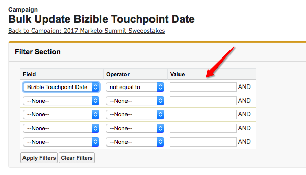

# Campagne Dynamics ed elenchi marketing {#dynamics-campaigns-and-marketing-lists}

>[!NOTE]
>
>Questo articolo riguarda un processo obsoleto. Invitiamo gli utenti a utilizzare [processo in-app nuovo e migliorato](/help/channel-tracking-and-setup/offline-channels/custom-campaign-sync.md){target="_blank"}.

## Campagne {#campaigns}

Le campagne Dynamics sono utili per tenere traccia delle attività di marketing offline e per includerle nel percorso omni-channel. Le campagne devono essere correlate a lead o contatti e possono essere raggruppate nella campagna tramite le Risposte alla campagna o gli Elenchi di marketing.

## Risposte campagna {#campaign-responses}

Quando i lead o i contatti vengono aggiunti direttamente a una campagna, vengono inseriti come record Risposta campagna.

## Abilita punti di contatto {#enable-touchpoints}

Per includere questi record nel percorso dei punti di contatto, sono disponibili alcune opzioni per la sincronizzazione dei tipi di risposte alla campagna. Nel record Campaign dovrebbe essere presente un campo personalizzato della soluzione installata etichettato, &quot;[!UICONTROL Enable Buyer Touchpoints].&quot; In caso contrario, il campo dovrà essere aggiunto tramite l’Editor di moduli.

Puoi scegliere di includere nella campagna tutti i record che hanno una risposta alla campagna, o solo quelli con una risposta di &quot;Interessato&quot;, oppure, per impostazione predefinita, non puoi includere le risposte alla campagna. Puoi lasciare vuoto il campo o scegliere esplicitamente di escluderlo.

[!DNL Marketo Measure] non supporta i valori di risposta personalizzati.

Di seguito sono riportati i valori di risposta stock per la risposta alla campagna:

In base alla selezione, questi record sono ora idonei per i punti di contatto nel percorso Lead, Contatto o Opportunità. Se si qualificano, nel percorso verrà visualizzato un punto di contatto &quot;Dynamics Campaign&quot;.

Uno dei motivi per cui una risposta alla campagna potrebbe non essere visualizzata è che per lead/contatto è già stata registrata un’attività Primo contatto e/o Creazione lead e la funzione &quot;PostLC&quot; è disabilitata o ha raggiunto il numero massimo di punti di contatto.

## Data punto di contatto {#touchpoint-date}

La data del punto di contatto per una campagna si trova in genere nella data in cui la risposta della campagna è stata aggiunta alla campagna. Può essere ignorato se viene compilato il campo personalizzato della soluzione installata con l’etichetta &quot;Data del punto di contatto dell’acquirente&quot;. In caso contrario, il campo dovrà essere aggiunto tramite l’Editor di moduli.

Un esempio comune che utilizza questo campo è per gli eventi in cui un elenco di scansioni dei badge da un evento viene aggiunto al CRM giorni dopo che si è verificato l’evento, in modo che l’utente possa effettivamente modificare la Data del punto di contatto dell’acquirente in data in cui si è verificato l’evento.

## Liste di marketing {#marketing-lists}

Gli elenchi marketing rappresentano un altro modo per includere lead o contatti in un percorso di marketing. Gli elenchi di marketing sono univoci per un gruppo di lead o contatti, il che significa che l’utente deve scegliere se il proprio elenco è un set di lead o un set di contatti.

[!DNL Marketo Measure] supporta solo gli elenchi marketing statici. Non sono supportati gli elenchi marketing dinamici perché la nostra elaborazione richiede la verifica della data di modifica di un record, ma poiché un elenco dinamico si sta modificando di frequente, non esiste una data di modifica per [!DNL Marketo Measure] per effettuare il controllo. Ciò richiederebbe il download costante dell’intero set di dati nel corso della giornata.

La schermata precedente è un elenco di marketing per lead. Gli elenchi di marketing sono associati alle campagne e possono essere associati a più campagne. A meno che non si crei un solo elenco di marketing per una campagna, [!DNL Marketo Measure] sconsiglia ai clienti di utilizzare gli elenchi di marketing per monitorare le campagne. È improbabile che lo stesso elenco esatto di lead/contatti sia idoneo per i punti di contatto in più campagne.

## Abilita punti di contatto {#enable-touchpoints-1}

Per abilitare un elenco di marketing per i punti di contatto, esiste un’impostazione separata sul record Campagna etichettato, &quot;[!UICONTROL Sync Marketing Lists],&quot; che è un semplice interruttore sì/no. In caso contrario, il campo dovrà essere aggiunto tramite l’Editor di moduli. Nel record Campagna puoi vedere quali elenchi marketing sono correlati alla campagna, in modo da sapere quanti elenchi stai abilitando.

## Data punto di contatto {#touchpoint-date-1}

La data di contatto per un elenco di marketing è in genere la data di creazione di ListMember, ovvero la data in cui il lead o il contatto è stato aggiunto all&#39;elenco di marketing. Può essere ignorato se viene compilato il campo personalizzato della soluzione installata con l’etichetta &quot;Data del punto di contatto dell’acquirente&quot;. In caso contrario, il campo dovrà essere aggiunto tramite l’Editor di moduli.

## Mappatura canale {#channel-mapping}

Le campagne Dynamics vengono inserite nel bucket dei canali di marketing personalizzati utilizzando il campo Tipo di campagna. È possibile modificarli nel menu Personalizzazioni di Dynamics.

I valori nel menu Tipo di campagna sono inseriti nel [!DNL Marketo Measure] Applicazione. **[!UICONTROL My Account]** > **[!UICONTROL Settings]** > **[!UICONTROL Offline Channels]**.

Per ogni tipo di campagna, può essere mappato su una combinazione di Canale e Sottocanale in modo che ogni punto di contatto che deriva dalla campagna abbia il canale e il Sottocanale mappati corretti.

## Data di sincronizzazione della campagna {#campaign-sync-date}

Questo non è disponibile per i clienti Dynamics

## Domande frequenti {#faq}

**È possibile abilitare i punti di contatto negli elenchi di marketing o solo nelle campagne in Dynamics?**

Puoi abilitare un elenco di marketing, ma deve essere correlato a una campagna poiché l’opzione per sincronizzare un elenco di marketing è disponibile nella campagna.

**È possibile utilizzare le risposte alle campagne e gli elenchi di marketing in una campagna?**

Sì.
