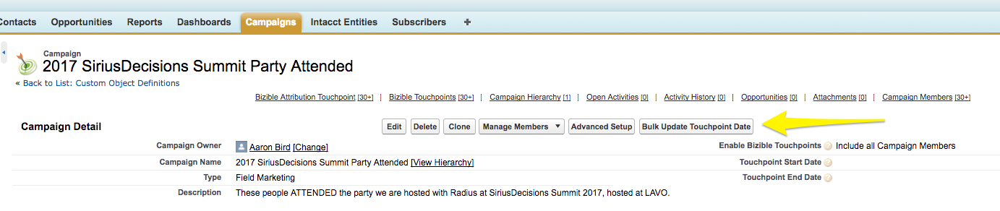

# Sincronizzazione delle campagne offline {#syncing-offline-campaigns}

Può essere difficile tracciare con precisione le campagne offline e capire in che modo si confrontano con le tue attività di marketing digitale. [!DNL Marketo Measure] consente di tenere traccia e attribuire punti di contatto alle campagne offline in [!DNL Salesforce], anche in situazioni in cui non viene creata una campagna di [!DNL Salesforce] fino a poche settimane dopo l&#39;evento.

>[!NOTE]
>Questo articolo riguarda un processo obsoleto. Invitiamo gli utenti a utilizzare il [nuovo processo in-app migliorato](/help/channel-tracking-and-setup/offline-channels/custom-campaign-sync.md){target="_blank"}.

## Prima della sincronizzazione {#before-you-sync}

Di seguito sono riportati alcuni suggerimenti per un processo di sincronizzazione efficiente:

* Le campagne offline si riferiscono alle interazioni di marketing che non si verificano online. tra cui canali di marketing come eventi, webinar e fiere commerciali. Includi solo campagne di marketing offline.
* Se si desidera includere le campagne che hanno tracciato le attività online prima dell&#39;installazione di [!DNL Marketo Measure], impostare la data di fine del punto di contatto come data in cui JavaScript è stato distribuito sul sito.
* È utile mantenere aperta l&#39;app [!DNL Marketo Measure] sulla pagina dei canali offline in modo che sia facile identificare i diversi tipi di campagna e in quale canale di marketing verranno inseriti i punti di contatto.

* Controlla tutto prima di premere il pulsante &quot;[!UICONTROL Save]&quot;.

## Data punto di contatto per aggiornamento in blocco {#bulk-update-touchpoint-date}

In [!DNL Salesforce], il campo Data di creazione nell&#39;oggetto membro della campagna indica la data in cui il membro della campagna è stato aggiunto alla campagna. Affinché il processo di sincronizzazione si svolga senza problemi, assicurarsi che il campo Data di Buyer Touchpoint abbia la stessa data dell&#39;oggetto membro di Salesforce Campaign. Questo passaggio viene eseguito utilizzando &quot;[!UICONTROL Bulk Update Touchpoint Date button],&quot; _prima_ di selezionare l&#39;opzione [!UICONTROL picklist] nel campo Abilita punti di contatto buyer.

Perché è importante? Immagina per un momento che la tua azienda abbia sponsorizzato uno stand ad una conferenza in gennaio. Alla conferenza, 100 persone hanno mostrato interesse per il prodotto e hanno fornito le loro informazioni di contatto per ricevere gli aggiornamenti via e-mail. Tre settimane dopo, hai finalmente creato una campagna in [!DNL Salesforce] per tenere traccia dell&#39;esito della conferenza.

La data di caricamento sarebbe tre settimane dopo la data della conferenza. Per correggere questa differenza, è possibile utilizzare il pulsante [!UICONTROL Bulk Update Touchpoint Date] per impostare la data appropriata. Il pulsante è illustrato nell&#39;immagine seguente.

In questo caso, la data di caricamento verrebbe retrocompilata di tre settimane. Questo passaggio deve essere eseguito prima di impostare il campo &quot;[!UICONTROL Enable Buyer Touchpoints]&quot;.

In sintesi, se si utilizza il pulsante [!UICONTROL Bulk Update Touchpoint Date] e si modifica la data del punto di contatto con la data dell&#39;evento, [!DNL Marketo Measure] genererà punti di contatto per la data effettiva dell&#39;evento, non per la data di caricamento.

Puoi anche aggiornare le date per tutti i membri della campagna su una campagna esistente. Quando si esegue questa operazione, assicurarsi che la data del punto di contatto sia la data dell&#39;interazione del membro. Fare clic su Aggiorna in blocco Data Buyer Touchpoint, filtrare l&#39;elenco dei membri della campagna in base alle esigenze e nell&#39;opzione &quot;[!UICONTROL Select Date]&quot; sopra l&#39;elenco dei membri della campagna aggiungere la stessa data della data in cui si è verificato l&#39;evento.

>[!CAUTION]
>Assicurati di aggiornare la data del punto di contatto _prima_ di abilitare i punti di contatto per tutti i membri della campagna.

## Come creare una campagna e sincronizzare i punti di contatto dell’acquirente {#how-to-create-a-campaign-and-sync-buyer-touchpoints}

Per creare una campagna in [!DNL Salesforce], passare alla scheda [!UICONTROL Campaigns] e selezionare &#39;[!UICONTROL New]&#39; come illustrato nell&#39;immagine seguente. A seconda della configurazione di [!DNL Salesforce], potrebbe essere necessario aggiungere Campagne alla barra superiore facendo clic sull&#39;icona più (+).

Quando si crea questa campagna, fare clic sul campo &quot;[!UICONTROL Enable Buyer Touchpoints]&quot; e selezionare una delle opzioni seguenti dall&#39;elenco a discesa:

* **Includi tutti i membri della campagna**
   * Questa opzione consente a [!DNL Marketo Measure] di attribuire un punto di contatto a ciascun membro della campagna.

* **Includi membri della campagna &quot;Rispondenti&quot;.**
   * Questa opzione applica i punti di contatto ai membri della campagna che hanno lo stato &quot;Risposta&quot;.

* **Escludi tutti i membri della campagna.**
   * Questa opzione non attribuisce punti di contatto ad alcun membro della campagna e funge da flag per segnalare che la campagna è stata deliberatamente esclusa da [!DNL Marketo Measure]. Se sincronizzi una campagna con i punti di contatto dell’acquirente per errore, puoi cambiare lo stato in &quot;Escludi tutti i membri della campagna&quot; e i punti di contatto verranno rimossi.

Una volta selezionata una di queste selezioni, [!DNL Marketo Measure] assegnerà a ogni membro della campagna un punto di contatto, se applicabile. Il lead o il contatto aggiunto alla campagna _deve_ avere un indirizzo e-mail associato al record affinché [!DNL Marketo Measure] possa creare un punto di contatto. Senza un indirizzo e-mail, [!DNL Marketo Measure] non assegnerà un punto di contatto al membro della campagna.

>[!MORELIKETHIS]
>[[!DNL Marketo Measure] Tutorial: Mappatura Dei Canali Offline](https://experienceleague.adobe.com/en/docs/marketo-measure-learn/tutorials/onboarding/marketo-measure-salesforce/mapping-offline-channels){target="_blank"}
>[[!DNL Marketo Measure] Tutorial: Campi Oggetto Campaign](https://experienceleague.adobe.com/en/docs/marketo-measure-learn/tutorials/onboarding/marketo-measure-salesforce/campaign-object-fields){target="_blank"}
