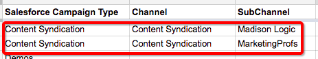

# Impostazione canale personalizzato offline {#offline-custom-channel-setup}

## Guida introduttuva {#getting-started}

Rispetto al modo in cui [!DNL Marketo Measure] gestisce le regole del canale online, noterai che le regole del canale offline non richiedono l&#39;utilizzo di un foglio di calcolo. Tuttavia, nel piano di implementazione è ancora presente un foglio, perché può essere utile per riflettere sul modo in cui organizzare i canali offline.

Il foglio di calcolo è composto da tre colonne:

Tipo di campagna **[!UICONTROL Salesforce]** - Aggiungere qui i tipi di campagna identificati in [!DNL Salesforce]

* Ad esempio, potrebbe trattarsi di un’e-mail, un webinar, una conferenza o di qualsiasi valore creato per questo campo a cui si desidera attribuire punti di contatto.

**[!UICONTROL Channel]** - aggiungi qui i vari canali di marketing

**[!UICONTROL Subchannel]** - aggiungi qui eventuali sottocanali corrispondenti

## Logica canale offline {#offline-channel-logic}

La logica del canale offline [!DNL Marketo Measure] è determinata dall&#39;oggetto Campaign, in particolare dal tipo di campagna [!DNL Salesforce]. Ogni impegno offline deve avere un tipo di campagna [!DNL Salesforce], ad esempio una cena o una fiera, perché [!DNL Marketo Measure] si basa su questo campo per capire a quale canale e sottocanale mappare.

I tipi di campagna SFDC verranno visualizzati nella scheda del canale offline, elencati in Tipo di campagna [!DNL Salesforce]. [!DNL Marketo Measure] può importare solo i tipi di campagna SFDC per le campagne a cui sono associati punti di contatto buyer.

È qui che puoi creare la mappatura Canale/Sottocanale nell&#39;app [!DNL Marketo Measure]. Ciò richiederà probabilmente la creazione di nuovi canali e sottocanali nell&#39;app [!DNL Marketo Measure], operazione che viene eseguita nella sezione Crea canali dell&#39;app, illustrata nell&#39;immagine seguente. È necessario creare nuovi canali e subcanali per [!DNL Marketo Measure] per capire dove inviare i punti di contatto. Puoi decidere come mappare i tipi di campagna.

## Esempio di mappatura dei canali {#channel-mapping-example}

Si supponga ad esempio di partecipare a due [!DNL Salesforce] conferenze all&#39;anno. Tuttavia, ogni conferenza è molto diversa e ha un pubblico di destinazione univoco. Vuoi sapere quale dei due apporta più valore. Nell&#39;ambiente [!DNL Salesforce], è possibile assegnare all&#39;evento di gennaio il tipo di campagna &quot;Conferenza&quot;, denominare il canale &quot;[!DNL Salesforce]&quot; e il sottocanale &quot;Conferenza di gennaio&quot;.

Ora volete fare lo stesso per la conferenza di giugno. Visto che anche questa è una conferenza, si può dare lo stesso Tipo di campagna, in questo caso, &quot;Conferenza&quot;. Il canale è lo stesso, [!DNL Salesforce], e il sottocanale di questa seconda conferenza è &quot;Conferenza di giugno&quot;. Tutto ciò ha senso da un punto di vista organizzativo. Tuttavia, è molto confuso con la logica [!DNL Marketo Measure] leggere e applicare queste regole perché entrambe le campagne hanno lo stesso tipo di campagna. Lo script [!DNL Marketo Measure] non può mappare i dati da un tipo a due diversi sottocanali. Ciò significa che dovrai creare un nuovo Tipo di campagna per ogni sottocanale, ma che i sottocanali possono avere lo stesso canale.

Di seguito è riportato un esempio di logica che [!DNL Marketo Measure] non sarebbe in grado di leggere:

Nello scenario precedente, creerai un tipo di campagna univoco perché non puoi mappare lo stesso tipo di campagna a due canali secondari diversi. È invece necessario impostare tipi univoci come i seguenti:

Eventuali tipi di campagna esistenti devono essere inclusi nella mappa del canale e &quot;NULL&quot; deve essere aggiunto come canale.

Prenditi del tempo per entrare in [!DNL Salesforce] e determinare il numero e la natura dei tipi di record esistenti che desideri includere e se è necessario creare ulteriori campagne in base alle informazioni precedenti. Una volta completate tutte le informazioni necessarie, puoi procedere al caricamento.

Ulteriori informazioni sulla [sincronizzazione offline [!DNL Salesforce] Campagne con [!DNL Marketo Measure]](/help/channel-tracking-and-setup/offline-channels/legacy-processes/syncing-offline-campaigns.md).

## Gestione delle campagne SFDC per attività di marketing online {#handling-sfdc-campaigns-for-online-marketing-efforts}

In genere i team di marketing creano [!DNL Salesforce] campagne per monitorare varie attività di marketing digitale. Non c’è alcun problema con questa pratica; tuttavia, è importante trattare queste campagne in modo diverso rispetto alle vere campagne offline, come ad esempio direct mailing o conferenze. Le campagne correlate a eventi digitali (interazioni che si verificano sul sito Web) non devono essere sincronizzate con [!DNL Marketo Measure]. La sincronizzazione di queste campagne comporterebbe la duplicazione dei punti di contatto perché il JavaScript [!DNL Marketo Measure] sta già tenendo traccia delle attività online.

Un altro suggerimento per la gestione delle campagne per le attività online consiste nel mappare il tipo di campagna [!DNL Salesforce] su NULL. A questo scopo, creare innanzitutto un canale nell&#39;app [!DNL Marketo Measure] denominato NULL, come illustrato nell&#39;immagine seguente. Si trova nell&#39;app [!DNL Marketo Measure] nella sezione **Crea canali**. Questo sarà utile nel caso in cui una campagna che non deve essere sincronizzata venga sincronizzata accidentalmente. È facile trovare la campagna e correggere lo stato di sincronizzazione osservando tutti gli elementi inseriti nel bucket con NULL.

## Immissione delle regole del canale offline nell’app {#entering-your-offline-channel-rules-to-the-app}

Dopo aver modificato e aggiornato il foglio di calcolo con le regole personalizzate, il passaggio successivo consiste nel ricreare la mappatura dei canali nell&#39;app [!DNL Marketo Measure]. Non verrà caricato un foglio di calcolo per i canali offline. Piuttosto, immetterai le informazioni nelle caselle dell’elenco a discesa come mostrato nell’immagine seguente. Trovato facendo clic su **[!UICONTROL Offline Channels]** nella sezione **[!UICONTROL Channels]**.

>[!TIP]
>Vuoi determinare _quando_ un tipo di campagna [!DNL Salesforce] viene trascinato nella mappatura dei canali [!DNL Marketo Measure]? Vai a **[!UICONTROL Setup]** > **[!UICONTROL Campaigns]** > **[!UICONTROL Fields]** > **[!UICONTROL Type]**. Puoi quindi vedere quali valori sono presenti nell’elenco a discesa e quali sono inattivi. Quelli inattivi non verranno visualizzati come tipo selezionabile nella sezione &quot;[!UICONTROL Offline Channels]&quot;. Questo processo può richiedere da pochi minuti a 48 ore.

Al termine, fai clic su **[!UICONTROL Save]**. [!DNL Marketo Measure] caricherà le modifiche ed elaborerà nuovamente i dati.

>[!MORELIKETHIS]
> [[!DNL Marketo Measure] Tutorial: Mappatura Dei Canali Offline](https://experienceleague.adobe.com/it/docs/marketo-measure-learn/tutorials/onboarding/marketo-measure-salesforce/mapping-offline-channels){target="_blank"}
> [[!DNL Marketo Measure] Esercitazioni: Sincronizzazione delle campagne offline](https://experienceleague.adobe.com/it/docs/marketo-measure-learn/tutorials/onboarding/marketo-measure-salesforce/syncing-offline-campaigns){target="_blank"}
> [Integrazione dei programmi Marketo Engage](/help/marketo-measure-and-marketo/marketo-engage-programs-integration.md#channel-mapping){target="_blank"}
