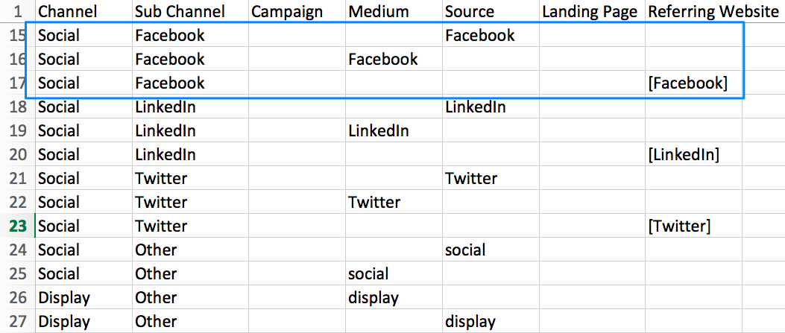

# Configurazione del canale personalizzato online {#online-custom-channel-setup}

Per ottenere rapporti accurati, i canali di marketing devono essere impostati in modo da riflettere la strategia UTM della tua organizzazione. Questa guida illustra il modo migliore per configurare le regole del canale personalizzate.

## Prima di iniziare {#before-you-begin}

Prima di iniziare a creare le regole del canale per [!DNL Marketo Measure], prendi del tempo per pensare all’organizzazione delle campagne di marketing e a come si adattano alle [!DNL Marketo Measure] struttura. È necessario determinare quali canali, sottocanali, campagne e siti web di riferimento si desidera monitorare.

Aspetti da tenere a mente:

* La tua organizzazione può creare un massimo di 40 canali di marketing personalizzati. Ciò include sia i canali offline che online.
* La tua organizzazione può creare fino a 200 sottocanali.
* Per ogni raccolta, o bucket, di dati è necessaria una propria regola (riga nel foglio di calcolo) per specificare come verranno organizzati i dati. Sia il più specifico possibile.
* [!DNL Marketo Measure] la logica assegna priorità ai dati in ordine decrescente a partire dalla riga superiore del foglio di calcolo e per poi scendere. Legge ogni secchio, o cellula, di fila in fila cercando la prima vestibilità. I dati vengono quindi ordinati in base ai valori contenuti in questi blocchi. Ulteriori informazioni qui sotto.
* Non ordinare il foglio in ordine alfabetico, in quanto interferirà con le regole logiche.
* Una volta caricato il file, non puoi modificare nessuna delle regole per sette giorni. [!DNL Marketo Measure] utilizza questo tempo per elaborare e aggiornare i punti di contatto.

## [!DNL Marketo Measure] Logica e priorità {#marketo-measure-logic-and-priorities}

Il primo passaggio è quello di scaricare il foglio di calcolo del canale personalizzato dal [!DNL Marketo Measure] app. Passa a **Impostazioni** in **Il mio account** e seleziona **Online**. Puoi selezionarne una **Scarica modello originale** o **Scarica le regole correnti**.

Il foglio di calcolo ha 7 colonne:

* **Canale:** aggiungi qui i vari canali di marketing
* **Canale secondario:** aggiungi qui i sottocanali corrispondenti
* **Campagna:** aggiungi qui i nomi delle campagne, sia che il valore provenga da UTM o da Campagne Salesforce per [!DNL Marketo Measure] Funzionalità delle attività
* **Media:** la colonna media rappresenta il valore del parametro utm_medium
* **Origine:** la colonna sorgente rappresenta il valore del parametro utm_source
* **Pagina di destinazione:** aggiungi la pagina di destinazione qui
* **Sito Web di riferimento:** gli URL dei siti web che fanno riferimento al traffico sulle pagine o incorporati [!DNL Marketo Measure] logica (indicata da parentesi)

L’ottava colonna indica le regole che non è possibile eliminare dal foglio di calcolo con &quot;Do Not Remove&quot; (Non rimuovere). Nella parte superiore del foglio di calcolo sono presenti regole di canale predefinite che [!DNL Marketo Measure] consiglia di non modificare o rimuovere anche se non si utilizzano questi canali. [!DNL Marketo Measure] dispone di integrazioni profonde con queste piattaforme, in modo che siano incluse per impostazione predefinita.

Le righe rappresentano le regole e l’ordine in cui [!DNL Marketo Measure] assegna la priorità ai dati. La prima riga ha la priorità sulla seconda riga, la seconda riga ha la priorità sulla terza riga e così via. Quando si determina in quale canale di marketing e canale secondario eseguire il bucket dei punti di contatto, [!DNL Marketo Measure] legge dall’alto verso il basso, da sinistra a destra, finché non trova una riga che soddisfa i criteri del punto di contatto. (IE se un punto di contatto ha un utm_source=Facebook, il punto di contatto viene inserito nel canale Social.Facebook a causa della regola 15 nello screenshot).

[!DNL Marketo Measure] viene fornito con 12 canali predefiniti per l’uso. Questi canali sono correlati a piattaforme con cui [!DNL Marketo Measure] è completamente integrato. Che li utilizzi o meno, non rimuoverli. Se utilizzi una di queste piattaforme, ad esempio Bing Ads, ma preferisci utilizzare una convenzione di denominazione diversa per il canale o il canale secondario, puoi aggiornare il nome. Un esempio è mostrato nell&#39;immagine seguente.

Anche la struttura delle regole è importante. Le regole possono sembrare informazioni ripetute e dati mancanti, ma questa struttura è intenzionale. Per un ordinamento accurato dei dati, è necessario mappare separatamente ogni singola origine sul canale appropriato, anche le sorgenti che condividono i sottocanali e i canali. Più le regole sono dettagliate e dettagliate, più i risultati saranno approfonditi. In sostanza, è consigliabile scrivere una regola dettagliata per ogni singola attività di marketing da monitorare.

Considera la seguente situazione: hai altri annunci che non desideri tenere traccia per qualche motivo, o ricevi visite al tuo sito web da un canale familiare, ma non da una fonte familiare. Questa situazione potrebbe causare la perdita di dati se [!DNL Marketo Measure] impossibile trovare la regola appropriata da utilizzare per ordinare i dati. Per evitare che ciò accada, [!DNL Marketo Measure] consiglia di interrompere la regola su più righe.

Ogni parametro o componente della regola è mappato separatamente al canale. Ad esempio, quando [!DNL Marketo Measure] ha [!DNL Facebook] dati da ordinare, cerca le regole correlate [!DNL Facebook]. Scansiona dall&#39;alto verso il basso. Nell&#39;esempio seguente: [!DNL Marketo Measure] lo capirei per la prima volta [!DNL Facebook] subchannel, tutto ciò che deve leggere è il parametro sorgente per rilasciare i dati nel bucket di quella regola.

La regola successiva richiede solo il parametro medium, quindi tutti i dati con quel parametro verranno inseriti in questo canale. Infine, per [!DNL Facebook], tutti i dati provenienti dall’URL di Facebook verranno inseriti nell’ultimo bucket Facebook.

Il canale predefinito &quot;Altro&quot; esiste per rilevare i dati che non soddisfano i criteri di alcuna regola. Tieni presente che alcuni dei bucket nell&#39;Altro canale contengono asterischi (&#42;). Questi asterischi rappresentano i caratteri jolly che agiscono come un catch-all.

A causa di [!DNL Marketo Measure] logica che funziona dall&#39;alto verso il basso, tieni presente che la regola dei caratteri jolly, indicata con un asterisco (&#42;), deve essere posizionato alla fine del foglio delle regole. Tutti i dati che non vengono rilevati o ordinati dalle altre regole verranno aggiunti automaticamente a questo bucket di caratteri jolly.

Di seguito sono riportati altri esempi di logica con caratteri jolly:

* &#42;email&#42; = contiene &quot;email&quot;
* &#42;email = termina con &quot;email&quot;
* e-mail&#42; = [!UICONTROL starts with email]

Inoltre, se crei un canale secondario per uno dei tuoi canali, dovrai creare un canale secondario per tutte le regole sotto quel canale. In altre parole, se crei un canale secondario, non puoi lasciare vuoto il resto delle colonne.

## Impostazione delle regole dei canali personalizzati {#setting-up-your-custom-channels-rules}

Dopo aver deciso come organizzare e assegnare le priorità ai dati, puoi aggiungere le regole al foglio di calcolo. Di seguito sono riportate alcune best practice:

* Mantieni le tue regole il più semplice possibile fin dall&#39;inizio. Puoi sempre basarsi sulle regole mentre vai avanti.
* Non aggiungere caratteri speciali nei nomi dei canali (ad esempio, $%#&amp;&#42;@)
* Non modificare le regole associate a BingAds e AdWords. Queste regole sono cruciali per la creazione di pacchetti di dati che provengono automaticamente da [!DNL Marketo Measure] Integrazione API con queste piattaforme. Tuttavia, cambiare il nome del canale e del canale in base alle proprie esigenze non è un problema.
* Non rimuovere le regole che contengono una nota &quot;Do Not Remove&quot; (Non rimuovere).
* Le regole di ricerca organica vengono sempre posizionate dopo la [!UICONTROL Paid Search rules]
* Non puoi creare regole basate su sottodomini diversi.
* Se devi aggiungere più valori in una cella del foglio di calcolo, separali con un punto e virgola `;` solo. Nessuna virgola o spazio.
* Non è necessario aggiungere il punto com (.com) alla fine dell’URL di riferimento.
* Quando aggiungi un URL di riferimento, non inserirlo tra parentesi come le altre regole relative all’API.

## Caricamento delle regole dei canali personalizzati {#uploading-your-custom-channels-rules}

Assicurati che tutti i nuovi valori di canale e canale secondario che stai aggiungendo nel CSV siano già stati aggiunti nell’area delle impostazioni del canale del tuo account Bizible. Controlla tutti i nomi dei canali e dei sottocanali che corrispondono nel CSV con l&#39;area delle impostazioni del canale del tuo [!DNL Marketo Measure] conto. Verifica la presenza di virgole e spazi.

Se ricevi un messaggio di errore durante il caricamento, correggi il problema e ricarica. Se non viene ricevuto alcun messaggio di errore, fai clic su **Salva e processo** nella parte inferiore della pagina.
