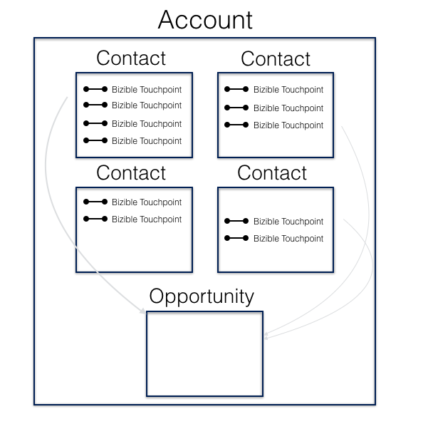

# Metodologia di mappatura attribuzione {#attribution-mapping-methodology}

La metodologia di mappatura dell’attribuzione è il processo di ricerca di determinati oggetti nel CRM (contatti, opportunità, account) per creare punti di contatto di attribuzione nell’opportunità associata. In altre parole, rappresenta il modo [!DNL Marketo Measure] di capire quali punti di contatto includere nel modello di attribuzione in base ai processi del CRM corrente.

## Mappatura ID account {#account-id-mapping}

Per impostazione predefinita, [!DNL Marketo Measure] fornisce la mappatura dell&#39;ID account. [!DNL Marketo Measure] esamina le informazioni di marketing dell&#39;account e dei relativi contatti per creare punti di contatto di attribuzione associati all&#39;opportunità. Di seguito è riportata una semplice rappresentazione di tale processo.

Tieni presente che **non tutti** i punti di contatto dei tuoi contatti vengono inseriti nell&#39;opportunità come punti di contatto di attribuzione. La timeline dell’opportunità (data del primo contatto, data di chiusura) determina se un punto di contatto conta come influencer sull’opportunità. Pertanto, se si è verificato un punto di contatto sul contatto A dopo che l&#39;opportunità è stata chiusa con successo/perso, [!DNL Marketo Measure] non invierà tale punto di contatto all&#39;opportunità. Questa procedura timeline viene seguita in tutte le altre mappature di oggetti di attribuzione.

Pro: questo metodo di attribuzione è molto efficace per la maggior parte delle aziende. Il team marketing non deve necessariamente affidarsi al team vendite per associare tutti i contatti a una particolare opportunità (che spesso è un problema). Inoltre, anche se un team di vendita associa ruoli di contatto, molte interazioni di altri contatti con il materiale di marketing potrebbero non essere presenti. Infine, questo metodo aiuta la strategia ABM che si sforza di influenzare la totalità di un account, piuttosto che influenzatori specifici.

Contro: se esistono forti accordi sui livelli di servizio di marketing e vendita che definiscono a chi assegnare il merito per cosa, allora questo metodo potrebbe essere problematico. Inoltre, se le persone non utilizzano le gerarchie dei conti per definire specifiche unità aziendali all’interno di un conto più grande (ad esempio, IBM), le interazioni di marketing specifiche per una unità aziendale possono essere distribuite tra altre opportunità di unità aziendali.

## Mappatura ruolo contatto opportunità {#opportunity-contact-role-mapping}

>[!NOTE]
>
>I metodi di mappatura del ruolo di contatto sono disponibili solo per coloro che utilizzano Salesforce come CRM. Non è disponibile per gli utenti di Microsoft Dynamics a causa della mancanza di un oggetto Ruolo contatto all’interno di tale CRM.

Sebbene la maggior parte dei client utilizzi il mapping degli ID account, [!DNL Marketo Measure] può cercare i ruoli di contatto (contatti associati all&#39;opportunità) all&#39;interno di un&#39;opportunità per suddividere il processo di attribuzione. Ciò significa che [!DNL Marketo Measure] invierà solo le interazioni di marketing associate ai ruoli di contatto dell&#39;opportunità come punti di contatto di attribuzione dell&#39;acquirente. Di seguito è riportata una rappresentazione di questo processo.

Pro: se il team dispone di un processo per i ruoli di contatto ben definito, questo tipo di mappatura di attribuzione potrebbe essere ideale per te. Aiuta ad allineare le vendite e il marketing un po’ di più, in quanto tutti capirebbero appieno come l’attribuzione viene suddivisa. Questo processo è utile anche quando le organizzazioni eseguono il targeting di più business unit all’interno di una grande azienda e quando vendono contemporaneamente prodotti diversi.

Contro: tuttavia, se non è attivo alcun processo per il ruolo di contatto, il marketing perde molti dati di marketing e il team riceverà molto meno credito per le attività di marketing che influenzano le opportunità.

## Mappatura ruolo contatto principale opportunità {#opportunity-primary-contact-role-mapping}

Oltre a esaminare semplicemente i ruoli di contatto nell&#39;opportunità, [!DNL Marketo Measure] può concentrarsi di più per esaminare solo i contatti principali in un&#39;opportunità. Tenendo presente questa configurazione, [!DNL Marketo Measure] acquisisce solo il punto di contatto di marketing associato ai contatti primari su un&#39;opportunità e invia tali informazioni nella storia di attribuzione di tale opportunità specifica. Vedi l’immagine seguente.

Pro: se il team è interessato solo a comprendere l’influenza di marketing sui contatti impostati come &quot;primari&quot; nell’opportunità, questo tipo di mappatura è più adatto al team.

Contro: questo è sicuramente il processo di mappatura meno utilizzato e può minare notevolmente l’influenza di marketing che sta spostando l’ago attraverso altri contatti in un’opportunità.
