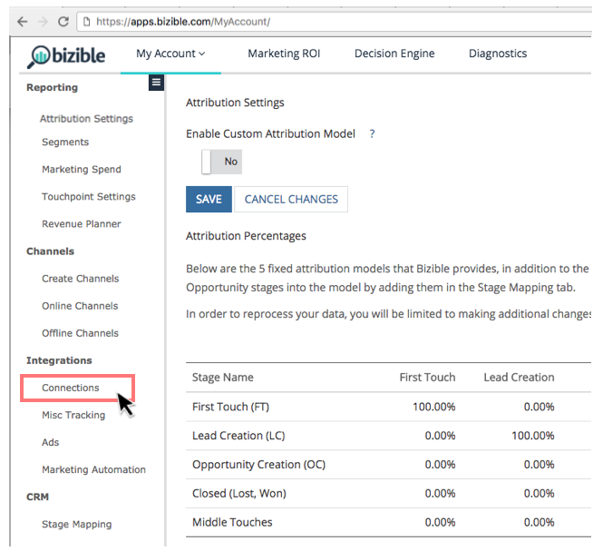
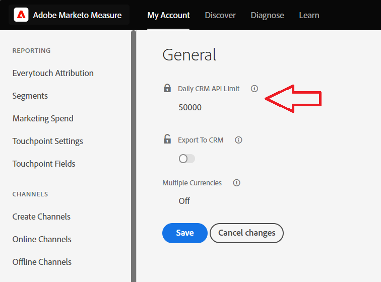
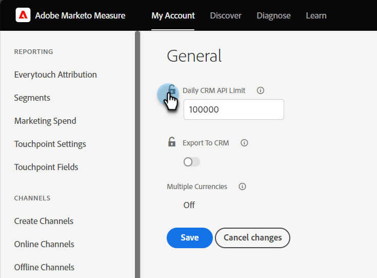

# Connettere Marketo Measure a Salesforce {#connect-marketo-measure-to-salesforce}

Questo articolo fornisce una panoramica su come collegare [!DNL Salesforce] account per il tuo [!DNL Marketo Measure] account.

## Connessione [!DNL Marketo Measure] con [!DNL Salesforce] {#connecting-marketo-measure-with-salesforce}

1. Utilizza un browser in incognito per accedere a [!DNL Marketo Measure].

1. Nella barra dei menu nella parte superiore dello schermo, passa a **[!UICONTROL My Account]** e fai clic su **[!UICONTROL Settings]** opzione.

1. Nella colonna di opzioni di impostazione a sinistra, fare clic su **[!UICONTROL Connections]** si trova sotto [!UICONTROL Integrations] sezione.

   

1. Nella sezione CRM in Connessioni, fai clic su **[!UICONTROL Set Up New CRM Connection]**.

   

1. Verrà visualizzata una finestra popup in cui viene richiesto di selezionare la connessione CRM. Fai clic su **[!UICONTROL Connect]** accanto al pulsante [!DNL Salesforce] Logo.

   

1. Viene visualizzata una finestra pop-up finale in cui viene richiesto di [!DNL Salesforce] credenziali, sandbox o produzione. Inserisci le tue informazioni e fai clic su **[!UICONTROL Authorize]** per collegare l&#39;account a [!DNL Marketo Measure].

>[!NOTE]
>
>[!DNL Marketo Measure] può essere connesso a una sola [!DNL Salesforce] alla volta.
>
>* A [!DNL Marketo Measure] L&#39;istanza può essere connessa a un&#39;istanza Sandbox SFDC per testare l&#39;integrazione prima di passare alla connessione all&#39;istanza di produzione SFDC.
>* Se esegui prima il test con una sandbox SFDC, ti consigliamo vivamente di eseguire il test con una che sia una replica esatta dell’istanza di produzione SFDC in termini di campi sugli oggetti Lead, Contatto, Account, Opportunità, Campagna e Caso. Se in produzione sono presenti trigger APEX attivi che attivano gli aggiornamenti per gli oggetti Lead, Contact, Account, Opportunity, Campaign e Case, è necessario provare a renderli attivi nella sandbox.
>* Al termine del test, potrai aggiornare [!DNL Marketo Measure] account per indicare la tua produzione [!DNL Salesforce] (anziché Sandbox [!DNL Salesforce]). A causa del modo in cui è stata costruita l’integrazione, una volta [!DNL Marketo Measure] l&#39;account è connesso alla produzione [!DNL Salesforce], non è possibile tornare indietro e connettersi a una sandbox [!DNL Salesforce] org.

## Utilizzo crediti API {#api-credits-usage}

Marketo Measure impiega un&#39;attività di integrazione CRM per interfacciarsi con la Salesforce di un cliente attraverso un utente integrato. Tutti gli scambi di dati tramite questo utente utilizzano i crediti API Salesforce. Puoi allocare una quota di credito a un utente di integrazione, il che consente di regolare chiamate API eccessive. La quota o il limite viene reimpostato ogni 24 ore.

Puoi accedere a questo limite in Marketo Measure tramite: **Il mio account** > **Impostazioni** > **CRM** > **Generale** > **Limite API CRM giornaliero** e possono configurarlo per i tenant.

### Impostazione di un limite per i crediti API {#setting-a-limit-for-api-credits}

1. Accedi a **Il mio account** > **Impostazioni**.

1. In CRM, fai clic su **Generale**. Vedrai il **Limite API CRM giornaliero** opzione.

1. Fai clic sull’icona Blocca per modificarla.

   

1. Inserisci un limite desiderato uguale o superiore a 100.000. Clic **Salva** al termine.

   

>[!NOTE]
>
>Per aumentare i crediti API di Salesforce disponibili per la soluzione connessa, contatta l’amministratore Salesforce e comunica [questo documento Salesforce](https://developer.salesforce.com/docs/atlas.en-us.salesforce_app_limits_cheatsheet.meta/salesforce_app_limits_cheatsheet/salesforce_app_limits_platform_api.htm){target="_blank"}.
