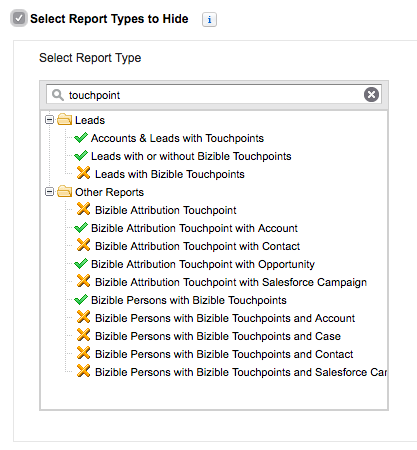

# Nascondere i tipi di rapporto non necessari {#hiding-unnecessary-report-types}

Dopo aver completato l&#39;installazione e aver iniziato a utilizzare i report, non tutti i report forniti con il pacchetto [!DNL Marketo Measure] verranno utilizzati dall&#39;organizzazione. Pertanto, è utile nascondere i tipi di rapporto non utilizzati per eliminare ogni confusione e consentire un aspetto più pulito. Puoi nascondere qualsiasi rapporto desiderato, ma i rapporti identificati nell’immagine seguente sono in genere nascosti.

1. Passare alla scheda **[!UICONTROL Reports]**.

1. Fare clic sul pulsante **[!UICONTROL Create New Report]** nella parte superiore della schermata.

1. Digita la parola &quot;punto di contatto&quot; per compilare i rapporti.

1. Selezionare la casella di controllo **[!UICONTROL Select Report Types to Hide]** in alto a sinistra.

1. Fai clic sui rapporti contrassegnati di seguito con una X arancione per far sì che l’elenco dei rapporti sia lo stesso dell’immagine seguente.

   

>[!MORELIKETHIS]
>
>[Salesforce - Nascondi tipi di report inutilizzati](https://help.salesforce.com/articleView?id=release-notes.rn_analytics_hide_report_types.htm&type=5&language=en_us)
