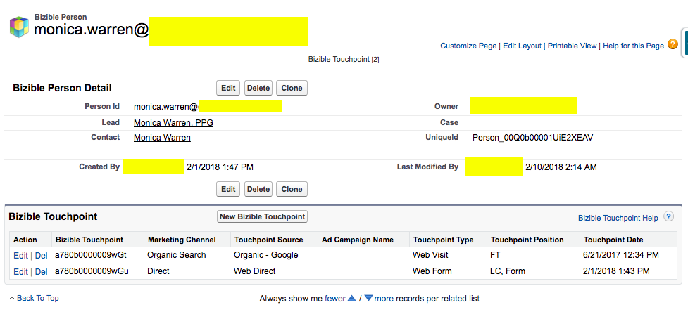

# [!DNL Marketo Measure] Oggetti Salesforce {#marketo-measure-salesforce-objects}

>[!NOTE]
>
>Potresti vedere le istruzioni che specificano &quot;[!DNL Marketo Measure]&quot; nella documentazione, ma vedi ancora &quot;Bizible&quot; nel tuo CRM. Stiamo lavorando per aggiornarlo e il rebranding verrà riportato nel tuo CRM a breve.

Quando [!DNL Marketo Measure] è installato in [!DNL Salesforce] (SFDC), diversi [!DNL Marketo Measure] Vengono aggiunti oggetti. Questo articolo fornisce una spiegazione di diversi di questi [!DNL Marketo Measure] Oggetti. Alcuni oggetti che [!DNL Marketo Measure] aggiunge a [!DNL Salesforce] sono:

* [Punto di contatto dell&#39;acquirente](#touchpoint)
* [Punto di contatto di attribuzione acquirente](#attribution)
* [[!DNL Marketo Measure] Persona](#person)
* [[!DNL Marketo Measure] Test A/B](#ab)
* [[!DNL Marketo Measure] Eventi](#events)

I punti di contatto acquisiti dagli elementi di cui si desidera tenere traccia verranno scritti negli oggetti personalizzati creati dall&#39;installazione di [!DNL Bizible Salesforce] pacchetto.

[!DNL Marketo Measure] Gli oggetti si riferiscono a uno standard specifico [!DNL Salesforce] Oggetti. Questo ti consente di creare rapporti su [!DNL Marketo Measure] e [!DNL Salesforce] Oggetti insieme. La tabella seguente mostra quali [!DNL Salesforce] Oggetto [!DNL Marketo Measure] L’oggetto si riferisce a.

## Punto di contatto dell&#39;acquirente {#buyer-touchpoint}

Il [!UICONTROL Buyer Touchpoint] (BT) Object racconta la storia di marketing di un individuo. Racchiude tutti i dati relativi ai punti di contatto di marketing generati da lead e contatti. Il BT mostra informazioni come il canale di marketing da cui proviene il punto di contatto o quale campagna pubblicitaria ha portato quel particolare lead/contatto al tuo sito web.

L&#39;oggetto BT è visibile nelle pagine Lead e Contatti come **Elenco correlato** (vedi immagine qui sotto).

Nell&#39;elenco relativo a BT vengono visualizzati tutti i punti di contatto appartenenti al lead o al contatto. All’interno dell’elenco sono [!DNL Marketo Measure] Campi che forniscono ulteriori dettagli su ciascun punto di contatto. Cliccando sul numero ID punto di contatto dell&#39;acquirente si accede alla pagina Dettagli punto di contatto dell&#39;acquirente, che fornisce ulteriori dettagli sul punto di contatto, come la prima pagina web visitata dal lead/contatto durante quella sessione web (**pagina di destinazione**).

## Punto di contatto di attribuzione acquirente {#buyer-attribution-touchpoint}

Il [!UICONTROL Buyer Attribution Touchpoint] L’oggetto racconta la storia delle interazioni di marketing dei contatti relativi a un’opportunità. Viene visualizzato il *attribuzione* dati relativi ai punti di contatto di marketing. Questo oggetto ti consente di vedere quanto credito di ricavi viene attribuito a ogni punto di contatto di marketing. Il tipo di modello di attribuzione utilizzato determinerà la percentuale di ricavi attribuiti ai punti di contatto.

I punti di contatto di attribuzione dell&#39;acquirente (BAT) vengono creati solo dopo la creazione di un&#39;opportunità relativa ai contatti che dispongono di dati dei punti di contatto dell&#39;acquirente (BT). Le BAT non verranno create senza un’opportunità. Una volta creata l&#39;opportunità, l&#39;oggetto BAT utilizzerà [!DNL Salesforce] *Quantità* sull’opportunità per capire l’importo dei ricavi da attribuire ai punti di contatto.

A **workflow** deve essere creato se utilizzi un [campo personalizzato Importo](/help/advanced-marketo-measure-features/custom-revenue-amount/using-a-custom-revenue-amount-field.md) per visualizzare i ricavi sull&#39;oggetto opportunità. [!DNL Marketo Measure] non è in grado di leggere le informazioni visualizzate nei campi importo personalizzati e di conseguenza non è in grado di popolare i dati di attribuzione dei ricavi sui punti di contatto. Questo flusso di lavoro utilizzerà **[!DNL Marketo Measure]Importo dell’opportunità** Campo, uno dei [!DNL Marketo Measure] campi personalizzati, per mappare il valore dei ricavi dal campo Importo personalizzato al campo Importo dell’opportunità.

L&#39;oggetto BAT è visibile sul [!UICONTROL Opportunity], [!UICONTROL Contact], e [!UICONTROL Account] Oggetto come elenco correlato. In questo elenco vengono visualizzati tutti i punti di contatto con i dati di attribuzione appartenenti a un’opportunità. Facendo clic sull&#39;ID punto di contatto di attribuzione acquirente, si aprirà la pagina Dettagli punto di contatto di attribuzione acquirente. Qui potrai vedere dati di attribuzione e informazioni più specifiche sulla provenienza del punto di contatto (simili a quelli forniti dall’oggetto punto di contatto dell’acquirente).

## [!DNL Marketo Measure] Persona {#marketo-measure-person}

Il [!DNL Marketo Measure] Oggetto Person mette in relazione gli oggetti Lead e Contact. Con Salesforce non è possibile creare report utilizzando l’oggetto Lead e Contact all’interno dello stesso report. Tramite la relazione con l&#39;oggetto lead e contatto, [!DNL Marketo Measure] Persona consente di creare rapporti su entrambi gli oggetti all’interno dello stesso rapporto. Questa funzione è particolarmente utile quando un lead è stato convertito in un contatto. Su un [!DNL Marketo Measure] Record della persona Vedrai una ricerca nel record corrispondente del lead e/o contatto, un elenco correlato dei punti di contatto associati alla persona e l’ID della persona (che è sempre l’indirizzo e-mail del lead/contatto). Poiché il [!DNL Marketo Measure] Persona si riferisce all&#39;oggetto lead e contatto, non ci sarà mai [!DNL Marketo Measure] Record di persona associato a un punto di contatto di attribuzione acquirente. Di seguito è riportato un esempio [!DNL Marketo Measure] Record della persona in Salesforce:

## [!DNL Marketo Measure] Test A/B {#marketo-measure-a-b-test}

Se esegui test A/B tramite [!DNL Optimizely] o VWO (Visual Web Optimizer), è possibile collegare tali account al [!DNL Marketo Measure] per visualizzare i dati dei test A/B in Salesforce. Il [!DNL Marketo Measure] L’oggetto test A/B consente essenzialmente di acquisire dati di test A/B da Optimizely/VWO e collegarli a lead e contatti.

Il [!DNL Marketo Measure] L’oggetto test A/B viene visualizzato come elenco correlato in [!UICONTROL Leads], [!UICONTROL Contacts] e [!UICONTROL Opportunity] pagine. L’elenco mette in evidenza tutti gli esperimenti e le varianti che stai eseguendo in Optimizely o VWO e ti consente di visualizzare gli esperimenti/le varianti in quanto si riferiscono a lead e contatti specifici.

## [!DNL Marketo Measure] Eventi {#marketo-measure-events}

Il [!DNL Marketo Measure] Oggetto Events consente di tenere traccia di eventi specifici che si verificano sul sito web. Per tenere traccia di eventi specifici che si verificano sul sito web, è necessario aggiungere alle pagine il codice personalizzato oltre al [!DNL Marketo Measure] JavaScript. Le informazioni acquisite verranno visualizzate all&#39;interno di [!DNL Marketo Measure] Elenco correlato agli oggetti, disponibile nella [!UICONTROL Leads], [!UICONTROL Contacts] e [!UICONTROL Opportunity] pagine. Il [!DNL Marketo Measure] Oggetto Events *non* legare ai dati di attribuzione. Lo scopo di questo oggetto è quello di verificare se le persone stanno eseguendo azioni specifiche sul sito web.

## [!DNL Marketo Measure] Campi {#marketo-measure-fields}

Dati acquisiti da [!DNL Marketo Measure] JavaScript viene inviato nel personalizzato [!DNL Marketo Measure] Campi all’interno del [!DNL Marketo Measure] Oggetti. Alcuni campi sono presenti solo su determinati oggetti. È possibile esaminare [glossario di [[!DNL Marketo Measure] campi]](/help/introduction-to-marketo-measure/overview-resources/glossary-of-marketo-measure-fields.md) e un [visualizzazione dei relativi [!DNL Marketo Measure] Oggetti](/help/configuration-and-setup/marketo-measure-and-salesforce/marketo-measure-object-and-field-taxonomy.md).

## [!DNL Marketo Measure] Rapporti e dashboard {#marketo-measure-reports-and-dashboards}

Il [!DNL Marketo Measure] Report e dashboard aggiunti al tuo [!DNL Salesforce] offre funzionalità predefinite di reporting e visualizzazione dei dati. Queste sono di base [!DNL Marketo Measure] report per organizzare, analizzare e comprendere rapidamente i dati dei punti di contatto.
