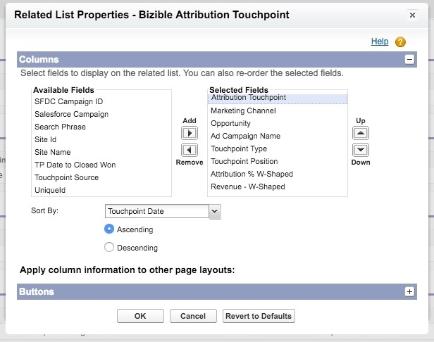

# Istruzioni di layout pagina {#page-layout-instructions}

>[!NOTE]
>
>Potresti vedere le istruzioni che specificano &quot;[!DNL Marketo Measure]&quot; nella documentazione, ma vedi ancora &quot;Bizible&quot; nel tuo CRM. Stiamo lavorando per aggiornarlo e il rebranding verrà riportato nel tuo CRM a breve.

Per vedere facilmente [!DNL Marketo Measure] è consigliabile aggiornare i layout di pagina per i [!UICONTROL Account], [!UICONTROL Contact], [!UICONTROL Lead], [!UICONTROL Opportunity], e [!UICONTROL Campaign] Oggetti. Le istruzioni vengono suddivise per ogni layout di pagina oggetto riportato di seguito.

Per iniziare, accedi al [!DNL Salesforce] Impostazioni di configurazione e individuazione [!UICONTROL Customize] scheda.

## Oggetto Campaign {#campaign-object}

Si consiglia di aggiungere [!DNL Marketo Measure] campi nella tua Campagna SFDC solo per la sandbox. I campi possono essere utilizzati per testare la generazione di punti di contatto. In produzione, si consiglia di aggiungere solo il [!DNL Marketo Measure] Pulsante Bulk Update Touchpoint Date (Data punto di contatto per aggiornamento in blocco). Si sconsiglia di aggiungere [!DNL Marketo Measure] campi in produzione, in quanto è possibile creare la regola di sincronizzazione di Campaign.

1. All’interno dell’opzione Build, seleziona **[!UICONTROL Campaigns]**.

1. Clic **[!UICONTROL Page Layouts]**.

   

1. Clic **[!UICONTROL Edit]** accanto al layout di pagina che si desidera aggiornare.

   

1. All&#39;interno del [!UICONTROL fields] , seleziona l&#39;opzione **[!UICONTROL Enable Buyer Touchpoints]** e trascinarlo nella posizione desiderata sulla pagina. Quindi, aggiungere **[!UICONTROL Touchpoint Start Date]** e **[!UICONTROL Touchpoint End Date]** campi.

   

1. Quindi, nella parte superiore della pagina, fai clic su &quot;[!UICONTROL Buttons]&quot; nel menu ricerca rapida.

1. Trascina **[!UICONTROL Bulk Update Touchpoint Date]** nella sezione dei pulsanti personalizzati.

   

1. Clic **[!UICONTROL Save]**.

   >[!NOTE]
   >
   >Se utilizzi più tipi di record Campaign, devi aggiornare i valori dell’elenco a discesa per **[!UICONTROL Enable Buyer Touchpoints]** campo. Fai riferimento a [questo articolo](/help/channel-tracking-and-setup/offline-channels/configurations-for-multiple-campaign-record-types.md) per istruzioni.

## Lead {#leads}

1. All’interno dell’opzione Build, seleziona **[!UICONTROL Leads]**.

1. Clic **[!UICONTROL Page Layouts]**.

1. Clic **[!UICONTROL Edit]** accanto al layout di pagina che si desidera aggiornare. Tieni presente che più layout di pagina possono contenere le sezioni Punti di contatto dell’acquirente.

1. Fare clic sull&#39;opzione della pagina VisualForce a sinistra nel menu di ricerca rapida.

1. Crea una sezione e denominala &quot;Punti di contatto dell’acquirente&quot;.

   >[!NOTE]
   >
   >Seleziona il formato &quot;una colonna&quot; per ciascuna di queste sezioni.

1. Trascina **[!UICONTROL Marketo Measure Lead Related List]** Pagina VisualForce nella sezione di layout della pagina.

   

1. Fare clic sulla chiave all&#39;interno del [!DNL VisualForce] e impostare l&#39;altezza su 100 e attivare le barre di scorrimento.

1. Nel menu, seleziona la [!UICONTROL Canvas Apps] e creare una sezione denominata &quot;Marketo Measure Insights&quot; sotto i punti di contatto [!DNL VisualForce] sezione creata.

   >[!NOTE]
   >
   >Seleziona il formato &quot;una colonna&quot; per ciascuna di queste sezioni.

1. Trascina [!DNL Marketo Measure Insights] Canvas App nella sezione appena creata. Clic **Salva**. A volte è necessario salvare il layout di pagina prima di rilasciarlo nell’app Canvas, perché Salesforce non lo riconosce immediatamente. Quindi, dopo aver creato la sezione, salva il layout di pagina e rimodificalo per trascinare l’app nell’area di lavoro all’interno della sezione. Questo vale per ogni oggetto.

   >[!NOTE]
   >
   >Per [!DNL Marketo Measure Insights] App Canvas per funzionare correttamente, [le autorizzazioni devono essere configurate correttamente](/help/configuration-and-setup/marketo-measure-insights-canvas-app/marketo-measure-insights-configuration.md).

   >[!TIP]
   >
   >La maggior parte dei clienti non utilizza i campi che terminano con (FT) o (LC) perché sono campi precedenti a [!DNL Marketo Measure] Il punto di contatto esisteva come oggetto.

Se utilizzi il [!DNL Marketo Measure] funzione ABM, [fare clic qui per ulteriori istruzioni sul layout della pagina](/help/advanced-marketo-measure-features/account-based-marketing/account-based-marketing-overview.md).

## Contatti {#contacts}

1. All’interno dell’opzione Build, seleziona **[!UICONTROL Contacts]**.

1. Clic **[!UICONTROL Page Layouts]**.

1. Seleziona il Layout di pagina da modificare.

   Passa all’opzione Elenchi correlati nel menu di ricerca rapida e aggiungi **[!UICONTROL Buyer Touchpoints]** elenco correlato.

1. Fai clic sull’icona chiave inglese e aggiungi le seguenti colonne in questo ordine:

   * Punto di contatto dell&#39;acquirente
   * Canale di marketing
   * Sorgente punto di contatto
   * Nome campagna pubblicitaria
   * Posizione punto di contatto
   * Data punto di contatto

1. Ordina Per: Data Punto Di Contatto, Crescente.

   

1. Espandi l’opzione Pulsanti e deseleziona **[!UICONTROL New]**.

   

1. Torna a [!UICONTROL Related List] nel menu e ora aggiungi il **[!UICONTROL Buyer Attribution Touchpoint]** elenco correlato.

1. Fai clic sull’icona chiave inglese e aggiungi le seguenti colonne in questo ordine:

   * Punto di contatto di attribuzione
   * Canale di marketing
   * Opportunità
   * Nome campagna pubblicitaria
   * Tipo di punto di contatto
   * Posizione punto di contatto
   * Attribuzione a forma di % W (_o il modello di attribuzione più affidabile, ad esempio Percorso completo o Personalizzato_)
   * Ricavi a forma di W (_o il modello di attribuzione più affidabile, ad esempio Percorso completo o Personalizzato_)
   * Data punto di contatto

1. Ordina per punto di contatto [!UICONTROL Date] > [!UICONTROL Ascending].

1. Espandere la sezione Pulsanti e deselezionare **[!UICONTROL New]**.

1. Clic **[!UICONTROL Save]**.

## Opportunità {#opportunities}

1. All’interno dell’opzione Build, seleziona **[!UICONTROL Opportunities]**.

1. Clic **[!UICONTROL Page Layouts]**.

1. Seleziona il Layout di pagina da modificare.

1. Aggiungi il **[!UICONTROL Buyer Attribution Touchpoint]** Elenco correlato e fare clic sulla chiave inglese per aggiungere le seguenti colonne per Opportunità:

   * Punto di contatto di attribuzione
   * Canale di marketing
   * Contatto
   * Nome campagna pubblicitaria
   * Tipo di punto di contatto
   * Posizione punto di contatto
   * Attribuzione a forma di % W (_o il modello di attribuzione più affidabile, ad esempio Percorso completo o Personalizzato_)
   * Ricavi a forma di W (_o il modello di attribuzione più affidabile, ad esempio Percorso completo o Personalizzato_)
   * Data punto di contatto

1. Ordina per [!UICONTROL Touchpoint Date] > [!UICONTROL Ascending].

1. Deseleziona **[!UICONTROL New]** all&#39;interno del [!UICONTROL Buttons] sezione.

1. Clic **[!UICONTROL Save]**.

## Account {#accounts}

1. All’interno dell’opzione Build, seleziona **[!UICONTROL Accounts]**.

1. Clic **[!UICONTROL Page Layouts]**.

1. Seleziona il Layout di pagina da modificare.

1. Aggiungi il **[!UICONTROL Buyer Attribution Touchpoint]** Elenco correlato e fare clic sulla chiave inglese per aggiungere le colonne seguenti:

   * Punto di contatto di attribuzione
   * Canale di marketing
   * Opportunità
   * Nome campagna pubblicitaria
   * Tipo di punto di contatto
   * Posizione punto di contatto
   * Attribuzione a forma di % W (_o il modello di attribuzione più affidabile, ad esempio Percorso completo o Personalizzato_)
   * Ricavi a forma di W (_o il modello di attribuzione più affidabile, ad esempio Percorso completo o Personalizzato_)
   * Data punto di contatto

1. Ordina per Data punto di contatto > Crescente.

1. Deseleziona **[!UICONTROL New]** all&#39;interno del [!UICONTROL Buttons] sezione.

1. Clic **[!UICONTROL Save]**.

Se utilizzi il [!DNL Marketo Measure] funzione ABM, rivedi il [istruzioni aggiuntive per il layout della pagina](/help/advanced-marketo-measure-features/account-based-marketing/account-based-marketing-overview.md).
