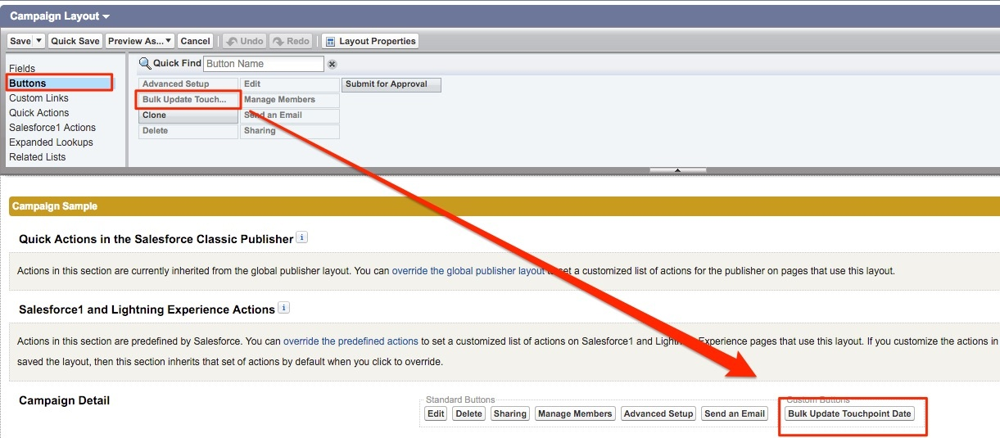

# Istruzioni di layout pagina {#page-layout-instructions}

>[!NOTE]
>Potresti vedere le istruzioni che specificano &quot;[!DNL Marketo Measure]&quot; nella documentazione, ma vedere ancora &quot;Bizible&quot; nel tuo CRM. Stiamo lavorando per aggiornarlo e il rebranding verrà riportato nel tuo CRM a breve.

Per visualizzare facilmente i dati di [!DNL Marketo Measure], si consiglia di aggiornare i layout di pagina per gli oggetti [!UICONTROL Account], [!UICONTROL Contact], [!UICONTROL Lead], [!UICONTROL Opportunity] e [!UICONTROL Campaign]. Le istruzioni vengono suddivise per ogni layout di pagina oggetto riportato di seguito.

Per iniziare, passare alle impostazioni di installazione di [!DNL Salesforce] e individuare la scheda [!UICONTROL Customize].

## Oggetto Campaign {#campaign-object}

Si consiglia di aggiungere i campi [!DNL Marketo Measure] alla campagna SFDC solo per la sandbox. I campi possono essere utilizzati per testare la generazione di punti di contatto. In produzione, si consiglia di aggiungere solo il pulsante [!DNL Marketo Measure] Bulk Update Touchpoint Date. Non è consigliabile aggiungere i campi [!DNL Marketo Measure] alla produzione in quanto è possibile creare la regola di sincronizzazione di Campaign.

1. Selezionare **[!UICONTROL Campaigns]** all&#39;interno dell&#39;opzione Build.

1. Fai clic su **[!UICONTROL Page Layouts]**.

   

1. Fare clic su **[!UICONTROL Edit]** accanto al layout di pagina che si desidera aggiornare.

   

1. All&#39;interno dell&#39;opzione [!UICONTROL fields], selezionare il campo **[!UICONTROL Enable Buyer Touchpoints]** e trascinarlo nella posizione desiderata sulla pagina. Aggiungere quindi i campi **[!UICONTROL Touchpoint Start Date]** e **[!UICONTROL Touchpoint End Date]**.

   

1. Quindi, nella parte superiore della pagina fare clic sull&#39;opzione &quot;[!UICONTROL Buttons]&quot; nel menu di ricerca rapida.

1. Trascina il pulsante **[!UICONTROL Bulk Update Touchpoint Date]** nella sezione dei pulsanti personalizzati.

   

1. Fai clic su **[!UICONTROL Save]**.

   >[!NOTE]
   >Se si utilizzano più tipi di record di Campaign, è necessario aggiornare i valori dell&#39;elenco di selezione per il campo **[!UICONTROL Enable Buyer Touchpoints]**. Per istruzioni, consulta [questo articolo](/help/channel-tracking-and-setup/offline-channels/configurations-record-types.md).

## Lead {#leads}

1. Selezionare **[!UICONTROL Leads]** all&#39;interno dell&#39;opzione Build.

1. Fai clic su **[!UICONTROL Page Layouts]**.

1. Fare clic su **[!UICONTROL Edit]** accanto al layout di pagina che si desidera aggiornare. Tieni presente che più layout di pagina possono contenere le sezioni Punti di contatto dell’acquirente.

1. Fare clic sull&#39;opzione della pagina VisualForce a sinistra nel menu di ricerca rapida.

1. Crea una sezione e denominala &quot;Punti di contatto dell’acquirente&quot;.

   >[!NOTE]
   >Seleziona il formato &quot;una colonna&quot; per ciascuna di queste sezioni.

1. Trascinare la pagina VisualForce **[!UICONTROL Marketo Measure Lead Related List]** nella sezione di layout della pagina.

   

1. Fare clic sulla chiave inglese all&#39;interno della pagina [!DNL VisualForce], impostare l&#39;altezza su 100 e attivare le barre di scorrimento.

1. Nel menu, seleziona la sezione [!UICONTROL Canvas Apps] e crea una sezione denominata &quot;Marketo Measure Insights&quot; sotto la sezione [!DNL VisualForce] punti di contatto creata.

   >[!NOTE]
   >Seleziona il formato &quot;una colonna&quot; per ciascuna di queste sezioni.

1. Trascina l&#39;app Area di lavoro [!DNL Marketo Measure Insights] nella sezione appena creata. Fai clic su **Salva**. A volte è necessario salvare il layout di pagina prima di rilasciarlo nell’app Canvas, perché Salesforce non lo riconosce immediatamente. Quindi, dopo aver creato la sezione, salva il layout di pagina e rimodificalo per trascinare l’app nell’area di lavoro all’interno della sezione. Questo vale per ogni oggetto.

   >[!NOTE]
   >Affinché l&#39;app Canvas [!DNL Marketo Measure Insights] funzioni correttamente, è necessario che [le autorizzazioni siano configurate correttamente](/help/configuration-and-setup/marketo-measure-insights-canvas-app/marketo-measure-insights-configuration.md).

   >[!TIP]
   >La maggior parte dei clienti non utilizza i campi che terminano con (FT) o (LC) perché sono campi legacy precedenti al punto di contatto [!DNL Marketo Measure] esistente come oggetto.

Se utilizzi la funzionalità ABM [!DNL Marketo Measure], [fai clic qui per ulteriori istruzioni sul layout della pagina](/help/advanced-features/account-based-marketing/account-based-marketing-overview.md).

## Contatti {#contacts}

1. Selezionare **[!UICONTROL Contacts]** all&#39;interno dell&#39;opzione Build.

1. Fai clic su **[!UICONTROL Page Layouts]**.

1. Seleziona il Layout di pagina da modificare.

   Passare all&#39;opzione Elenchi correlati nel menu di ricerca rapida e aggiungere l&#39;elenco correlato **[!UICONTROL Buyer Touchpoints]**.

1. Fai clic sull’icona chiave inglese e aggiungi le seguenti colonne in questo ordine:

   * Buyer Touchpoint
   * Canale di marketing
   * Source punto di contatto
   * Nome campagna pubblicitaria
   * Posizione punto di contatto
   * Data punto di contatto

1. Ordina Per: Data Punto Di Contatto, Crescente.

   

1. Espandere l&#39;opzione Pulsanti e deselezionare **[!UICONTROL New]**.

   

1. Torna all&#39;opzione [!UICONTROL Related List] nel menu e ora aggiungi l&#39;elenco correlato a **[!UICONTROL Buyer Attribution Touchpoint]**.

1. Fai clic sull’icona chiave inglese e aggiungi le seguenti colonne in questo ordine:

   * Punto di contatto di attribuzione
   * Canale di marketing
   * Opportunità
   * Nome campagna pubblicitaria
   * Tipo di punto di contatto
   * Posizione punto di contatto
   * % di attribuzione a forma di W (_o modello di attribuzione più affidabile, ad esempio Percorso completo o Personalizzato_)
   * Ricavi a forma di W (_o modello di attribuzione più affidabile, ad esempio Percorso completo o Personalizzato_)
   * Data punto di contatto

1. Ordina per punto di contatto [!UICONTROL Date] > [!UICONTROL Ascending].

1. Espandere la sezione Pulsanti e deselezionare **[!UICONTROL New]**.

1. Fai clic su **[!UICONTROL Save]**.

## Opportunità {#opportunities}

1. Selezionare **[!UICONTROL Opportunities]** all&#39;interno dell&#39;opzione Build.

1. Fai clic su **[!UICONTROL Page Layouts]**.

1. Seleziona il Layout di pagina da modificare.

1. Aggiungi l&#39;elenco correlato a **[!UICONTROL Buyer Attribution Touchpoint]** e fai clic sulla chiave inglese per aggiungere le seguenti colonne per Opportunità:

   * Punto di contatto di attribuzione
   * Canale di marketing
   * Contatto
   * Nome campagna pubblicitaria
   * Tipo di punto di contatto
   * Posizione punto di contatto
   * % di attribuzione a forma di W (_o modello di attribuzione più affidabile, ad esempio Percorso completo o Personalizzato_)
   * Ricavi a forma di W (_o modello di attribuzione più affidabile, ad esempio Percorso completo o Personalizzato_)
   * Data punto di contatto

1. Ordina per [!UICONTROL Touchpoint Date] > [!UICONTROL Ascending].

1. Deseleziona **[!UICONTROL New]** nella sezione [!UICONTROL Buttons].

1. Fai clic su **[!UICONTROL Save]**.

## Account {#accounts}

1. Selezionare **[!UICONTROL Accounts]** all&#39;interno dell&#39;opzione Build.

1. Fai clic su **[!UICONTROL Page Layouts]**.

1. Seleziona il Layout di pagina da modificare.

1. Aggiungi l&#39;elenco correlato a **[!UICONTROL Buyer Attribution Touchpoint]** e fai clic sulla chiave inglese per aggiungere le colonne seguenti:

   * Punto di contatto di attribuzione
   * Canale di marketing
   * Opportunità
   * Nome campagna pubblicitaria
   * Tipo di punto di contatto
   * Posizione punto di contatto
   * % di attribuzione a forma di W (_o modello di attribuzione più affidabile, ad esempio Percorso completo o Personalizzato_)
   * Ricavi a forma di W (_o modello di attribuzione più affidabile, ad esempio Percorso completo o Personalizzato_)
   * Data punto di contatto

1. Ordina per Data punto di contatto > Crescente.

1. Deseleziona **[!UICONTROL New]** nella sezione [!UICONTROL Buttons].

1. Fai clic su **[!UICONTROL Save]**.

Se utilizzi la funzione ABM [!DNL Marketo Measure], controlla le [istruzioni aggiuntive per il layout della pagina](/help/advanced-features/account-based-marketing/account-based-marketing-overview.md).
