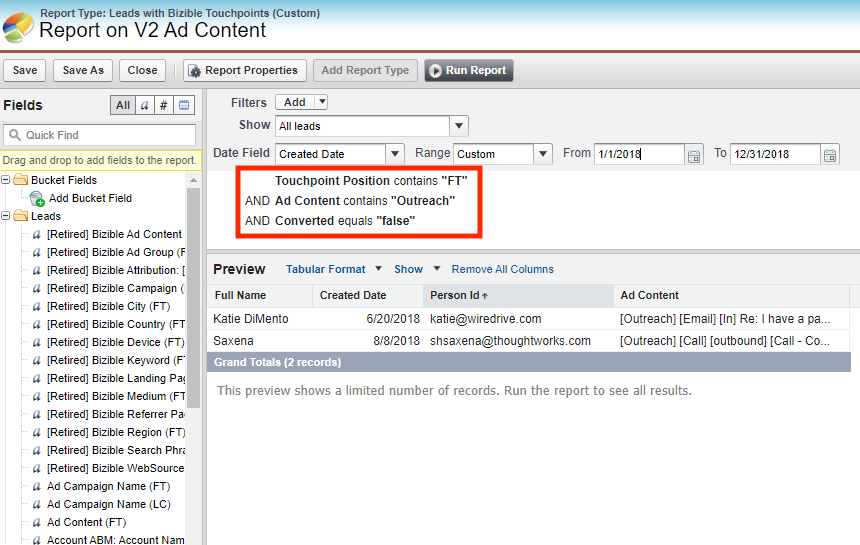

# [!DNL Salesforce] Consolidamento dei pacchetti {#salesforce-package-consolidation}

Siamo entusiasti di annunciare le prossime modifiche ai pacchetti Marketo Measure Salesforce. Nel tentativo di migliorare l&#39;esperienza utente e semplificare l&#39;utilizzo, stiamo consolidando tutti i pacchetti esistenti in un unico pacchetto completo.

## Pacchetto di smobilizzo {#package-retirement}

In conseguenza di questo consolidamento, gli attuali pacchetti V1, V2_EXT, V2_Security e tutti i pacchetti di reporting verranno ritirati dopo agosto 2023. Se il pacchetto V2 è già installato, è necessario aggiornarlo alla nuova versione consolidata.

## Nuovo pacchetto consolidato {#new-consolidated-package}

Il nuovo pacchetto consolidato V2 incorpora tutte le funzionalità dei pacchetti precedenti, offrendo un&#39;esperienza utente migliore. Questo pacchetto aggiornato consente un monitoraggio più efficiente delle prestazioni di marketing e vendita e fornisce informazioni più approfondite sul comportamento dei clienti.

Sono stati aggiunti due nuovi campi per migliorare le funzionalità di reporting:

* nome_modulo: ora disponibile negli oggetti BT/BAT, questo campo consente agli utenti di creare report basati sui nomi dei moduli.
* user_touchpoint_id: questo campo consente agli utenti di creare rapporti con conteggi univoci dei punti di contatto degli utenti.

## Supporto e transizione {#support-and-transition}

Sappiamo che questo cambiamento può richiedere adeguamenti e ci impegniamo a supportarti durante l&#39;intero processo. Nostro [Team di supporto](https://nation.marketo.com/t5/support/ct-p/Support){target="_blank"} è pronto a rispondere a qualsiasi domanda e a garantire una transizione senza intoppi al nuovo pacchetto consolidato.

## Azioni richieste {#retired-actions}

* Se il pacchetto V2 è già installato, è necessario aggiornarlo alla nuova versione consolidata.
* Se disponi di report o dashboard da qualsiasi pacchetto di reporting, puoi ricrearli facilmente senza alcuna modifica necessaria, poiché tutti i campi utilizzati sono presenti nel pacchetto consolidato.
* Se si dispone di report che utilizzano campi nel pacchetto V2_EXT, è possibile ricrearli nel pacchetto consolidato tramite i passaggi seguenti:
   * Tutti i dati nei campi V2_EXT sono disponibili nei campi punto di contatto, per cui puoi modificare i rapporti in modo da recuperare i dati dai campi corrispondenti dei punti di contatto V2 aggiungendo un filtro per la posizione del punto di contatto.
   * Esempio di report che recupera tutti i lead con contenuto annuncio FT contenente testo &quot;Outreach&quot;.
      * Query V2_EXT:
         * bizible2_ext__Ad_Content_FT__c contiene Outreach

* Query corrispondente nel pacchetto consolidato:
   * bizible2__Touchpoint_Position__c contiene FT AND
   * bizible2__Ad_Content__c contiene Outreach

## Domande frequenti {#faq}

**Il pacchetto consolidato sarà in conflitto con i campi del pacchetto esistente?**

Non è necessario disinstallare il pacchetto prima di installarlo. Non ci saranno conflitti nei campi, poiché si troveranno in uno spazio dei nomi diverso.

**Come posso eseguire la retrocompilazione dei dati dai miei pacchetti correnti?**

È possibile archiviare un ticket [con supporto](https://nation.marketo.com/t5/support/ct-p/Support){target="_blank"} per la retrocompilazione e la rielaborazione dei dati BT/BAT da compilare nei campi ID punto di contatto e ID modulo.

**I campi nei pacchetti V1 e V2_EXT saranno disponibili nel pacchetto consolidato?**

Sì. Il pacchetto consolidato conterrà gli stessi campi nella versione 1, con ulteriori raggruppamenti per oggetti e campi V2_EXT attraverso i campi dei punti di contatto.

**È possibile ricreare nel pacchetto consolidato i rapporti che utilizzano i campi V2_EXT?**

Sì. Segui i passaggi descritti in [Azioni richieste](#retired-actions) sopra.
