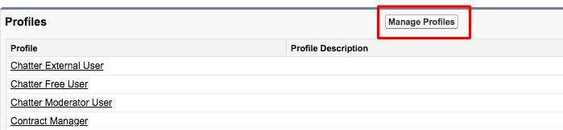

# [!DNL Marketo Measure] Configurazione approfondimenti {#marketo-measure-insights-configuration}

Il [!DNL Marketo Measure] L’app Canvas per approfondimenti deve essere aggiunta al layout della pagina lead ma richiede un’ulteriore configurazione nella sezione App collegate della [!DNL Salesforce] Configurazione. Segui queste istruzioni per assicurarti che l’app Canvas disponga delle autorizzazioni appropriate.

1. Accedi a [!DNL Salesforce] Imposta e fai clic su **[!UICONTROL Connected Apps]** sotto [!UICONTROL Manage Apps] scheda.

1. Seleziona la [!DNL Marketo Measure Insights] dall’elenco che compila.

1. Sotto [!UICONTROL OAuth] criteri, modificare l’impostazione Utenti consentiti in &quot;Gli utenti approvati dall’amministratore sono pre-autorizzati&quot;. Apparirà un pop-up, fai clic su **[!UICONTROL OK]** e poi **[!UICONTROL Save]**.

   

1. Una volta salvata la pagina, potrai fare clic sul pulsante **[!UICONTROL Manage Profiles]** pulsante.

   

1. Seleziona tutti i profili a cui accedere [!DNL Marketo Measure] Approfondimenti e clic **[!UICONTROL Save]**.
