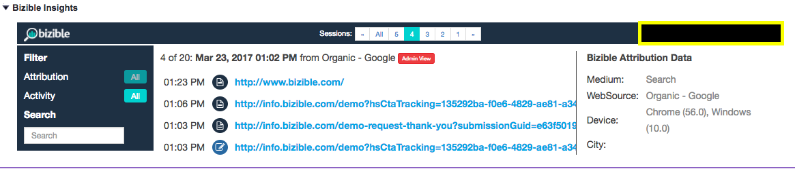

# [!DNL Marketo Measure] Spiegazione approfondimenti {#marketo-measure-insights-explained}

Scopri di più su [!DNL Marketo Measure] Visualizzazione approfondimenti in [!DNL Salesforce], tra cui cosa rappresentano le diverse icone e come utilizzare la funzione. Questa funzione è particolarmente utile per visualizzare le prime 20 sessioni di un lead, contatto o account.

Quando qualcuno viene tracciato da [!DNL Marketo Measure] JavaScript e compila un modulo sul sito web, la persona diventa un lead nel sistema e i suoi dati di marketing digitale vengono inviati all’organizzazione Salesforce (SFDC). In questo caso, puoi vedere i dati del punto di contatto popolati all’interno del [!DNL Marketo Measure] Sezione Informazioni lead (un’app Canvas) sugli oggetti Lead/Contact/Opportunity/Account.

Innanzitutto, nella parte centrale delle tue informazioni, vedi il numero di sessioni che la persona ha avuto sul tuo sito web. Puoi scorrere queste sessioni e navigare a tuo piacimento.

Puoi esaminare il rollup di tutte le sessioni facendo clic su &quot;Tutto&quot; nella parte medio-superiore delle tue informazioni. Qui puoi comprendere le date delle singole sessioni, il canale o la sorgente che le ha guidate e una serie di icone che specificano ulteriori informazioni.

La prima cosa che vedete sono le icone FT o LC. Questi rappresentano la posizione del punto di contatto delle sessioni elencate. Nello specifico, FT sta per First Touch e LC sta per Lead Creation. Puoi avere più sessioni, ma solo un punto di contatto può essere il FT o LC. Non troverai mai più FT o LC associati a una persona.

Le icone che sembrano fogli indicano che si è verificata una visualizzazione di pagina durante la sessione. È probabile che ogni sessione includa questa icona.

L’icona che sembra un becher segnala che si è verificato un esperimento di test A/B. A questo punto ci integriamo con Optimizely e VWO. Con questa integrazione, siamo in grado di inviare in push l’esperimento e la variante che l’utente ha visto nella sua sessione specifica.

Se fai clic su una sessione specifica (per farlo, fai clic sulla data effettiva della sessione o nella parte superiore centrale delle sessioni raggruppate), potrai visualizzare i dettagli della sessione. In ogni sessione, puoi visualizzare tutte le pagine specifiche che l’utente ha visto ordinate per data e ora.

Sul lato destro di ogni sessione puoi vedere una maggiore quantità di dati di marketing granulari su cui viene eseguito il push di [!DNL Marketo Measure] campi nell’SFDC. In questo esempio, puoi visualizzare Gruppo di annunci, Contenuto annuncio, Campagna, Parola chiave, Medio. Puoi anche scorrere verso il basso per visualizzare più di [!DNL Marketo Measure] i dati che forniamo.

Infine, una volta che qualcuno ha una miriade di sessioni, puoi utilizzare alcuni filtri in [!UICONTROL Insights] per cercare parti specifiche del loro coinvolgimento sul sito. Puoi filtrare per [!UICONTROL Touchpoint Position] ad esempio.

È inoltre possibile eseguire ricerche per visualizzazioni di pagina, test AB o Forms.
