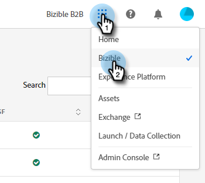
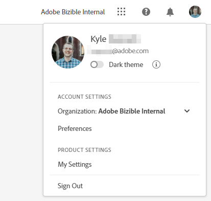
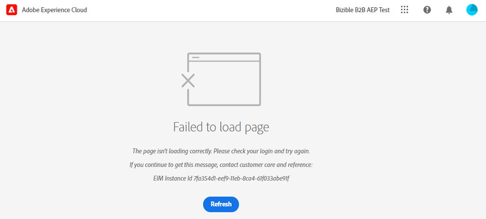

# Panoramica sull’interfaccia di Adobe Experience Cloud {#experience-cloud-interface-overview}

L’interfaccia di Adobe Experience Cloud allinea l’aspetto delle applicazioni e dei servizi Adobe Experience Cloud. Ma non si tratta solo di un nuovo design. Si tratta di un&#39;applicazione a pagina singola che offre l&#39;esperienza utente in una singola istanza.

## Flusso utente {#user-flow}

Se hai già effettuato l&#39;accesso a un prodotto Adobe Experience Cloud, fai clic sull&#39;icona del menu e seleziona **[!DNL Marketo Measure]**.

>[!NOTE]
>
>Il menu a discesa potrebbe avere un aspetto diverso a seconda dei prodotti Adobe Experience Cloud a cui sei abbonato.

Se sei _not_ già connesso a un prodotto Adobe Experience Cloud, accedi direttamente a [!DNL Marketo Measure] qui: [https://experience.adobe.com/marketo-measure](https://experience.adobe.com/marketo-measure).

## Nuove funzionalità {#new-features}

Oltre al look and feel aggiornato, osserva le seguenti funzioni:

**Gestione dominio**

[Gestisci i tuoi [!DNL Marketo Measure] domini](/help/domain-management.md) senza assistenza da [!DNL Marketo Measure].

**Help Center integrato**

Cerca articoli di supporto, invia ticket, fornisci feedback, il tutto dall&#39;interno dell&#39;applicazione [!DNL Marketo Measure].

**Commutatore applicazione**

Coloro che hanno accesso a più prodotti Adobe sono in grado di passare facilmente da un prodotto all’altro.

**Notifiche e annunci**

Visualizza e interagisci con le notifiche specifiche per il prodotto e gli annunci generali sui prodotti Adobe direttamente nell&#39;applicazione.

**Impostazioni Adobe**

Per modificare la lingua o altre preferenze a livello di Adobe, fai clic sull’icona del tuo profilo. È inoltre possibile apportare [!DNL Marketo Measure] modifiche specifiche facendo clic su **Impostazioni personali**.

## Domande frequenti {#faq}

**Cosa succederà ai segnalibri?**

I segnalibri vengono reindirizzati. Ad esempio, se dovessi passare a https://apps.marketo-measure.com/Discover/391, verrai reindirizzato a https://experience.adobe.com/marketo-measure/Discover/391 dopo aver completato l’autenticazione.

**Impossibile accedere a [!DNL Marketo Measure] tramite l&#39;interfaccia Experience Cloud. Quale potrebbe essere il problema?**

Se è possibile accedere ad Adobe Experience Cloud ma si visualizza una pagina come quella riportata di seguito, il problema potrebbe verificarsi sul lato [!DNL Marketo Measure]:

Se ricevi l&#39;errore precedente, [contatta l&#39;assistenza](https://nation.marketo.com/t5/support/ct-p/Support).
