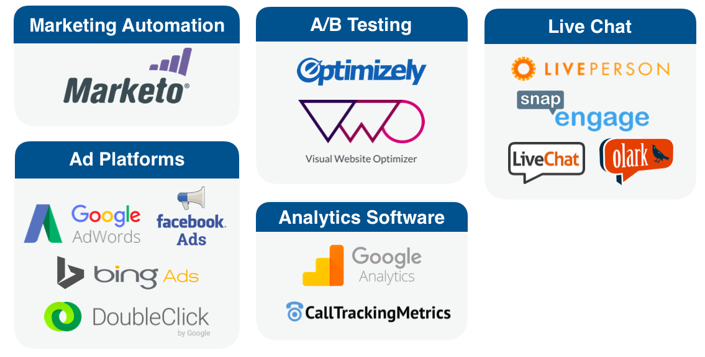

# Framework Marketo Measure {#marketo-measure-framework}

Ulteriori informazioni sui quattro componenti principali che compongono il framework Marketo Measure. Marketo Measure si avvale di queste applicazioni per monitorare, organizzare e conservare i dati, nonché per fornire funzionalità di reporting. Le quattro componenti che compongono il framework di Marketo Measure sono:

* JavaScript di Marketo Measure
* Integrazioni CRM
* Applicazioni/sistemi di terze parti
* Applicazione Marketo Measure

## Marketo Measure JavaScript {#marketo-measure-javascript}

Marketo Measure JavaScript tiene traccia di tutte le interazioni di marketing online, denominate anche punti di contatto, che i potenziali clienti/lead hanno con la tua organizzazione. Si tratta di uno script personalizzato che viene aggiunto prima del tag di chiusura `</head>` in ogni pagina del sito Web.

``

>[!NOTE]
>
>Per istruzioni su come aggiungere Marketo Measure JS, [fai clic qui](/help/marketo-measure-tracking/setting-up-tracking/adding-marketo-measure-script.md).

JS di Marketo Measure acquisisce i dati dalle visite web (comprese le visite web anonime), dal traffico generale/navigazione delle pagine, dai download di contenuti e dall’invio di moduli. Questi dati vengono inviati al CRM e ogni interazione di marketing viene visualizzata come punto di contatto.

## Integrazioni CRM {#crm-integrations}

Marketo Measure si integra con i sistemi di gestione delle relazioni con i clienti per ospitare e organizzare tutti i dati acquisiti da Marketo Measure JS. Attualmente, Marketo Measure dispone di integrazioni API con due CRM:

Facendo emergere i dati di Marketo Measure nel CRM, puoi visualizzare le informazioni granulari relative a ciascun punto di contatto e generare rapporti per comprendere le prestazioni dei tuoi canali.

## Applicazioni di terze parti {#third-party-applications}

La maggior parte degli esperti di marketing si basa su poche applicazioni diverse per eseguire le attività di marketing. Oltre a Salesforce e MS Dynamics, Marketo Measure è integrato con 13 applicazioni di terze parti (elencate di seguito).

Se esegui attività di marketing utilizzando le applicazioni di cui sopra, puoi collegare tali account al tuo account Marketo Measure. Questo consente di tracciare e trasferire facilmente i dati sul tuo account Marketo Measure.

## Applicazione Marketo Measure {#marketo-measure-application}

L’applicazione Marketo Measure viene utilizzata per visualizzare e creare rapporti sui dati di attribuzione, configurare le impostazioni dell’account e aggiornare le informazioni sull’account. Le voci di menu principali nell’app Marketo Measure includono:

**Configurazione account**

Qui puoi aggiornare le informazioni generali della tua azienda e accedere al codice JavaScript di Marketo Measure.

**Impostazioni**

Questa voce di menu ti consente di configurare le impostazioni di attribuzione e mappatura dei canali, gestire le integrazioni con i sistemi di gestione delle relazioni con i clienti e le applicazioni di terze parti, visualizzare/aggiungere utenti dell’account Marketo Measure e aggiornare le informazioni di fatturazione.

**Dashboard ROI marketing**

La voce di menu della dashboard Marketing ROI è quella in cui puoi visualizzare i dati in termini di prestazioni del canale, attività e costi.
