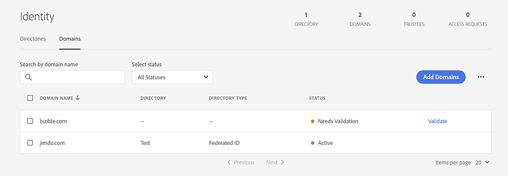
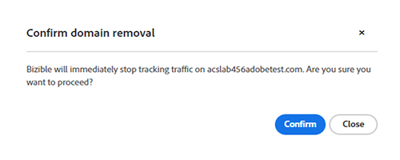

# Gestione del dominio {#domain-management}

Per i tenant abilitati per IMS che eseguono [!DNL Marketo Measure] nell&#39;interfaccia di Experience Cloud, [!DNL Marketo Measure] fornisce un&#39;interfaccia che consente agli utenti di gestire il proprio elenco di domini. Gli utenti di [!DNL Marketo Measure] devono prima verificare tutti i domini che desiderano monitorare in [Adobe Admin Console](https://adminconsole.adobe.com/). Una volta verificati i domini in Admin Console, gli utenti possono gestire se [!DNL Marketo Measure] utilizza questi domini per tenere traccia del traffico del sito Web.

## Aggiunta di domini in Admin Console {#adding-domains-in-admin-console}

Gli utenti IMS con accesso a Adobe Admin Console possono aggiungere e convalidare i domini di loro proprietà. La convalida del dominio comporta l’aggiunta di un record DNS per ciascun dominio e quindi la possibilità per Admin Console di verificarlo.

Le istruzioni per l&#39;aggiunta dei domini sono disponibili nella [documentazione di Admin Console](https://helpx.adobe.com/enterprise/using/add-domains-directories.html). Una volta aggiunto, il dominio deve essere [collegato a una directory](https://helpx.adobe.com/enterprise/using/add-domains-directories.html#link-domains-to-directoies).

## Gestione dei domini in [!DNL Marketo Measure] {#managing-domains-in-marketo-measure}

Dopo l&#39;aggiunta di un dominio in Admin Console, [!DNL Marketo Measure] sincronizza regolarmente il record nel database. Questa sincronizzazione viene eseguita ogni notte e ogni volta che un utente visita la pagina **[!UICONTROL Domains]** nell&#39;interfaccia utente di [!DNL Marketo Measure]. Per impostazione predefinita, tutti i record importati da [!DNL Marketo Measure] sono disabilitati e il tenant deve abilitare manualmente ogni dominio.

Nella pagina **[!UICONTROL Integration]** > **[!UICONTROL Domains]**, l&#39;utente visualizza tutti i domini registrati in Admin Console, insieme al relativo stato. Ogni dominio può essere abilitato o disabilitato. Se un dominio è abilitato, il monitoraggio [!DNL Marketo Measure] raccoglie tutto il traffico visualizzato in quel dominio. Se un dominio è disabilitato, [!DNL Marketo Measure] ignora il traffico proveniente da tale dominio e non crea punti di contatto o altri dati. [!DNL Marketo Measure] conferma la disabilitazione di un dominio e avvisa di eventuali ramificazioni:

L’attivazione di un dominio ha un impatto immediato e le modifiche non sono retroattive. In futuro, [!DNL Marketo Measure] eliminerà i dati dai domini disabilitati dopo un periodo impostato.

## Stati {#statuses}

Gli stati di Admin Console sono suddivisi come segue:

* **CONVALIDATO**: dominio verificato in Admin Console
* **NON VERIFICATO**: il dominio non è stato completamente verificato in Admin Console e non è idoneo per il monitoraggio in [!DNL Marketo Measure]
* **NON VALIDO**: il dominio potrebbe essere scaduto o essere stato rimosso da Admin Console. I dati di tracciamento in [!DNL Marketo Measure] sono contrassegnati per l&#39;eliminazione
* **LEGACY**: questo dominio è stato creato in [!DNL Marketo Measure] e non esiste in Admin Console

Gli stati di tracciamento possono essere i seguenti:

* **ACTIVE**: [!DNL Marketo Measure] sta ricevendo dati da questo dominio
* **DISABLED**: questo dominio è disponibile per il tracciamento, ma è disabilitato
* **NON DISPONIBILE**: dominio non disponibile per il monitoraggio perché non verificato

Passando il puntatore del mouse su un singolo elemento di stato viene attivata una descrizione che spiega ulteriormente tale stato.

## Domande frequenti {#faq}

**Cosa succede quando un dominio viene rimosso in Admin Console?**

Quando un dominio viene rimosso in Admin Console, [!DNL Marketo Measure] contrassegna il dominio come eliminato. [!DNL Marketo Measure] interrompe immediatamente il tracciamento del traffico su questo dominio, ma non rimuove i dati raccolti in precedenza.

**Perché non è possibile abilitare un dominio?**

Ci sono diversi motivi per cui un dominio potrebbe non essere consentito per la selezione in questa pagina. Se il dominio non viene convalidato in Admin Console, non sarà disponibile in [!DNL Marketo Measure]. Analogamente, se il dominio appartiene a un&#39;organizzazione Adobe diversa dal tenant [!DNL Marketo Measure] corrente, potrebbe non essere disponibile per la selezione.

**Come si rimuove un dominio da questo elenco?**

Se in un dominio l&#39;opzione &quot;abilitato&quot; è disattivata, [!DNL Marketo Measure] la ignora e viene effettivamente rimossa da [!DNL Marketo Measure]. Per rimuovere definitivamente un dominio da [!DNL Marketo Measure], è necessario disattivarlo in [!DNL Marketo Measure] e quindi rimuoverlo da Admin Console.
