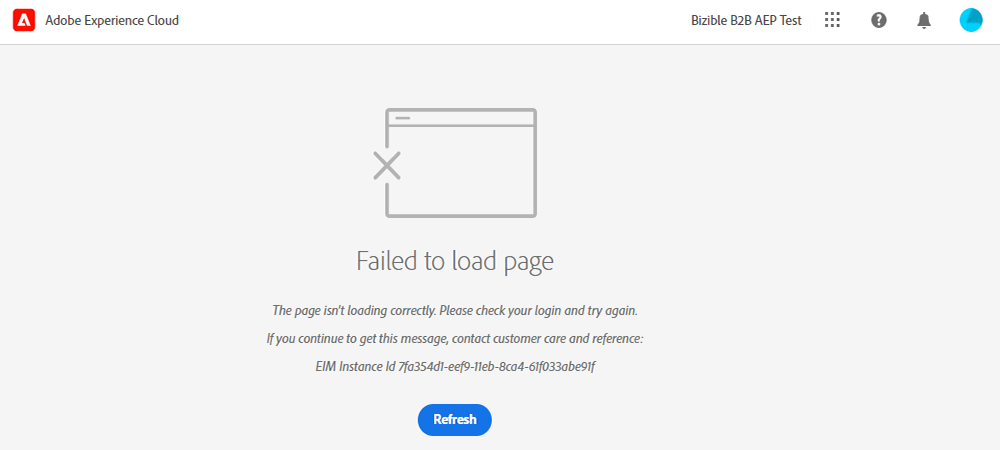

# Panoramica dell’interfaccia di Adobe Experience Cloud {#experience-cloud-interface-overview}

L&#39;interfaccia Adobe Experience Cloud consente di allineare l&#39;aspetto delle applicazioni e dei servizi Adobe Experience Cloud. Ma non si tratta solo di un nuovo design. Si tratta di un’applicazione a pagina singola che offre l’esperienza utente in una singola istanza.

## Flusso utente {#user-flow}

Se hai già effettuato l’accesso a un prodotto Adobe Experience Cloud, fai clic sull’icona del menu e seleziona **[!DNL Marketo Measure]**.

>[!NOTE]
>
>Il menu a discesa potrebbe avere un aspetto diverso a seconda dei prodotti Adobe Experience Cloud a cui sei abbonato.

Se sei _non_ ha già effettuato l’accesso a un prodotto Adobe Experience Cloud, accedi direttamente a [!DNL Marketo Measure] qui: [https://experience.adobe.com/marketo-measure](https://experience.adobe.com/marketo-measure).

## Nuove funzioni {#new-features}

Oltre al look and feel aggiornato, osserva le seguenti funzioni:

**Gestione del dominio**

[Gestione [!DNL Marketo Measure] domini](/help/marketo-measure-and-adobe/domain-management.md) senza l&#39;assistenza di [!DNL Marketo Measure].

**Centro assistenza integrato**

Cerca articoli di supporto, invia biglietti, fornisci feedback, il tutto dall’interno di [!DNL Marketo Measure] applicazione.

**Commutatore applicazione**

Coloro che hanno accesso a più prodotti di Adobe sono in grado di passare facilmente da un prodotto all’altro.

**Notifiche e annunci**

Visualizza e interagisce direttamente con le notifiche specifiche per il prodotto e gli annunci generali dei prodotti di Adobe direttamente nell’applicazione.

**Impostazioni Adobe**

Per modificare la lingua o altre preferenze a livello di Adobe, fai clic sull’icona del tuo profilo. Puoi anche effettuare le seguenti operazioni: [!DNL Marketo Measure]modifiche specifiche facendo clic su **Le mie impostazioni**.

## Domande frequenti {#faq}

**Cosa succede ai miei segnalibri?**

I segnalibri vengono reindirizzati. Ad esempio, se dovessi passare a https://apps.marketo-measure.com/Discover/391, verrai reindirizzato a https://experience.adobe.com/marketo-measure/Discover/391 dopo aver completato l’autenticazione.

**Non riesco ad accedere a [!DNL Marketo Measure] tramite l&#39;interfaccia Experience Cloud. Quale potrebbe essere il problema?**

Se è possibile accedere a Adobe Experience Cloud, ma si visualizza una pagina come quella riportata di seguito, il problema potrebbe verificarsi in [!DNL Marketo Measure] lato:

Se ricevi l’errore precedente, [contatta l’assistenza](https://nation.marketo.com/t5/support/ct-p/Support) per assistenza.
