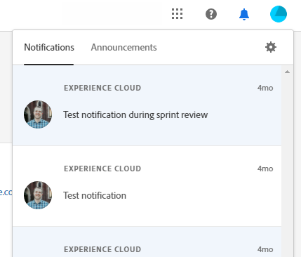

# Panoramica della shell unificata {#unified-shell-overview}

Unified Shell allinea l&#39;aspetto &quot;shell&quot; delle applicazioni e dei servizi Adobe Experience Cloud. Ma è più che un nuovo design. È un&#39;applicazione a pagina singola che offre l&#39;esperienza utente in una singola istanza.

## Flusso utente {#user-flow}

**Flusso shell unificato**

Se hai già effettuato l’accesso a un prodotto Adobe Experience Cloud, fai clic sull’icona del menu e seleziona **[!DNL Marketo Measure]**.

>[!NOTE]
>
>Il menu a discesa può avere un aspetto diverso a seconda dei prodotti Adobe Experience Cloud per i quali hai effettuato l’abbonamento.

Se sei _not_ ha già effettuato l&#39;accesso a un prodotto Adobe Experience Cloud, accedi direttamente a [!DNL Marketo Measure] qui: [https://experience.adobe.com/marketo-measure](https://experience.adobe.com/marketo-measure).

## Nuove funzioni {#new-features}

Oltre all’aspetto e all’aspetto aggiornati, noterai le seguenti funzioni:

**Gestione dei domini**

[Gestire [!DNL Marketo Measure] Domini](/help/marketo-measure-and-adobe/domain-management.md) senza l&#39;assistenza di [!DNL Marketo Measure].

**Centro assistenza integrato**

Cerca articoli di supporto, invia ticket, fornisci feedback, il tutto dall’interno del [!DNL Marketo Measure] applicazione.

**Cambia applicazione**

Coloro che hanno accesso a più prodotti di Adobe potranno facilmente passare da uno all’altro.

**Notifiche e annunci**

Puoi visualizzare e interagire direttamente nell’applicazione con le notifiche specifiche per prodotto e gli annunci generali sui prodotti di Adobe.

**Impostazioni Adobe**

Fai clic sull’icona del profilo per modificare la lingua o altre preferenze a livello di Adobe. Puoi anche effettuare [!DNL Marketo Measure]- modifiche specifiche facendo clic su **Impostazioni personali**.

## Domande frequenti {#faq}

**Cosa succede ai miei segnalibri?**

I segnalibri verranno reindirizzati. Ad esempio, se devi passare a https://apps.marketo-measure.com/Discover/391, verrai reindirizzato a https://experience.adobe.com/marketo-measure/Discover/391 dopo aver completato l’autenticazione.

**Non riesco ad accedere a [!DNL Marketo Measure] attraverso la Shell unificata. Quale potrebbe essere il problema?**

Se è possibile accedere a Adobe Experience Cloud, ma si visualizza una pagina come segue, il problema potrebbe essere sul [!DNL Marketo Measure] lato:

Se ricevi l&#39;errore di cui sopra, si prega di [contattare il supporto](https://nation.marketo.com/t5/support/ct-p/Support) per assistenza.
