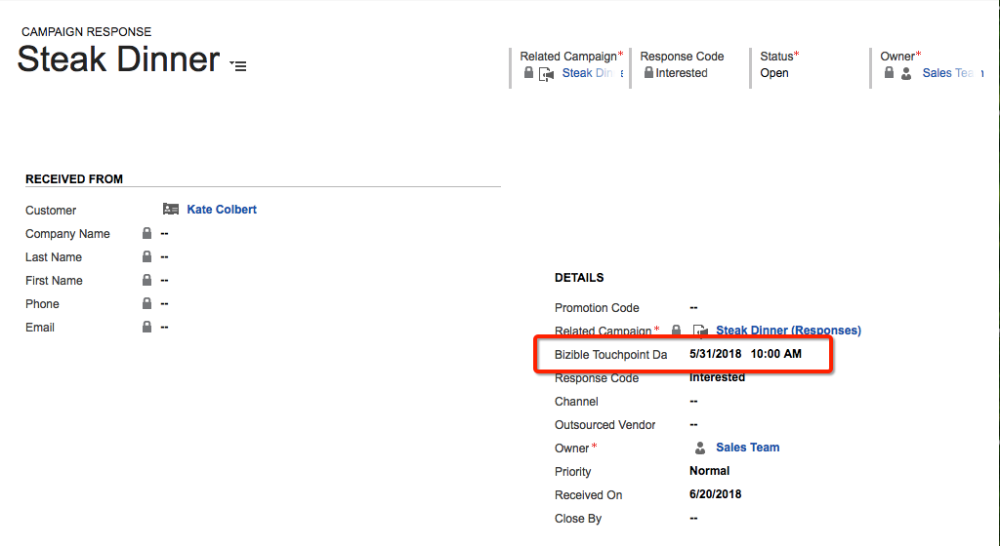
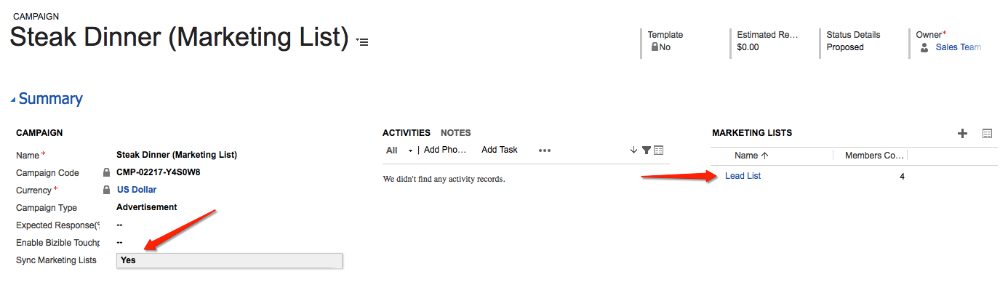
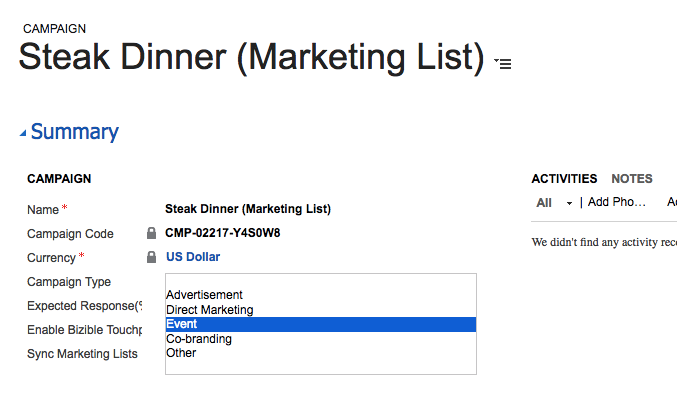

# Campagne Dynamics ed elenchi di marketing {#dynamics-campaigns-and-marketing-lists}

>[!NOTE]
>
>È possibile visualizzare istruzioni che specificano &quot;[!DNL Marketo Measure]&quot; nella nostra documentazione, ma vedi ancora &quot;Bizible&quot; nel tuo CRM. Stiamo lavorando per aggiornarlo e il rebranding verrà riflesso nel tuo CRM presto.

## Campagne {#campaigns}

Le campagne Dynamics sono utili per monitorare le attività di marketing offline e includerle nel percorso omni-channel. Le campagne devono essere correlate a Lead o Contatti e possono essere raggruppate per la campagna tramite Risposte campagna o Elenchi di marketing.

## Risposte alla campagna {#campaign-responses}

Quando i lead o i contatti vengono aggiunti direttamente a una campagna, vengono inseriti come record Risposta campagna.

## Abilita punti di contatto {#enable-touchpoints}

Per includere questi record nel percorso dei punti di contatto, sono disponibili alcune opzioni per la sincronizzazione dei tipi di risposte di Campaign. Nel record Campaign, deve essere presente un campo personalizzato dalla soluzione installata etichettata &quot;[!UICONTROL Enable Buyer Touchpoints].&quot; In caso contrario, il campo dovrà essere aggiunto tramite l’Editor moduli.

Puoi scegliere di includere tutti i record con una risposta di campagna nella campagna, o solo quelli con una risposta di &quot;Interessato&quot;, o per impostazione predefinita, non puoi includere le risposte di campagna. Puoi lasciare vuoto il campo oppure scegliere esplicitamente di escluderlo.

[!DNL Marketo Measure] non supporta i valori di risposta personalizzati.

Questi sono i valori di risposta stock per la risposta della campagna:

In base alla selezione, questi record sono ora idonei per i punti di contatto nel percorso Lead, Contatto o Opportunità. Se si qualificano, nel percorso verrà visualizzato un punto di contatto &quot;Dynamics Campaign&quot;.

Una delle ragioni per cui una risposta campagna potrebbe non essere visualizzata è perché un&#39;attività Primo contatto e/o Creazione lead Touch era già stata registrata per il lead/contatto e la funzione &quot;PostLC&quot; è disabilitata o ha raggiunto il numero massimo di punti di contatto.

## Data punto di contatto {#touchpoint-date}

La data del punto di contatto per una campagna è solitamente la data in cui la risposta della campagna è stata aggiunta alla campagna. Può essere ignorato se il campo personalizzato della soluzione installata, denominato &quot;Data punto di contatto dell’acquirente&quot;, è popolato. In caso contrario, il campo dovrà essere aggiunto tramite l’Editor moduli.

Un esempio comune che utilizza questo campo è relativo agli eventi in cui un elenco di scansioni di badge da un evento viene aggiunto ai giorni di gestione delle relazioni con i clienti dopo l’evento, in modo che l’utente possa effettivamente modificare la data del punto di contatto dell’acquirente fino al momento in cui si è verificato l’evento.

## Elenchi di marketing {#marketing-lists}

Gli elenchi di marketing sono un altro modo per includere i lead o i contatti in un percorso di marketing. Gli elenchi di marketing sono univoci per un gruppo di lead o contatti, il che significa che l’utente deve selezionare se l’elenco è un set di lead o un set di contatti.

[!DNL Marketo Measure] supporta solo elenchi di marketing statici. Non sono supportati gli elenchi di marketing dinamici perché l’elaborazione richiede che venga eseguita la verifica della data di modifica di un record, ma poiché un elenco dinamico viene spesso modificato, non è disponibile alcuna data di modifica per [!DNL Marketo Measure] da controllare. Ciò richiederebbe un download costante dei dati completi impostati durante l&#39;intera giornata.

La schermata precedente è una lista di marketing per i lead. Gli elenchi di marketing sono associati alle campagne e possono essere associati a più campagne. A meno che non venga mai creato un solo elenco di marketing per una campagna, [!DNL Marketo Measure] non consiglia ai clienti di utilizzare gli elenchi di marketing per tenere traccia delle campagne. È improbabile che lo stesso elenco esatto di Lead/Contatti possa essere idoneo per punti di contatto in più campagne.

## Abilita punti di contatto {#enable-touchpoints-1}

Per abilitare un elenco di marketing per i punti di contatto, esiste un’impostazione separata nel record Campagna etichettato, &quot;[!UICONTROL Sync Marketing Lists],&quot; che è un semplice interruttore sì/no. In caso contrario, il campo dovrà essere aggiunto tramite l’Editor moduli. Nel record Campaign, puoi vedere quali elenchi di marketing sono correlati alla campagna, in modo da sapere quanti elenchi stai abilitando.

## Data punto di contatto {#touchpoint-date-1}

La data del punto di contatto per un elenco di marketing è in genere la data creata da ListMember, quindi la data in cui il lead o il contatto è stato aggiunto all’elenco di marketing. Può essere ignorato se il campo personalizzato della soluzione installata, denominato &quot;Data punto di contatto dell’acquirente&quot;, è popolato. In caso contrario, il campo dovrà essere aggiunto tramite l’Editor moduli.

## Mappatura del canale {#channel-mapping}

Le campagne Dynamics sono inserite nei canali di marketing personalizzati utilizzando il campo Tipo di campagna . Queste possono essere modificate nel menu delle personalizzazioni di Dynamics.

I valori nel menu Tipo campagna vengono inseriti nella [!DNL Marketo Measure] Applicazione. **[!UICONTROL My Account]** > **[!UICONTROL Settings]** > **[!UICONTROL Offline Channels]**.

Per ogni tipo di campagna, può essere mappato su una combinazione Canale e Canale secondario in modo che ogni punto di contatto derivato dalla campagna abbia il canale e il canale secondario mappati corretti.

## Data sincronizzazione campagna {#campaign-sync-date}

Non disponibile per i clienti Dynamics

## Domande frequenti {#faq}

**È possibile abilitare i punti di contatto negli elenchi di marketing o solo nelle campagne in Dynamics?**

Puoi abilitare un elenco di marketing ma deve essere correlato a una campagna perché l’opzione per sincronizzare un elenco di marketing è attiva nella campagna.

**È possibile utilizzare le risposte e gli elenchi di marketing di una campagna?**

Sì.
