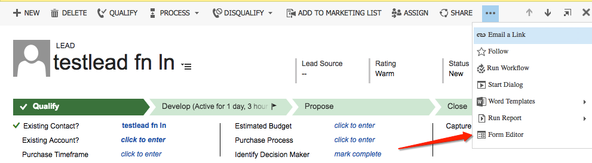
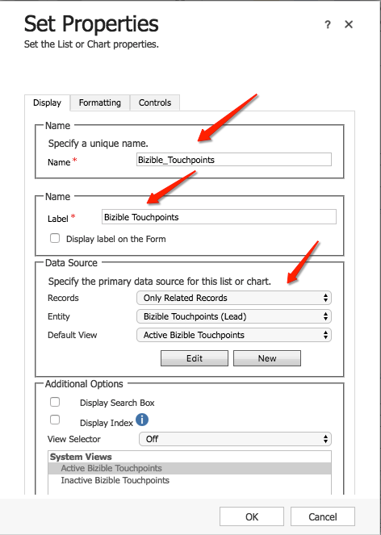
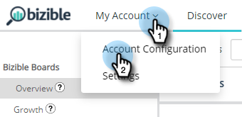

# [!DNL Microsoft Dynamics] Guida all’installazione di CRM {#microsoft-dynamics-crm-installation-guide}

>[!NOTE]
>
>È possibile visualizzare istruzioni che specificano &quot;[!DNL Marketo Measure]&quot; nella nostra documentazione, ma vedi ancora &quot;Bizible&quot; nel tuo CRM. Stiamo lavorando per aggiornarlo e il rebranding verrà riflesso nel tuo CRM presto.

## Versioni supportate {#supported-versions}

[!DNL Marketo Measure] supporta quanto segue [!DNL Microsoft Dynamics CRM] versioni:

* [!DNL Microsoft Dynamics 2016] (Online e on-premise)
* [!DNL Microsoft Dynamics 365] (Online e on-premise)

Per la connessione e l&#39;autenticazione, [!DNL Marketo Measure] supporta le seguenti versioni di Active Directory Federated Services (ADFS):

* ADFS 4.0 - [!DNL Windows Server 2016]
* ADFS 5.0 - [!DNL Windows Server 2019]

## Installare la soluzione gestita {#install-the-managed-solution}

[Scarica e installa](assets/marketo-measure-dynamics-extension.zip) il file zip all’interno di Dynamics CRM.

**[!UICONTROL Settings]** > **[!UICONTROL Customizations]** > **[!UICONTROL Solutions]** > **[!UICONTROL Import]** (pulsante) > **[!UICONTROL Choose File]**.

>[!NOTE]
>
>Le due schermate seguenti possono variare leggermente rispetto alle tue, in quanto sono state scattate durante un aggiornamento della soluzione.

## [!DNL Marketo Measure] Autorizzazioni utente {#marketo-measure-user-permissions}

Consigliamo di creare un [!DNL Marketo Measure] Utente in Dynamics per l’esportazione e l’importazione di dati tramite per evitare problemi con altri utenti nel CRM. Prendi nota del nome utente e della password, nonché dell’URL dell’endpoint, così come verrà utilizzato durante la creazione del [!DNL Marketo Measure] conto.

## Ruoli di protezione {#security-roles}

Se la tua organizzazione utilizza i ruoli di sicurezza di Dynamics, assicurati che l’utente connesso o l’utente dedicato [!DNL Marketo Measure] L&#39;utente dispone di autorizzazioni sufficienti di lettura/scrittura per le entità richieste.

I ruoli di protezione si trovano qui: **[!UICONTROL Settings]** > **[!UICONTROL Security]** > **[!UICONTROL Security Roles]**.

Per [!DNL Marketo Measure] entità personalizzate, avremo bisogno di autorizzazioni complete per tutte le nostre entità.

>[!NOTE]
>
>Gli utenti che chiuderanno le opportunità avranno anche bisogno di autorizzazioni complete.

Per le entità standard di Dynamics, consulta la sezione [!DNL Marketo Measure] Documento schema di Dynamics. Ad alto livello, [!DNL Marketo Measure] è sufficiente leggere in alcune entità per raccogliere i dati appropriati e scrivere in campi personalizzati che verranno installati con la soluzione gestita. Non verranno creati nuovi record standard, né verranno aggiornati campi standard.

## Includi punti di contatto nei layout di pagina: {#include-touchpoints-on-page-layouts}

1. Per ogni entità, passare all’Editor di moduli. Puoi trovarlo in **[!UICONTROL Settings]** > **[!UICONTROL Customizations]** > **[!UICONTROL Customize the System]** > `[Entity]` > **[!UICONTROL Forms]**. Oppure puoi trovarlo sulle impostazioni mentre visualizzi un record.

   * Le entità da configurare: Account, opportunità, contatto, lead e campagna.

   * Per configurare le campagne, devi attivare l’opzione &quot;Sincronizzazione campagna&quot; in **[!UICONTROL CRM]** > **[!UICONTROL Campaigns]**.

   

1. Layout di pagina: aggiungi prima un &quot;[!UICONTROL One Column]&quot; nella sezione si desidera che i punti di contatto vivano. All’interno di questa nuova colonna, sarà necessaria una griglia secondaria aggiunta a ciascun modulo all’interno delle entità Account, Opportunità, Contatto e Lead.

   

   

1. Seleziona l’oggetto (Punti di contatto per l’attribuzione dell’acquirente o Punti di contatto dell’acquirente) che deve essere visualizzato nella griglia secondaria, a seconda della relazione dell’oggetto. Se necessario, modificare le colonne da visualizzare facendo clic sul pulsante Modifica. La soluzione gestita ha impostato un layout predefinito.

   Sottogriglia punto di contatto per l’attribuzione dell’acquirente - Account, opportunità e contatti\
   Sottorete punto di contatto dell&#39;acquirente - Lead e contatti

   

1. Dopo aver completato l’aggiornamento del modulo, pubblicare e salvare le modifiche.

## Considerazioni relative allo schema {#schema-related-considerations}

**Entrate**

[!DNL Marketo Measure] punta al campo Ricavo effettivo standard per impostazione predefinita. Se non lo utilizzi, spieghi in che modo invierai rapporti sui ricavi al tuo ingegnere delle soluzioni o al tuo Success Manager in quanto sarà necessario un flusso di lavoro personalizzato.

**Chiudi data**

[!DNL Marketo Measure] fa riferimento al campo Data di chiusura effettiva. Se non utilizzi questo o utilizzi anche il campo Data di chiusura stimata , spieghi il processo al tuo ingegnere delle soluzioni o al tuo Success Manager. Potrebbe essere necessario un flusso di lavoro personalizzato per tenere conto di entrambi i campi.

## Configurazione del provider di identità e Adobe Admin Console {#set-up-your-adobe-admin-console-and-identity-provider}

Il primo passaggio da utilizzare [!DNL Marketo Measure] crea e accedi al tuo Adobe Admin Console predisposto. Se non hai già ricevuto l&#39;e-mail con le istruzioni di accesso, contatta il tuo [!DNL Marketo Measure] Rappresentante del conto.

Come prodotto all’interno della suite Adobe, [!DNL Marketo Measure] sfrutta la funzionalità completa di Adobe Admin Console per Identity Management. Più risorse possono essere [qui](https://helpx.adobe.com/it/enterprise/using/admin-console.html).

È consigliabile consultare tutte le risorse, le best practice e le opzioni disponibili per [Identity Management](https://helpx.adobe.com/enterprise/using/set-up-identity.html).

Per assistenza e revisione sulla configurazione del tuo Identity Management all&#39;interno di Adobe Admin Console, contatta il tuo [!DNL Marketo Measure] Rappresentante del conto.

Per facilitare l&#39;autenticazione e l&#39;autorizzazione degli utenti con il tuo [!DNL Marketo Measure] istanze, sono necessari i seguenti passaggi all’interno di Adobe Admin Console:

**Impostazione della [!DNL Marketo Measure] Scheda prodotto**

Accedendo al Adobe Admin Console, visualizzerai il tuo [!DNL Marketo Measure] Istanza o istanze di prodotto presenti nella sezione Panoramica .

Fai clic su [!DNL Marketo Measure] La scheda prodotto ti mostrerà tutti i tuoi [!DNL Marketo Measure] istanze. Per impostazione predefinita, ciascuna [!DNL Marketo Measure] L&#39;istanza ha un proprio profilo con il prefisso &quot;[!DNL Marketo Measure]&quot;. Tutti gli amministratori o gli utenti aggiunti a questo o a qualsiasi altro profilo in questa istanza saranno in grado di accedere a [!DNL Marketo Measure].

Non è necessaria alcuna azione per creare un nuovo profilo all’interno della [!DNL Marketo Measure] Istanza del prodotto.

Per iniziare ad aggiungere utenti a cui è possibile accedere [!DNL Marketo Measure], si prega di fare riferimento al [Aggiunta [!DNL Marketo Measure] Amministratori e [!DNL Marketo Measure] Utenti](#adding-marketo-measure-admins-and-marketo-measure-users) di seguito.

## Aggiunta [!DNL Marketo Measure] Amministratori e [!DNL Marketo Measure] Utenti {#adding-marketo-measure-admins-and-marketo-measure-users}

Il passaggio successivo consiste nel concedere l’accesso al [!DNL Marketo Measure] aggiungendo utenti. Questo può essere fatto nella directory degli amministratori e degli utenti del [!DNL Marketo Measure] scheda prodotto.

| Tipo di utente | Descrizione |
|---|---|
| Amministratori | si tratta di amministratori e utenti di energia [!DNL Marketo Measure] Applicazione con piena capacità di aggiornamento e gestione [!DNL Marketo Measure]Opzioni di configurazione specifiche |
| Utenti | sono utenti standard del [!DNL Marketo Measure] Applicazione con autorizzazioni di sola lettura [!DNL Marketo Measure] applicazione |

Quando aggiungi un utente al rispettivo gruppo, viene visualizzata la relativa [Tipo di identità elencato](https://helpx.adobe.com/enterprise/admin-guide.html/enterprise/using/set-up-identity.ug.html).

>[!NOTE]
>
>Per essere un [!DNL Marketo Measure] amministratore (in [experience.adobe.com/marketo-measure](https://experience.adobe.com/marketo-measure){target="_blank"}), un utente deve essere aggiunto come utente _e_ un amministratore per qualsiasi [!DNL Marketo Measure] profilo di prodotto [!DNL Marketo Measure] scheda prodotto.

**Accesso a[!DNL Marketo Measure]**

Dopo essere stato aggiunto a un profilo di prodotto, un utente può accedere ai [!DNL Marketo Measure] le istanze scegliendo la **Accesso con Adobe ID** opzione in [experience.adobe.com/marketo-measure](https://experience.adobe.com/marketo-measure){target="_blank"}.

## Configurazione di connessioni e provider di dati {#configuring-your-connections-and-data-providers}

Dopo aver effettuato l’accesso al [!DNL Marketo Measure] e sono stati impostati come utente in Adobe Admin Console, il passaggio successivo consiste nell&#39;impostare le varie connessioni dati.

**CRM come fornitore di dati**

1. Nel tuo [!DNL Marketo Measure] fare clic sull&#39;account **[!UICONTROL My Account]** a discesa e seleziona **[!UICONTROL Settings]**.

   

1. Sotto [!UICONTROL Integrations] nel menu di navigazione a sinistra, fai clic su **[!UICONTROL Connections]**.

   

1. Fai clic sul pulsante **[!UICONTROL Set Up New CRM Connection]** pulsante .

   

1. Accanto a [!UICONTROL Microsoft Dynamics CRM], fai clic su **[!UICONTROL Connect]** pulsante .

   

1. Seleziona [!UICONTROL Credentials] o [!UICONTROL OAuth].

   

   >[!NOTE]
   >
   >Per ulteriori informazioni su OAuth, visita [articolo](/help/marketo-measure-and-dynamics/getting-started-with-marketo-measure-and-dynamics/oauth-with-azure-active-directory-for-dynamics-crm.md). In caso di domande sul processo, contatta il tuo [!DNL Marketo Measure] Rappresentante dell&#39;account.

1. In questo esempio, abbiamo scelto Credenziali. Immetti le credenziali e fai clic su **[!UICONTROL Next]**.

Dopo la connessione, vedrai i dettagli della connessione Dynamics nell&#39;elenco Connessioni CRM/MAP.

**Connessioni dell&#39;account annuncio**

Per collegare i tuoi account annuncio con [!DNL Marketo Measure], inizia visitando il [!UICONTROL Connections] nella scheda [!DNL Marketo Measure] applicazione.

1. Segui i passaggi 1 e 2 di cui sopra _CRM come fornitore di dati_ sezione .

1. Fai clic sul pulsante **[!UICONTROL Set up New CRM Connection]** pulsante .

   

1. Seleziona la piattaforma desiderata.

   

**[!DNL Marketo Measure]Javascript**

Per [!DNL Marketo Measure] per tenere traccia delle attività web, sono disponibili diversi passaggi per la configurazione.

1. Fai clic sul pulsante **[!UICONTROL My Account]** a discesa e seleziona **[!UICONTROL Account Configuration]**.

   

1. Inserire il numero di telefono. Per Sito Web, immetti il dominio principale principale per il quale verrà utilizzato [!DNL Marketo Measure] sul sito web. Fai clic su **[!UICONTROL Save]** al termine.

   

   >[!NOTE]
   >
   >Per aggiungere più domini principali, contatta il tuo [!DNL Marketo Measure] Rappresentante del conto.

1. La [[!DNL Marketo Measure] JavaScript](/help/marketo-measure-tracking/setting-up-tracking/adding-marketo-measure-script.md) deve quindi essere posizionato sull’intero sito e sulle pagine di destinazione. È consigliabile codificare lo script nella parte superiore delle pagine di destinazione o aggiungerlo tramite un sistema Tag Management, ad esempio [Google Tag Manager](/help/marketo-measure-tracking/setting-up-tracking/adding-marketo-measure-script-via-google-tag-manager.md).

   >[!NOTE]
   >
   >Per impostazione predefinita, [!DNL Marketo Measure] esporta 200 record per credito API ogni volta che un lavoro invia dati al tuo CRM. Per la maggior parte dei clienti, questo offre un equilibrio ottimale tra i crediti API utilizzati da [!DNL Marketo Measure] e i requisiti delle risorse della CPU nel sistema di gestione delle relazioni con i clienti. Tuttavia, per i clienti con configurazioni CRM complesse, come flussi di lavoro e trigger, una dimensione batch più piccola potrebbe essere utile per migliorare le prestazioni CRM. A tal fine, [!DNL Marketo Measure] consente ai clienti di configurare la dimensione batch di esportazione CRM. Questa impostazione è disponibile nella pagina Impostazioni > CRM > Generale della [!DNL Marketo Measure] le applicazioni web e i clienti possono scegliere tra le dimensioni batch di 200 (impostazione predefinita), 100, 50 o 25.
   >
   >Quando modifichi questa impostazione, tieni presente che dimensioni batch più piccole utilizzeranno più crediti API dal tuo CRM. È consigliabile ridurre la dimensione del batch solo se si verifica un timeout della CPU o un elevato carico della CPU nel CRM.

   >[!NOTE]
   >
   >Quando disattivi l’esportazione di dati da Marketo Measure in Dynamics, non verranno rimossi dati esistenti. Per informazioni sulla rimozione dei dati esistenti, contatta il supporto per Dynamics.
