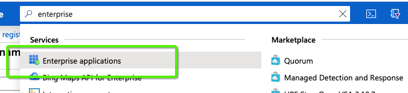
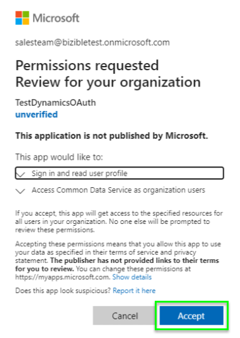

# OAuth con [!DNL Azure Active Directory] per Dynamics CRM {#oauth-with-azure-active-directory-for-dynamics-crm}

## Chi è interessato {#who-s-affected}

Questa configurazione è nuova [!DNL Marketo Measure] clienti che utilizzano Dynamics CRM con un [!DNL Azure Active Directory] (AAD) account o per i clienti che desiderano effettuare la migrazione dal nome utente e password di accesso legacy a [!DNL Azure Active Directory] con OAuth.

>[!NOTE]
>
>Per entrambi questi scenari, AAD è configurato qui per facilitare la connessione dell’istanza Dynamics in [!DNL Marketo Measure] come fornitore di dati.

## Imposta nuova applicazione {#set-up-new-application}

1. Accedi al tuo [Portale di Azure](https://portal.azure.com/#home).

1. Scegli il tenant di Azure AD facendo clic sull’account nell’angolo in alto a destra della pagina, quindi facendo clic sulla navigazione Cambia directory e selezionando il tenant appropriato (salta questo passaggio se sotto l’account è presente solo un tenant di Azure AD o se hai già selezionato il tenant di Azure AD appropriato).

   

1. Cerca &quot;[!DNL Azure Active Directory]&quot; nella barra di ricerca e fai clic sul nome da aprire.

   

1. Fai clic su **[!UICONTROL App Registrations]** nel menu a sinistra.

   

1. Fai clic su **[!UICONTROL New Registration]** in alto.

   

1. Seguire le istruzioni e creare una nuova applicazione. Non importa se si tratta di un&#39;applicazione web o di un&#39;applicazione client pubblica (mobile e desktop), ma se desideri esempi specifici per applicazioni web o applicazioni client pubbliche, controlla il nostro [avvio rapido](https://docs.microsoft.com/en-us/azure/active-directory/develop/v1-overview).\
   a) Nome è il nome dell&#39;applicazione e descrive l&#39;applicazione agli utenti finali.\
   b) In Tipi di account supportati , seleziona Account in qualsiasi directory organizzativa e account Microsoft personali.\
   c. Specifica l&#39;URI di reindirizzamento. Per le applicazioni web, si tratta dell’URL di base dell’app, al quale gli utenti possono accedere. Ad esempio, `http://localhost:12345`. Per il client pubblico (mobile e desktop), Azure AD lo utilizza per restituire le risposte ai token. Immettere un valore specifico per l&#39;applicazione. Ad esempio, `http://MyFirstAADApp`.

1. Una volta completata la registrazione, Azure AD assegnerà all’applicazione un identificatore client univoco (l’ID applicazione). Questo valore è necessario nella sezione successiva, quindi copialo dalla pagina dell&#39;applicazione.

1. Per trovare l’applicazione nel portale di Azure, fai clic su **[!UICONTROL App Registrations]**, quindi fai clic su **[!UICONTROL All Applications]**. Apri l&#39;applicazione appena creata

1. Fai clic su **[!UICONTROL Authentication]** nel menu a sinistra.

   

1. Aggiungi il [!DNL Marketo Measure] URL di reindirizzamento: `https://apps.bizible.com/OAuth2` e `https://apps.bizible.com/OAuth2?identityOnly=true` all’elenco degli URL di reindirizzamento.

   

1. Passa alla scheda Autorizzazioni API e accertati che le autorizzazioni corrette siano assegnate all’applicazione.

   

1. Da qui, immetti &quot;[!UICONTROL enterprise]&quot; nella casella di ricerca e fai clic su **[!UICONTROL Enterprise Applications]**.

   

1. Di nuovo, trova e apri la nuova applicazione dall&#39;elenco delle applicazioni.

1. Dalla scheda Autorizzazioni, fai clic su **[!UICONTROL Grant Admin Consent for (instance name)]**.

   

1. Clic **[!UICONTROL Accept]**.

   

1. Da &quot;[!UICONTROL Users and Groups]&quot;, assicurarsi che i &quot;Utenti e gruppi&quot; validi siano assegnati all&#39;applicazione.

   

## Creazione di un utente dell&#39;applicazione {#creating-an-application-user}

Una volta effettuata la registrazione dell&#39;applicazione, è possibile creare un utente dell&#39;applicazione.

1. Passa all’ambiente del servizio dati comune (`https://[org].crm.dynamics.com`).

1. Passa a **[!UICONTROL Settings]** > **[!UICONTROL Security]** > **[!UICONTROL Users]**.

1. Scegli **[!UICONTROL Application Users]** nel filtro di visualizzazione.

1. Seleziona **[!UICONTROL + New]**.

1. Nel modulo Utente applicazione, immettere le informazioni richieste.

   >[!NOTE]
   >
   >* Le informazioni sul nome utente non devono corrispondere a un utente esistente nella [!DNL Azure Active Directory].
   >
   >* Nel campo ID applicazione , immetti l’ID applicazione dell’app registrata in precedenza in Azure AD.

1. Se la configurazione è corretta, dopo aver selezionato **[!UICONTROL Save]**, **[!UICONTROL Application ID URI]** e **[!UICONTROL Azure AD Object Id]** i campi verranno compilati automaticamente con i valori corretti.

1. Prima di uscire dal modulo utente, scegli **[!UICONTROL Manage Roles]** e assegna un ruolo di sicurezza a questo utente dell&#39;applicazione in modo che l&#39;utente dell&#39;applicazione possa accedere ai dati dell&#39;organizzazione desiderati.

## Collegamento dell’istanza di Dynamics tramite OAuth {#connecting-your-dynamics-instance-via-oAuth}

1. Quando imposti la connessione Dynamics per la prima volta, segui i passaggi 1-5 della sezione &quot;CRM as a Data Provider&quot; in [articolo](/help/marketo-measure-and-dynamics/getting-started-with-marketo-measure-and-dynamics/microsoft-dynamics-crm-installation-guide.md).

1. Quando viene richiesto di specificare le credenziali OAuth, compila l’ID client, il segreto client e l’URI ID applicazione impostati nella sezione precedente.

a) L&#39;ID client è l&#39;ID del passaggio 7 nella sezione precedente. Se non l&#39;hai annotata, l&#39;ID applicazione viene visualizzato nelle Impostazioni della registrazione dell&#39;app.

b) Segreto client è il segreto applicazione creato nel portale di Azure per la tua applicazione in Certificati e segreti.

c. URI ID applicazione è l’URL dell’API Web di destinazione (risorsa protetta). Per trovare l’URL dell’ID app, nel portale di Azure fai clic su [!DNL Azure Active Directory], fare clic su Registrazioni applicazioni, aprire la pagina Impostazioni dell&#39;applicazione, quindi fare clic su Proprietà. Può anche essere una risorsa esterna come `https://graph.microsoft.com`. In genere si tratta dell’URL dell’istanza di Dynamics.

1. Dopo aver fatto clic su **[!UICONTROL Submit]**, ti verrà richiesto di accedere con [!DNL Azure Active Directory]. Quando l’autenticazione ha esito positivo, l’account Dynamics verrà connesso come provider di dati in [!DNL Marketo Measure].

## Riautenticazione dell’account Dynamics {#re-authenticating-your-dynamics-account}

1. Quando sei nel [!DNL Marketo Measure] applicazione, vai a **[!UICONTROL My Settings]** > **[!UICONTROL Settings]** > **[!UICONTROL Connections]**.

1. Fai clic sull’icona chiave nella sezione CRM accanto alla connessione Dynamics.

1. Quando si fa clic sulla chiave, viene visualizzato un pop-up e viene richiesto di immettere l&#39;ID client, il segreto client e l&#39;URI ID applicazione, in modo simile al flusso di registrazione.

   

1. Dopo aver fatto clic su **[!UICONTROL Submit]**, ti verrà richiesto di accedere con [!DNL Azure Active Directory]. Quando l’autenticazione avrà esito positivo, l’account Dynamics verrà nuovamente autorizzato in [!DNL Marketo Measure].
