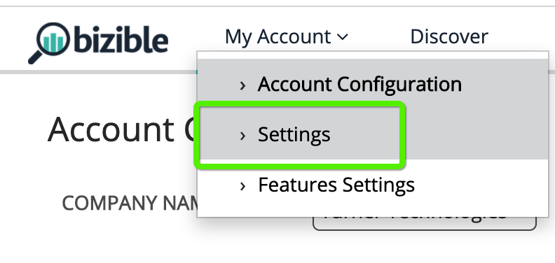

# [!DNL Marketo Engage] Integrazione delle attività {#marketo-engage-activities-integration}

Nell&#39;ambito del programma [!DNL Marketo Measure] e [!DNL Marketo Engage] Integrazione, questo sforzo di attrarre in attività di Marketo gioca un ruolo enorme. Tramite le attività di Marketo, il sistema tiene traccia di eventi come Clic su e-mail, Modifica punteggio o Modifica stato in Progressione; questi tipi di attività possono essere analizzati e definiti per selezionare un sottoinsieme idoneo per i punti di contatto. Una volta creati, i punti di contatto su queste attività vengono tracciati nel percorso di coinvolgimento e misurati insieme agli altri canali di marketing, come Ricerca a pagamento o Marketing dei partner.

## Requisiti {#requirements}

* Istanza Marketo di produzione
* Produzione [!DNL Salesforce] o [!DNL Microsoft Dynamics] istanza
* Qualsiasi pagamento effettuato [!DNL Marketo Measure] abbonamento
* Sincronizzazione utenti Marketo abilitata ([!DNL Marketo Measure] Settings)
* Programmi Marketo abilitati ([!DNL Marketo Measure] Settings)
* Attività Marketo abilitate ([!DNL Marketo Measure] Settings)

## Configurazione {#setup}

1. Per iniziare a configurare le attività di Marketo, passa a **Il mio account** > **Impostazioni** > **Attività**.

   

   

   La prima cosa da fare è selezionare l&#39;elenco dei tipi di attività su cui si intende creare le regole. Non è richiesto un numero eccessivo di tipi di attività, ma consigliamo anche di non sovraccaricare i punti di contatto e di diluire l’importanza di tappe fondamentali significative. Detto questo, non sono necessari più di 5 tipi di attività per monitorare i progetti rilevanti.

1. Fai clic sul menu a discesa sotto [!UICONTROL Select Activities Types] per iniziare a scegliere i vari tipi.

   

1. Una volta selezionate tutte le attività necessarie, le visualizzerai anche popolate nel tuo [!UICONTROL Selected Activities List] nonché in [!UICONTROL Define Rules].

   

1. Per ogni tipo di attività, dovrai definire una o più regole che determinano quali record sono idonei per i punti di contatto. Ad esempio, aggiungeremo una regola per il tipo di attività &quot;Punteggio di modifica&quot; in modo che il sistema crei un punto di contatto quando una persona Marketo raggiunge un punteggio di 90 o superiore.

1. In primo luogo, a seconda del tipo di attività, potrebbe essere necessario impostare un [!DNL Marketo Measure] Nome della campagna che può essere utilizzato in seguito per la mappatura del canale. [!DNL Marketo Measure] I nomi delle campagne possono essere riutilizzati in più regole. Questo consente di avere nomi più ampi che possono essere utilizzati in una regola a canale singolo. Non tutti i tipi di attività contengono un programma Marketo, pertanto è necessario specificare un nome come primo passaggio.

   Ecco un esempio di come apparirebbe quel passaggio aggiuntivo:

   

1. Nell’esempio &quot;Change Score&quot; (Modifica punteggio) non è necessario inserire il nome di una campagna in quanto è possibile estrarre tali informazioni dal programma Marketo. Ora puoi creare l’espressione della regola. Seguendo il nostro esempio, vogliamo selezionare il campo &quot;[!UICONTROL New Value]&quot; con un operatore di &quot;[!UICONTROL is greater than]&quot; con un valore di 90.

   Puoi espandere le regole e aggiungere ulteriori filtri o criteri aggiungendo istruzioni &quot;and&quot; o &quot;or&quot; per limitare i risultati.

   

   

1. Infine, scegli cosa utilizzare come data del punto di contatto. Tutti i campi data o data/ora disponibili verranno visualizzati qui da Marketo. Se non disponi di campi data personalizzati, visualizzerai &quot;[!UICONTROL Activity Date].&quot;

   

1. Assicurati di fare clic su **[!UICONTROL Save As Draft]** lungo il percorso in modo da non perdere le modifiche.

   

1. Accedi a **[!UICONTROL Attribute Mapping]** scheda.

   

1. Per ogni tipo di attività selezionato, è possibile mappare attributi Marketo aggiuntivi ai campi dei punti di contatto in modo da visualizzare e generare rapporti su tali valori in [!DNL Marketo Measure Discover] o nel CRM.

   Molti campi sono stati mappati automaticamente e non possono essere modificati per coerenza con le altre integrazioni. Fai riferimento alla sezione Mappature campi di seguito per trovare tali valori. Per alcuni tipi di attività, Marketo include attributi per una pagina di destinazione, una pagina di provenienza o un browser che puoi facoltativamente mappare a un campo punto di contatto. Nell’esempio seguente, abbiamo aggiunto alcuni suggerimenti che è possibile rimuovere.

1. Selezionare il campo Punto di contatto buyer nella colonna sinistra a cui si desidera eseguire il mapping. Quindi, scegli l’Attributo Marketo che desideri compilare nel campo Punto di contatto acquirente. Si tratta di mappature aggiuntive facoltative oltre a quelle che [!DNL Marketo Measure] ha già stabilito.

   Campi mappabili:

   * Città
   * Paese
   * Area geografica
   * Pagina di destinazione
   * Pagina referrer
   * Pagina modulo
   * Data modulo
   * Piattaforma
   * Browser

   >[!NOTE]
   >
   >I campi annuncio come Contenuto annuncio o Parola chiave non sono disponibili in questo elenco, in quanto sono riservati per le integrazioni con la piattaforma di annunci.

## Tipi di attività {#activity-types}

Alcuni tipi di attività ci forniscono l’ID e il nome del programma, pertanto è facile mapparli nell’ID e nel nome della campagna nel punto di contatto dell’acquirente. Per gli altri, non esiste alcuna associazione di programma, pertanto parte della definizione delle regole richiede la creazione di un [!DNL Marketo Measure] Nome della campagna. Di seguito sono riportati gli elenchi di ciascuna categoria:

**Tipi di attività con ID programma**

Invia e-mail (6)\
E-mail consegnata (7)\
E-mail non recapitate (8)\
Annulla iscrizione e-mail (9)\
Apri e-mail (10)\
Fai clic su E-mail (11)\
Modifica valore dati (13)\
Modifica punteggio (22)\
Aggiungi all&#39;elenco (24)\
Modifica stato in progressione (104)\
Aggiungi all&#39;alimentazione (113)\
Cambiare la cadenza dello sviluppo (115)

>[!NOTE]
>
>Dei Tipi di attività in cui è previsto un ID programma, se viene rilevata un&#39;attività senza un programma, [!DNL Marketo Measure] non lo accetterà come punto di contatto ammissibile perché non possiamo avere valori di Campaign nulli.

**Tipi di attività senza ID programma**

Fai clic sul collegamento (3)\
Nuovo lead (12)\
Lead di sincronizzazione per SFDC (19)\
Converti lead (21)\
Cambia proprietario (23)\
Rimuovi dall’elenco (25)\
Attività SFDC (26)\
E-mail non recapitata morbida (27)\
Elimina lead da SFDC (29)\
Unisci lead (32)\
Aggiungi all’opportunità (34)\
Rimuovi dall’opportunità (35)\
Opportunità di aggiornamento (36)\
Elimina lead (37)\
Invia avviso (38)\
Invia e-mail per vendite (39)\
Apri e-mail per vendite (40)\
Fai clic su E-mail vendita (41)\
Aggiungi a campagna SFDC (42)\
Rimuovi da Campagna SFDC (43)\
Modifica stato in Campagna SFDC (44)\
Ricevi e-mail per vendite (45)\
Richiedi campagna (47)\
E-mail di vendita non recapitate (48)\
Fase modifica ricavi (101)\
Modifica manualmente fase ricavi (102)\
Cambia segmento (108)\
Chiama webhook (110)\
Inoltro a e-mail amico (111)\
Ricevuto Inoltra a e-mail amico (112)\
Cambia percorso di sviluppo (114)\
Invia lead a Marketo (145)\
Lead di sincronizzazione per Microsoft (300)\
Condividi contenuto (400) Dialogo coinvolto (158) Documento interagito con (159) Appuntamento finestra di dialogo pianificato (160) Obiettivo finestra di dialogo raggiunto (161) Attività personalizzata (xxx)

## Mappatura canale {#channel-mapping}

Per qualsiasi regola appartenente a un Tipo di attività con un ID programma, il Canale del programma Marketo è determinato dal Programma. Utilizziamo il canale del programma per mappare i tuoi canali offline personalizzati, quindi dovrai accertarti che i tuoi canali siano configurati correttamente [come indicato qui](/help/marketo-measure-and-marketo/marketo-measure-integrations-with-marketo/marketo-engage-programs-integration.md#channel-mapping).

E per una qualsiasi delle regole da un Tipo di attività senza un ID programma, il primo passaggio era creare un Nome campagna. Usa questo nome campagna per configurare i tuoi canali online personalizzati [disposto qui](/help/channel-tracking-and-setup/online-channels/online-custom-channel-setup.md).

Se i canali per le attività Marketo non sono configurati correttamente, è probabile che i nuovi punti di contatto rientrino nel canale &quot;Altro&quot;.

## Costi del programma {#program-costs}

Attraverso l&#39;importazione dei dati dei programmi Marketo, i costi vengono scaricati automaticamente da Costi periodo e il costo riportato in Marketo viene distribuito nel corso del mese assegnato. Ad esempio, se per gennaio 2021 viene segnalato l’importo di 1000 $, tale importo viene suddiviso in 31 giorni. I costi si trovano in [!DNL Marketo Measure Discover].

## Mappatura cookie {#cookie-mapping}

In seguito alla [!DNL Marketo Measure] integrazione con Marketo, il [!DNL Marketo Measure] Anche l’ID cookie viene ora mappato e sincronizzato con il [!DNL Marketo Munchkin Id]. Questo consente di colmare il divario per attribuire il primo contatto anonimo a una sessione web, anziché attribuire i tocchi FT e LC a un’attività Marketo. Immagina questo scenario:

Mark fa clic su un annuncio Facebook e arriva su wayneenterprises.com dove viene ricettato con [!DNL Marketo Measure] Id 123 e [!DNL Marketo Munchkin Id] 456. Il modulo non viene compilato.

Il team di marketing di Wayne Enterprises invia un&#39;e-mail esplosiva a lead mirati specifici, uno dei quali è `mark@email.com`.

`mark@email.com` riceve l’e-mail, fa clic su e riceve il messaggio `wayneenterprises.com`. Questo diventa `mark@email.com's` seconda visita a `wayneenterprise.com` con gli stessi ID cookie, ma non è stato compilato alcun modulo, quindi per [!DNL Marketo Measure], sono ancora un visitatore anonimo.

Il team marketing di Wayne Enterprises crea una regola di attività Marketo per generare punti di contatto per un tipo di attività &quot;Fai clic su e-mail&quot;.

L&#39;implementazione odierna creerebbe un unico punto di contatto FT e LC per `mark@email.com` dall’attività Marketo dal tipo di attività &quot;Fai clic su E-mail&quot;.

Con questo miglioramento della mappatura dei cookie, il FT tornerebbe indietro e verrebbe accreditato all’annuncio Facebook e il LC verrebbe accreditato all’E-mail.

>[!NOTE]
>
>Con il comportamento di mappatura dei cookie, potresti trovare alcuni punti di contatto LC provenienti da una visita web. È possibile che un lead sia apparso in Marketo senza alcuna attività associata, quindi [!DNL Marketo Measure] scaricato quel lead, corrispondeva ai cookie associati, quindi lo ha tracciato alla sessione web più recente, anche se non c&#39;era alcuna attività modulo che creasse il lead.

## Domande frequenti {#faq}

**Come posso sapere se creare una regola Programmi di Marketo o Attività di Marketo?**

Il [!DNL Marketo Engage] L’integrazione dei programmi è un modo semplice per generare punti di contatto in base al fatto che una persona sia o meno membro di un programma. Se ti interessa definire una regola in base al momento in cui una persona cambia in un particolare stato del programma, il [!DNL Marketo Engage] Attività L’integrazione sarà la configurazione desiderata, in particolare il tipo di attività &quot;Modifica stato in progressione&quot;, in modo che la Data del punto di contatto possa essere mappata sulla Data attività generata dal sistema.

**Perché il nome del tipo di punto di contatto viene troncato?**

Il campo Tipo di punto di contatto è stato creato nel [!DNL Marketo Measure] pacchetto con 16 caratteri. Sfortunatamente, modificare il limite di caratteri del campo richiederebbe di rendere obsoleto il campo esistente e crearne uno nuovo. Il valore del tipo di punto di contatto è il tipo di attività, impostato anche nel campo Medio.

**Perché il mio tipo di attività personalizzato non viene visualizzato nell’elenco delle attività disponibili?**

Mostriamo solo i tipi di attività personalizzati &quot;Approvati&quot; e non Bozza o Approvato con Bozza.

**Come posso determinare per quali tipi di attività voglio generare un punto di contatto?**

Anche se non esiste un limite al numero di tipi di attività che è possibile creare, in genere si consiglia di non più di 5 tipi di attività. Ci vuole tempo per determinare quali attività di marketing sono abbastanza rilevanti da far parte del percorso dei punti di contatto. Ad esempio, &quot;Annulla iscrizione e-mail&quot; potrebbe non essere un punto di contatto significativo da tracciare, ma &quot;Fai clic su e-mail&quot; con filtri aggiuntivi potrebbe essere un buon punto di contatto. Questo varia a seconda dell’organizzazione e di ogni team, pertanto ti consigliamo di collaborare con i tuoi team per trovare l’approccio migliore.

**Perché il mio Nome browser è disattivato?**

Il [!DNL Marketo Measure] Il nome del browser ha un limite rigido di 20 caratteri, anche se il valore dell’agente utente che otteniamo da Marketo tende a essere una stringa più lunga.

BrowserInfo.Name\
BrowserInfo.Version\
PlatformInfo.Name\
PlatformInfo.Version
