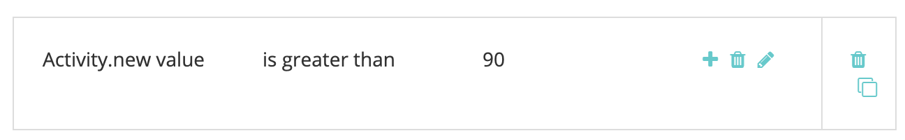

# [!DNL Marketo Engage] Integrazione delle attività {#marketo-engage-activities-integration}

Come parte del [!DNL Marketo Measure] e [!DNL Marketo Engage] L&#39;integrazione, questo sforzo per coinvolgere le attività di Marketo svolge un ruolo enorme. Tramite Attività di Marketo, il sistema tiene traccia di eventi quali Click Email, Change Score o Change Status in Progression - questi tipi di attività possono essere analizzati e definiti per selezionare un sottoinsieme idoneo per i punti di contatto. Una volta creati, i punti di contatto su queste attività vengono tracciati nel percorso di coinvolgimento e misurati insieme agli altri canali di marketing, come Ricerca a pagamento o Marketing partner.

## Requisiti {#requirements}

* Istanza Marketo di produzione
* Produzione [!DNL Salesforce] o [!DNL Microsoft Dynamics] istanza
* Qualsiasi pagamento [!DNL Marketo Measure] abbonamento
* Sincronizzazione persone Marketo abilitata ([!DNL Marketo Measure] Impostazioni)
* Programmi Marketo abilitati ([!DNL Marketo Measure] Impostazioni)
* Attività Marketo Abilitate ([!DNL Marketo Measure] Impostazioni)

## Configurazione {#setup}

1. Per iniziare a configurare le attività Marketo, passa a **Il mio account** > **Impostazioni** > **Attività**.

   

   

   La prima cosa necessaria è selezionare l’elenco dei tipi di attività su cui si intende creare le regole. Non è richiesto alcun numero rigido di tipi di attività, ma ti consigliamo anche di non sovraccaricare i punti di contatto e di diluire l’importanza di tappe significative. Detto questo, potrebbe non essere necessario più di 5 tipi di attività per tenere traccia dei relativi impegni.

1. Fai clic sul menu a discesa in [!UICONTROL Select Activities Types] per iniziare a scegliere i vari tipi.

   

1. Una volta selezionate tutte le attività necessarie, vengono anche visualizzate nella [!UICONTROL Selected Activities List] e [!UICONTROL Define Rules].

   

1. Per ogni tipo di attività, devi definire una o più regole che determinano quali record sono idonei per i punti di contatto. Ad esempio, aggiungeremo una regola per il tipo di attività &quot;Cambia punteggio&quot; in modo che il sistema crei un punto di contatto quando una persona Marketo raggiunge un punteggio di 90 o superiore.

1. Innanzitutto, a seconda del tipo di attività, potrebbe essere necessario impostare un [!DNL Marketo Measure] Nome della campagna che può essere utilizzato in seguito per la mappatura del canale. [!DNL Marketo Measure] I nomi delle campagne possono essere riutilizzati in più regole. Questo aiuta ad avere nomi più grandi che possono essere utilizzati in una singola regola di canale. Non tutti i tipi di attività contengono un programma Marketo, quindi è necessario assegnare un nome come primo passaggio.

   Ecco un esempio di come dovrebbe essere un ulteriore passaggio:

   

1. Nel nostro esempio &quot;Cambia punteggio&quot;, non è necessario inserire un nome della campagna in quanto possiamo estrarre tali informazioni dal programma Marketo. Ora puoi creare l’espressione della regola. Seguendo il nostro esempio, vogliamo selezionare il campo &quot;[!UICONTROL New Value]&quot; con un operatore di &quot;[!UICONTROL is greater than]&quot; con un valore di 90.

   Puoi espandere le regole e aggiungere altri filtri o criteri aggiungendo istruzioni &quot;e&quot; o &quot;o&quot; per limitare i risultati.

   

   

1. Infine, scegli ciò che dovremmo utilizzare come Data punto di contatto. Tutti i campi data/ora disponibili verranno visualizzati qui da Marketo. A meno che non siano disponibili campi data personalizzati, verrà visualizzato &quot;[!UICONTROL Activity Date].&quot;

   

1. Assicurati di fare clic su **[!UICONTROL Save As Draft]** lungo la strada in modo da non perdere le modifiche.

   

1. Passa a **[!UICONTROL Attribute Mapping]** scheda .

   

1. Per ogni tipo di attività selezionata, puoi mappare altri attributi Marketo nei campi punto di contatto in modo da visualizzare e segnalare tali valori in [!DNL Marketo Measure Discover] o nel CRM.

   Molti campi sono stati mappati automaticamente e non possono essere modificati per essere coerenti con le altre integrazioni. Fai riferimento alla sezione Mappature campi di seguito per trovare tali valori. Per alcuni tipi di attività, Marketo include gli attributi per una pagina di destinazione, una pagina di riferimento o un browser che è possibile mappare facoltativamente su un campo punto di contatto. Nell’esempio seguente, abbiamo avanzato alcuni suggerimenti aggiuntivi che possono essere rimossi.

1. Seleziona il campo Punto di contatto dell’acquirente dalla colonna a sinistra a cui desideri effettuare la mappatura. Quindi, scegli l’attributo Marketo che desideri compilare nel campo Punto di contatto dell’acquirente. Tieni presente che queste sono mappature facoltative e aggiuntive oltre a quelle che [!DNL Marketo Measure] ha già stabilito.

   Campi mappabili:

   * Città
   * Paese
   * Area geografica
   * Pagina di destinazione
   * Pagina di riferimento
   * Pagina modulo
   * Data modulo
   * Piattaforma
   * Browser

   >[!NOTE]
   >
   >I campi degli annunci come Ad Content o Keyword non sono disponibili in questo elenco, in quanto sono riservati per le nostre integrazioni di piattaforme pubblicitarie.

## Tipi di attività {#activity-types}

Alcuni tipi di attività ci forniscono l’ID del programma e il nome del programma, pertanto è facile mapparlo nell’ID della campagna e nel nome della campagna sul punto di contatto dell’acquirente. Per altri, non esiste alcuna associazione di programma, quindi parte della definizione delle regole richiederà la creazione di un [!DNL Marketo Measure] Nome campagna. Di seguito sono riportati gli elenchi di ciascuna categoria:

**Tipi di attività con ID programma**

Invia e-mail (6)\
E-mail consegnata (7)\
E-mail rimbalzata (8)\
Annulla sottoscrizione e-mail (9)\
Apri e-mail (10)\
Fai clic su E-mail (11)\
Modifica valore dati (13)\
Cambia punteggio (22)\
Aggiungi all’elenco (24)\
Cambia stato in progressione (104)\
Aggiungi alla cultura (113)\
Cambiare la cadenza della natura (115)

>[!NOTE]
>
>Dei tipi di attività in cui si prevede un ID programma, se viene rilevata un&#39;attività senza un programma, [!DNL Marketo Measure] non lo accetteremo come punto di contatto idoneo, in quanto non possiamo avere valori di Campaign nulli.

**Tipi di attività senza ID programma**

Fare clic sul collegamento (3)\
Nuovo lead (12)\
Sincr. lead a SFDC (19)\
Converti lead (21)\
Cambia proprietario (23)\
Rimuovi dall&#39;elenco (25)\
Attività SFDC (26)\
E-mail rimbalzata Soft (27)\
Elimina lead da SFDC (29)\
Unisci lead (32)\
Aggiungi a opportunità (34)\
Rimuovi da opportunità (35)\
Opportunità di aggiornamento (36)\
Elimina lead (37)\
Invia avviso (38)\
Invia e-mail di vendita (39)\
E-mail di vendita aperta (40)\
Fai clic su Email di vendita (41)\
Aggiungi alla campagna SFDC (42)\
Rimuovi dalla campagna SFDC (43)\
Cambia stato nella campagna SFDC (44)\
Ricevi e-mail di vendita (45)\
Richiesta campagna (47)\
E-mail di vendita rimbalzata (48)\
Fase di modifica dei ricavi (101)\
Modifica manuale della fase dei ricavi (102)\
Cambia segmento (108)\
Chiama Webhook (110)\
Inviato a Amico Email (111)\
Ricevuto Inoltro a Amico Email (112)\
Cambio percorso della natura (114)\
Push Lead to Marketo (145)\
Sincr. lead su Microsoft (300)\
Condividi contenuto (400) Finestra di dialogo Coinvolto (158) Documento Interagito Con (159) Finestra Di Dialogo Appuntamento Pianificato (160) Obiettivo Di Dialogo Raggiunto (161) Attività Personalizzata (xxx)

## Mappatura del canale {#channel-mapping}

Per una qualsiasi delle regole di un tipo di attività con un ID programma, il canale del programma Marketo è determinato dal programma. Utilizziamo il Canale del programma per eseguire la mappatura sui canali offline personalizzati, in modo da assicurarti che i canali siano configurati correttamente [come indicato qui](/help/marketo-measure-and-marketo/marketo-measure-integrations-with-marketo/marketo-engage-programs-integration.md#channel-mapping).

E per una qualsiasi delle regole di un tipo di attività senza un ID programma, il primo passaggio è stato quello di creare un nome campagna. Utilizza questo nome campagna per configurare i tuoi canali online personalizzati [qui](/help/channel-tracking-and-setup/online-channels/online-custom-channel-setup.md).

Se i canali per le attività Marketo non sono configurati correttamente, è probabile che i nuovi punti di contatto rientrino nel canale &quot;Altro&quot;.

## Costi del programma {#program-costs}

Attraverso l’importazione di dati dei programmi Marketo, i costi vengono scaricati automaticamente da Costi periodo e i costi segnalati in Marketo vengono distribuiti per tutto il mese assegnato. Ad esempio, se per gennaio 2021 viene segnalato $1000, i $1000 vengono suddivisi in 31 giorni. I costi sono reperibili in [!DNL Marketo Measure Discover].

## Mappatura dei cookie {#cookie-mapping}

Come risultato della [!DNL Marketo Measure] integrazione con Marketo, [!DNL Marketo Measure] Anche l’ID cookie è ora mappato e sincronizzato con il [!DNL Marketo Munchkin Id]. Questo aiuta a colmare il gap per attribuire il primo tocco anonimo a una sessione web invece di attribuire sia il contatto FT che LC a un&#39;attività Marketo. Immaginate questo scenario:

Mark clicca su un annuncio Facebook e arriva su wayneprises.com dove viene cucinato con [!DNL Marketo Measure] ID 123 e [!DNL Marketo Munchkin Id] 456 Non viene compilato alcun modulo.

Il team di Wayne Enterprises Marketing invia un&#39;e-mail esplosiva a specifici lead mirati, uno dei quali è `mark@email.com`.

`mark@email.com` riceve l’e-mail e i clic attraverso e arriva a `wayneenterprises.com`. Questo diventa `mark@email.com's` seconda visita a `wayneenterprise.com` con gli stessi ID cookie, ma non è stato compilato alcun modulo, quindi [!DNL Marketo Measure], sono ancora un visitatore anonimo.

Il team di Wayne Enterprises Marketing crea una regola di attività Marketo per generare punti di contatto per un tipo di attività &quot;Click Email&quot;.

L&#39;implementazione odierna creerebbe un unico punto di contatto FT e LC per `mark@email.com` dall’attività Marketo dal tipo di attività &quot;Fai clic su e-mail&quot;.

Con questo miglioramento della mappatura dei cookie, il FT tornerebbe indietro e ottenere accreditato all&#39;annuncio Facebook e la LC sarebbe accreditato all&#39;Email.

>[!NOTE]
>
>Con il comportamento di mappatura dei cookie, potresti trovare alcuni punti di contatto LC che provengono da una visita web. È possibile che un lead sia apparso in Marketo senza alcuna attività associata, quindi [!DNL Marketo Measure] il lead è stato scaricato e i cookie associati sono stati confrontati con la sessione Web più recente, anche se non vi era alcuna attività del modulo che ha creato il lead.

## Domande frequenti {#faq}

**Come posso sapere se creare una regola Marketo Programmi o una regola Marketo Activities?**

La [!DNL Marketo Engage] L’integrazione dei programmi è un modo semplice per generare punti di contatto in base al fatto che una Persona sia o meno un membro del programma di un programma. Se sei interessato a definire una regola basata sul momento in cui una Persona cambia in uno specifico stato del Programma, la [!DNL Marketo Engage] L&#39;integrazione delle attività sarà la configurazione desiderata, in particolare il tipo di attività &quot;Cambia stato in avanzamento&quot; in modo che la data del punto di contatto possa essere mappata alla data attività generata dal sistema.

**Perché il nome del mio tipo di punto di contatto è troncato?**

Il campo Tipo di punto di contatto è stato creato nel [!DNL Marketo Measure] pacchetto con 16 caratteri. Sfortunatamente, la modifica del limite di caratteri del campo richiede la deprecazione del campo esistente e la creazione di un nuovo campo. Il valore del tipo di punto di contatto è Tipo di attività, impostato anche nel campo Media.

**Perché il mio tipo di attività personalizzato non viene visualizzato nell’elenco delle attività disponibili?**

Mostriamo solo i tipi di attività personalizzate &quot;Approvato&quot; e non Bozza o Approvato con Bozza.

**Come posso determinare per quali tipi di attività voglio generare un punto di contatto?**

Sebbene non vi sia alcun limite al numero di tipi di attività che è possibile creare, in genere consigliamo non più di 5 tipi di attività. Ci vuole tempo per determinare quali attività di marketing sono rilevanti abbastanza da far parte del percorso di punti di contatto. Ad esempio, &quot;Annulla sottoscrizione e-mail&quot; potrebbe non essere un punto di contatto significativo da monitorare, ma &quot;Fai clic su e-mail&quot; con filtri aggiuntivi potrebbe essere buono. Questo varia a seconda dell’organizzazione e del team, pertanto ti consigliamo di collaborare con i tuoi team per sviluppare al meglio l’approccio da seguire.

**Perché il nome del browser è disattivato?**

La [!DNL Marketo Measure] Il nome del browser ha un limite rigido di 20 caratteri, anche se il valore dell&#39;agente utente ottenuto da Marketo tende ad essere una stringa più lunga.

BrowserInfo.Name\
BrowserInfo.Version\
PlatformInfo.Name\
PlatformInfo.Version
