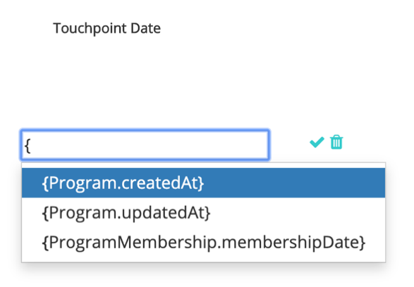

# [!DNL Marketo Engage] Integrazione dei programmi {#marketo-engage-programs-integration}

Attraverso il [!DNL Marketo Measure] integrazione con [!DNL Marketo Engage] Programmi, i nostri clienti possono iniziare a creare punti di contatto per il tracciamento dell’attribuzione dalle iscrizioni al programma Marketo. Questa funzionalità consente agli addetti al marketing di iniziare a tracciare le iscrizioni ai programmi da e-mail o programmi di coinvolgimento che altrimenti non sarebbero visibili da [!DNL Marketo Measure] javascript e devono essere misurati all’interno del percorso di attribuzione.

## Disponibilità {#availability}

Tutti i livelli.

## Requisiti {#requirements}

* Istanza Marketo di produzione
* Istanza Production Salesforce o Microsoft Dynamics
* Qualsiasi pagamento effettuato [!DNL Marketo Measure] abbonamento
* Sincronizzazione utenti Marketo abilitata ([!DNL Marketo Measure] Settings)
* Programmi Marketo abilitati ([!DNL Marketo Measure] Settings)

## Configurazione {#setup}

**Regole**

1. Per iniziare a impostare le regole per i programmi Marketo, passare a **[!UICONTROL My Account]** > **[!UICONTROL Settings]** > **[!UICONTROL Programs]**. Fai clic su **+** per iniziare a creare la prima regola.

   

   

1. Facoltativamente, puoi impostare un nome per la regola, se questo contribuisce a tenerne traccia. Per definire la regola, seleziona innanzitutto il campo dall’elenco dei campi Programma e Iscrizione al programma. Continua a creare la regola selezionando l’operatore e il valore previsto da verificare.

   

1. Aggiungi un’altra istruzione nella stessa casella per impostare un criterio &quot;e&quot; nella regola oppure fai clic sull’icona + all’esterno della casella per impostare un’istruzione &quot;o&quot;.

   

1. Scegli la data o il campo data/ora da utilizzare per il mapping alla data del punto di contatto. Per visualizzare l&#39;elenco dei valori disponibili in Marketo, immettere una parentesi graffa `{` e visualizzeremo i campi disponibili.

   

   >[!NOTE]
   >
   >Se la regola desidera acquisire la Data attività o la data in cui un membro del programma ha raggiunto uno stato particolare, è necessario utilizzare [!DNL Marketo Engage] Integrazione delle attività e impostazione di una regola per il tipo di attività &quot;Modifica stato in progressione&quot;.

   

La regola completata dovrebbe avere un aspetto simile al seguente:

## Test {#test}

Dopo aver creato alcune regole, è possibile testarle per verificare che l&#39;istruzione corrisponda ai programmi.

1. Per eseguire un test, fare clic su **[!UICONTROL TEST]** come mostrato di seguito.

   

1. Verrà visualizzata una finestra modale in cui puoi immettere l’ID del programma da Marketo.

   

   Una volta inserito l&#39;ID e fatto clic su [!UICONTROL Test] , il nostro motore di regole esaminerà ogni regola e determinerà se il programma soddisfa o meno una qualsiasi delle regole. Nell’esempio seguente, puoi vedere che il Programma 1002, denominato [!DNL Marketo Measure] Ebook, ha 5 membri del programma ed è idoneo a causa della regola visualizzata.

   Le regole vengono eseguite su un campione di 5000 membri. Se il programma contiene più di 5000 membri, è possibile che non venga eseguita alcuna verifica della compatibilità di tutti i membri. Questo strumento serve semplicemente come un modo per verificare che le regole siano costruite correttamente.

   

   È possibile fare clic sul conteggio membri per visualizzare un elenco degli ID Marketo People idonei all&#39;interno del programma.

   

## Mappatura canale {#channel-mapping}

Nell&#39;elenco dei canali del programma Marketo è necessario mappare i valori su [!DNL Marketo Measure] canali di marketing personalizzati creati in Impostazioni. I punti di contatto generati da questi programmi ereditano i nomi dei canali e dei sottocanali selezionati qui.

1. Per iniziare, passa a **[!UICONTROL My Account]** > **[!UICONTROL Settings]** > **[!UICONTROL Offline Channels]**.

1. Nella parte superiore, avrai la possibilità di mappare i tuoi tipi di campagna CRM, quindi di seguito, vedrai le opzioni per i tuoi canali del programma Marketo.

1. Seleziona innanzitutto il canale che deve essere mappato al valore, quindi facoltativamente seleziona il Sottocanale. Al termine, fai clic su **[!UICONTROL Save]** in basso.

   

## Costi del programma {#program-costs}

Attraverso l&#39;importazione dei dati dei programmi Marketo, i costi vengono scaricati automaticamente da Costi periodo e il costo riportato in Marketo viene distribuito nel corso del mese assegnato. Ad esempio, se per gennaio 2021 viene segnalato l’importo di 1000 $, tale importo viene suddiviso in 31 giorni. I costi si trovano in [!DNL Marketo Measure Discover].

## Come funziona {#how-it-works}

**Mappature campi**

<table> 
 <colgroup> 
  <col> 
  <col> 
 </colgroup> 
 <tbody> 
  <tr> 
   <th>biz_ad_campaigns</th> 
   <th>Marketo</th> 
  </tr> 
  <tr> 
   <td>ID</td> 
   <td>id</td> 
  </tr> 
  <tr> 
   <td>IS_DELETED</td> 
   <td>(verifica se il programma esiste ancora tramite API)</td> 
  </tr> 
  <tr> 
   <td>
NOME
</td> 
   <td>name</td> 
  </tr> 
 </tbody> 
</table>

| biz_campaign_members | Marketo |
|---|---|
| ID | &quot;MarketoProgramMembership&quot;_ProgramId_Lead Id |
| MODIFIED_DATE | updatedAt |
| DATA_CREAZIONE | membershipDate |
| LEAD_ID | ID (iscrizione all’elenco) |
| LEAD_EMAIL | E-mail (iscrizione all’elenco) |
| STATO | progressionStatus |
| HAS_RESPONDED | reachStatus |
| NOME_CAMPAGNA | programName |
| ID_CAMPAGNA | programId |
| CAMPAIGN_TYPE | channel |

## Mappatura cookie {#cookie-mapping}

In seguito alla [!DNL Marketo Measure] integrazione con Marketo, il [!DNL Marketo Measure] Anche l’ID cookie viene ora mappato e sincronizzato con il [!DNL Marketo Munchkin Id]. Questo consente di colmare il divario per attribuire il primo contatto anonimo a una sessione web, anziché attribuire i tocchi FT e LC a un’attività Marketo. Immagina questo scenario:

Contrassegna i clic su una [!DNL Facebook] ad e arriva su wayneenterprises.com dove viene cotto con [!DNL Marketo Measure] Id 123 e [!DNL Marketo Munchkin Id] 456. Il modulo non viene compilato.

Il team di marketing di Wayne Enterprises invia un&#39;e-mail esplosiva a lead mirati specifici, uno dei quali è `mark@email.com`.

`mark@email.com` riceve l’e-mail, fa clic su e arriva a wayneenterprises.com. Questo diventa `mark@email.com's` seconda visita a `wayneenterprise.com` con gli stessi ID cookie, ma non è stato compilato alcun modulo, quindi per [!DNL Marketo Measure], sono ancora un visitatore anonimo.

Il team marketing di Wayne Enterprises crea una regola di attività Marketo per generare punti di contatto per un tipo di attività &quot;Fai clic su e-mail&quot;.

L&#39;implementazione odierna creerebbe un unico punto di contatto FT e LC per `mark@email.com` dall’attività Marketo dal tipo di attività &quot;Fai clic su E-mail&quot;.

Con questo miglioramento della mappatura dei cookie, il FT tornerebbe indietro e verrebbe accreditato al [!DNL Facebook] e l’E-mail verrà accreditata all’indirizzo e-mail.

>[!NOTE]
>
>Con il comportamento di mappatura dei cookie, potresti trovare alcuni punti di contatto LC provenienti da una visita web. È possibile che un lead sia apparso in Marketo senza alcuna attività associata, quindi [!DNL Marketo Measure] scaricato quel lead, corrispondeva ai cookie associati, quindi lo ha tracciato alla sessione web più recente, anche se non c&#39;era alcuna attività modulo che creasse il lead.

## Domande frequenti {#faq}

**Come si imposta la data del punto di contatto come data di progressione o data in cui la modifica dello stato è avvenuta al membro del programma?**

Se la regola desidera acquisire la Data attività o la data in cui un membro del programma ha raggiunto uno stato particolare, è necessario utilizzare [!DNL Marketo Engage] Integrazione delle attività e impostazione di una regola per il tipo di attività &quot;Modifica stato in progressione&quot;. In caso contrario, [!DNL Marketo Engage] L’integrazione dei programmi rende disponibile solo la data di iscrizione, che è la prima data in cui la persona Marketo è stata inserita nel programma, anche se sono presenti più stati.

**Posso ottenere un elenco di selezione delle opzioni di data per la Data del punto di contatto?**

Per attivare il completamento automatico, inizia inserendo una parentesi graffa `{` nel campo di testo verranno visualizzati i campi disponibili.

**Se creo regole del programma Marketo e dispongo anche di regole della campagna CRM, queste verranno conteggiate due volte?**

Dipende dalla definizione della regola, ma forse sì. Valuterai il set di regole in modo da non avere regole che coprono un programma e una campagna, perché non verrà deduplicato né rilevato per appartenenze simili. Una soluzione possibile è copiare le regole di Campaign su Programmi se desideri che Marketo sia l’unica fonte di verità, quindi rimuovere le regole di Campaign. Un’altra opzione consiste nell’aggiungere un criterio &quot;CreatedOn&quot; o &quot;CreatedDate&quot; nelle regole in modo che le regole precedenti a una certa data utilizzino le regole di Campaign e quelle successive a una certa data utilizzino le regole di Programma. Ci sono molte soluzioni alternative, ma ci vorrà un po&#39; di pianificazione e coordinamento.

**Sono disponibili campi personalizzati per l’iscrizione al programma Marketo da definire?**

Per il momento non è possibile supportare i campi personalizzati per l’iscrizione al programma a causa di limitazioni tecniche. Una volta che tali campi saranno disponibili tramite API Marketo aggiuntive, saranno esposti a noi e visibili per l’utente.

**Come posso sapere se utilizzare programmi o attività?**

Il [!DNL Marketo Engage] L’integrazione dei programmi è un modo semplice per generare punti di contatto in base al fatto che una persona sia o meno membro di un programma. Se ti interessa definire una regola in base al momento in cui una persona cambia in un particolare stato del programma, il [!DNL Marketo Engage] Attività L’integrazione sarà la configurazione desiderata, in particolare il tipo di attività &quot;Modifica stato in progressione&quot;.
