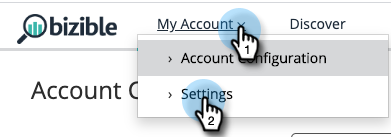
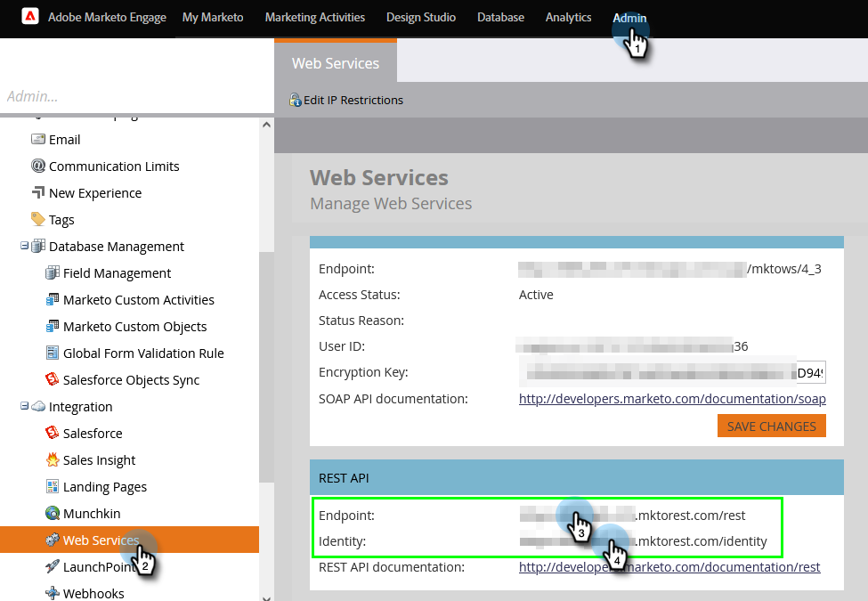

# Configura connessione Marketo {#set-up-marketo-connection}

Ecco come impostare la connessione a Marketo.

>[!PREREQUISITES]
>
>[Crea un ruolo utente solo API](https://experienceleague.adobe.com/docs/marketo/using/product-docs/administration/users-and-roles/create-an-api-only-user.html?lang=it){target="_blank"} per la connessione [!DNL Marketo Measure]/Marketo Engage.

1. In [!DNL Marketo Measure], fare clic sul menu a discesa **[!UICONTROL My Account]** e selezionare **[!UICONTROL Settings]**.

   

1. In [!UICONTROL Integrations], fare clic su **[!UICONTROL Connections]**.

   

1. Fai clic su **[!UICONTROL Set Up New CRM Connection]**.

   

1. Fare clic sul pulsante **[!UICONTROL Connect]** accanto a Marketo.

   

1. In una nuova scheda, accedi al tuo account Marketo Engage. Vai a **Amministratore** > **Servizi Web**. Scorri verso il basso fino a API REST. Evidenzia e salva l’URL dell’endpoint e del servizio Identity. Sono necessari nei passaggi seguenti.

   

1. Sempre in Marketo Engage, seleziona **LaunchPoint** nella struttura a sinistra. Individuare il servizio personalizzato che si desidera connettere a Marketo Measure e fare clic su **Visualizza dettagli**.

   

1. Evidenzia e salva l’ID client e il segreto client. Fai clic su **Chiudi**.

   

1. Compila nuovamente i campi in [!DNL Marketo Measure] con i dati raccolti.

   

1. Dopo aver immesso i valori, fare clic su **[!UICONTROL Authenticate]**. Il tuo account Marketo Engage è connesso a [!DNL Marketo Measure].

   

   >[!NOTE]
   >
   >[!DNL Marketo Measure] effettua chiamate all&#39;API Marketo per tuo conto senza utilizzare i limiti dell&#39;API Marketo, quindi non è necessario preoccuparsi dei limiti e dell&#39;allocazione del credito con altre integrazioni.
