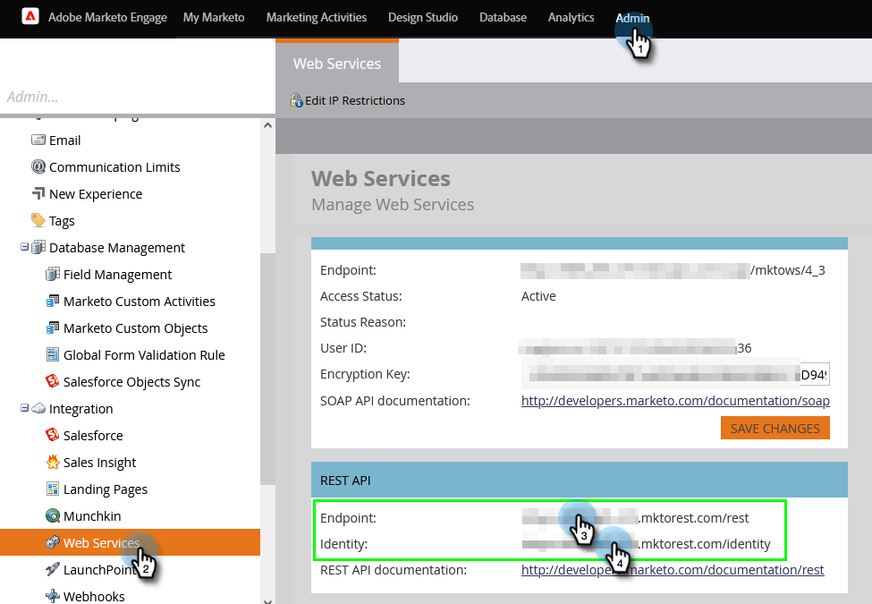

# Configurazione connessione Marketo {#set-up-marketo-connection}

Ecco come configurare la connessione a Marketo.

>[!PREREQUISITES]
>
>[Creare un ruolo utente solo API](https://experienceleague.adobe.com/docs/marketo/using/product-docs/administration/users-and-roles/create-an-api-only-user.html) per [!DNL Marketo Measure]/Marketo Engage di connessione.

1. In [!DNL Marketo Measure], fai clic su **[!UICONTROL My Account]** a discesa e seleziona **[!UICONTROL Settings]**.

   

1. Sotto [!UICONTROL Integrations], fai clic su **[!UICONTROL Connections]**.

   

1. Clic **[!UICONTROL Set Up New CRM Connection]**.

   

1. Fai clic sul pulsante **[!UICONTROL Connect]** accanto a Marketo.

   

1. In una nuova scheda, accedi al tuo account di Marketo Engage. Vai a **Amministratore** > **Servizi Web**. Scorri verso il basso fino all’API REST. Evidenziare e salvare l’URL del servizio Endpoint e Identity. Avrete bisogno di loro tra un po&#39;.

   

1. Sempre in Marketo Engage, selezionare **LaunchPoint** nell&#39;albero a sinistra. Trova il servizio personalizzato che desideri collegare a Marketo Measure e fai clic su **Visualizza dettagli**.

   

1. Evidenzia e salva l’ID client e il segreto client. Fai clic su **Chiudi**.

   

1. Indietro [!DNL Marketo Measure], compila i campi con i dati appena raccolti.

   

1. Dopo aver inserito i valori, fai clic su **[!UICONTROL Authenticate]**. Il tuo account di Marketo Engage sarà quindi connesso a [!DNL Marketo Measure].

   

   >[!NOTE]
   >
   >[!DNL Marketo Measure] effettuerà chiamate all’API Marketo per tuo conto senza utilizzare nessuno dei limiti delle tue API Marketo, pertanto non dovrai preoccuparti dei limiti massimi e dell’allocazione del credito con altre integrazioni.
