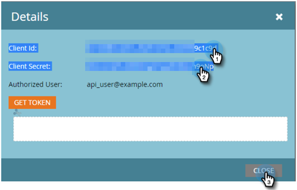

# Configura connessione Marketo {#set-up-marketo-connection}

Ecco come impostare la connessione a Marketo.

>[!PREREQUISITES]
>
>[Creare un ruolo utente solo API](https://experienceleague.adobe.com/docs/marketo/using/product-docs/administration/users-and-roles/create-an-api-only-user.html) per [!DNL Marketo Measure]/Marketi Engage.

1. In entrata [!DNL Marketo Measure], fare clic su **[!UICONTROL My Account]** a discesa e selezionare **[!UICONTROL Settings]**.

   

1. Sotto [!UICONTROL Integrations], fai clic su **[!UICONTROL Connections]**.

   

1. Clic **[!UICONTROL Set Up New CRM Connection]**.

   

1. Fai clic su **[!UICONTROL Connect]** accanto a Marketo.

   

1. In una nuova scheda, accedi al tuo account di Marketo Engage. Vai a **Amministratore** > **Servizi Web**. Scorri verso il basso fino a API REST. Evidenzia e salva l’URL dell’endpoint e del servizio Identity. Ne avrai bisogno tra un po&#39;.

   

1. Sempre nel Marketo Engage, seleziona **LaunchPoint** nell&#39;albero a sinistra. Trova il servizio personalizzato da connettere a Marketo Measure e fai clic su **Visualizza dettagli**.

   

1. Evidenzia e salva l’ID client e il segreto client. Fai clic su **Chiudi**.

   

1. Torna in [!DNL Marketo Measure], popola i campi con i dati appena raccolti.

   

1. Dopo aver immesso i valori, fare clic su **[!UICONTROL Authenticate]**. L&#39;account di Marketo Engage sarà quindi connesso a [!DNL Marketo Measure].

   

   >[!NOTE]
   >
   >[!DNL Marketo Measure] effettuerà chiamate all’API Marketo per tuo conto senza consumare nessuno dei limiti dell’API Marketo, quindi non preoccuparti di massimali e allocazione di credito con altre integrazioni.
