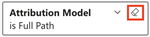

# Scopri nozioni di base sulla dashboard {#discover-dashboard-basics}

Questo articolo illustra le funzionalità fondamentali dell’interfaccia riprogettata, consentendoti di accedere e interpretare facilmente i dati. Approfondisci le dinamiche del riquadro dei filtri e scopri le complessità delle funzionalità di reporting avanzate, come le funzioni di drilling, i filtri incrociati e le descrizioni.

## Riquadro Filtro {#filter-pane}

Ogni dashboard dispone di una serie di filtri, accompagnati dai seguenti controlli per una navigazione e una personalizzazione fluide.

<table style="table-layout:auto"> 
 <tbody> 
  <tr> 
   <th>Nome</th> 
   <th>Icona</th>
   <th>Descrizione</th>
  </tr> 
  <tr> 
   <td>Pulsante Hamburger</td> 
   <td></td>
   <td>Attiva/disattiva l'apertura o la chiusura del riquadro dei filtri.</td>
  </tr>
  <tr> 
   <td>Ripristina</td> 
   <td></td>
   <td>Ripristina le impostazioni predefinite dei filtri.</td>
  </tr>
   <tr> 
   <td>Filtri per elementi visivi</td> 
   <td></td>
   <td>Passa il puntatore del mouse sull’angolo in alto a destra di un oggetto visivo e fai clic sul pulsante per visualizzarne i filtri attivi.</td>
  </tr>
 </tbody> 
</table>

## Funzionalità report {#report-capabilities}

### Drill-down e drill-up {#drill-down-and-up}

* Posizionare il puntatore del mouse su un elemento visivo per identificare se dispone di una gerarchia. La presenza di opzioni di controllo di drilling nella barra delle azioni indica che si tratta di un elemento visivo.

* Attivare il drill-down facendo clic sulla singola freccia verso il basso, evidenziata da uno sfondo grigio. Per ripristinare, utilizzare l&#39;icona di espansione.

Per espandere un campo alla volta, attivare l&#39;icona di espansione e selezionare un elemento visivo, ad esempio una barra.

Utilizzare l&#39;icona di espansione a doppia freccia per avanzare al livello gerarchico successivo.

Utilizza l’icona a forma di fork per aggiungere un ulteriore livello gerarchico nella vista corrente.

### Drill-through {#drill-through}

* Per esplorare i dati dietro l&#39;elemento visivo, fare clic con il pulsante destro del mouse sull&#39;elemento visivo e selezionare l&#39;opzione &quot;drill-through&quot;.

* Per esportare i dati sottostanti, posizionare il puntatore del mouse sull&#39;angolo superiore destro della pagina drill-through, fare clic sul pulsante &quot;altre opzioni&quot; e selezionare &quot;esporta dati&quot;.

* Per ingrandire un oggetto visivo o una tessera specifica, posiziona il cursore del mouse sull&#39;angolo in alto a destra e seleziona il pulsante &quot;focus&quot;.

### Filtri incrociati {#cross-filtering}

Per impostazione predefinita, selezionando un valore o un’etichetta di asse in una visualizzazione si filtrano altri elementi visivi nella pagina del rapporto, garantendo che vengano visualizzati solo i dati filtrati pertinenti.

### Descrizione {#tooltips}

Le descrizioni comandi offrono ulteriori dettagli sui dati visualizzati. Passa il puntatore del mouse su un elemento visivo e viene visualizzata una descrizione contestuale che fornisce informazioni o spiegazioni relative a quel punto dati specifico.

